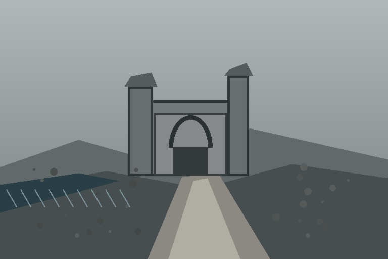
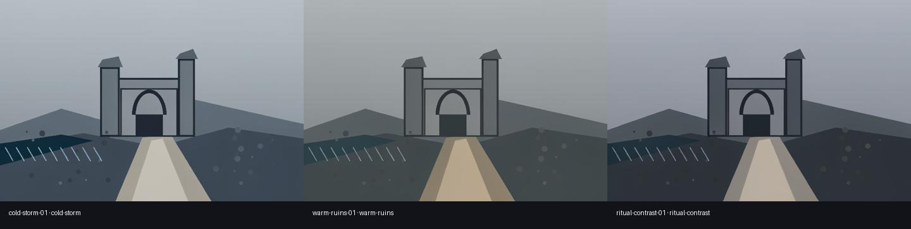

# ArtFlow Agent

面向游戏美术迭代的 AIGC Agent。它不让大模型任意拼接 ComfyUI 图，而是把美术需求转换为受约束、可审批、可恢复的生成任务，并把工作流版本、模型环境、Seed、候选结果、人工选择与交付文件保存在同一条可审计链路中。



> **当前阶段：可运行的首个端到端切片。** 构图保持流程已经在本地 RTX 4080 / ComfyUI 环境完成三方向生成；蒙版局部精修已通过真实工作流结构预检，但仍等待一次批准后的 GPU 视觉验收。仓库正在按 Contract-first 路线重构，现有切片被保留为回归基线。

## 为什么需要 Agent

公开 ComfyUI 工作流很多，但直接让 Agent 修改任意节点图，会同时带来成本、兼容性和结果可追溯问题。ArtFlow 将“模型可以判断什么”和“系统必须确定什么”分开：

```text
美术 Brief
  → 确定性 / 可选模型规划
  → 人工审批
  → 本机 ComfyUI 能力与工作流 Schema 预检
  → 只修改 Recipe 允许的参数槽
  → 多方向生成与断点恢复
  → 技术检查 + 可选视觉评价
  → 人工选片与局部精修
  → 带校验值的交付包
```

Agent 负责形成方向和调用受控工具；确定性代码负责审批边界、环境检查、执行、状态转换、收据和交付；最终采用哪张图始终由人决定。

## 当前可演示能力

- **结构化 Brief**：记录项目、任务类型、必须保留与禁止改变的视觉约束。
- **双规划入口**：默认使用离线确定性规划；只有显式传入 `--model` 才调用 PydanticAI 模型。
- **真实环境预检**：读取 ComfyUI `system_stats` 与 `object_info`，核对节点、模型、输入类型、枚举、数值范围和显存条件。
- **受审 Recipe**：Agent 只能填写允许的参数槽，不能提交任意工作流图。
- **显式审批**：未批准的 Run 无法进入 ComfyUI 队列，模型输出也不能绕过这一状态机。
- **多方向批处理**：上传源图、逐方向排队、轮询、下载并保存独立状态；中断后跳过已完成方向继续运行。
- **过程证据**：记录解析后的输入、Seed、工作流 Hash、运行环境指纹、ComfyUI 输出与逐步事件。
- **评估与选片**：生成 Contact Sheet，执行分辨率、宽高比、亮度范围和结构边缘等确定性检查，并保留独立的可选视觉评价入口。
- **可追踪 Revision**：局部精修只能从已经完成且由人工选中的父结果派生，并重新经过审批。
- **交付封装**：把状态、事件、收据、评估、选中结果和文件 SHA-256 写入可复核的 ZIP。
- **本地 Workbench**：React/TypeScript 界面展示环境、Brief、Plan、方向进度、Contact Sheet 与人工选择；它不能上传任意工作流图。

## 两条受控美术流程

### 构图保持的气氛方向

从场景灰盒生成多个灯光/天气方向，同时用结构边缘相似度检查构图是否发生明显漂移。当前真实运行 `862ac768a2f2` 已产生 cold storm、warm ruins 与 ritual contrast 三个候选，并下载对应收据和 Contact Sheet。



### 蒙版限定的局部精修

精修只能作用于指定区域；父图必须来自已完成人工选择的 Run，遮罩与源图作为显式输入上传，后续可用非遮罩区域稳定性检查判断越界变化。

| 场景灰盒 | 拱门区域蒙版 |
| --- | --- |
|  |  |

## 安装与本地验证

需要 Python 3.11+。默认测试不需要模型 Key、ComfyUI 或 GPU。

```powershell
python -m venv .venv
.\.venv\Scripts\python -m pip install -e ".[dev]"
.\.venv\Scripts\artflow validate-brief examples\brief.example.json
.\.venv\Scripts\pytest
```

检查正在运行的 ComfyUI：

```powershell
.\.venv\Scripts\artflow doctor --comfy-url http://127.0.0.1:8188
```

## 完整演示流程

```powershell
# 1. 建立可审阅任务；默认不调用模型。
.\.venv\Scripts\artflow create-run examples\brief.example.json

# 2. 人工查看计划后明确批准。
.\.venv\Scripts\artflow approve <run-id>

# 3. 运行全部方向；重试时会跳过已完成方向。
.\.venv\Scripts\artflow list-recipes
.\.venv\Scripts\artflow run-batch <run-id> examples\composition-values.example.json

# 4. 生成对比、人工选片并执行检查。
.\.venv\Scripts\artflow make-contact-sheet <run-id>
.\.venv\Scripts\artflow select <run-id> candidate-01
.\.venv\Scripts\artflow evaluate <run-id>
.\.venv\Scripts\artflow evaluate-assets <run-id>

# 5. 完成选片后制作带校验值的交付包。
.\.venv\Scripts\artflow package-run <run-id>
```

从选中结果建立蒙版精修子任务：

```powershell
.\.venv\Scripts\artflow create-revision <parent-run-id> examples\masked-brief.example.json
.\.venv\Scripts\artflow approve <revision-run-id>
.\.venv\Scripts\artflow run-batch <revision-run-id> examples\masked-values.example.json `
  --mask examples\assets\coastal-ruins-arch-mask.png
```

只有显式传入兼容的 PydanticAI 模型标识时，规划或视觉评价才会访问模型服务，例如：

```powershell
.\.venv\Scripts\artflow plan examples\brief.example.json --model <provider:model>
```

## 本地 Workbench

```powershell
cd web
npm install
npm run build
cd ..
.\.venv\Scripts\artflow serve
```

访问 `http://127.0.0.1:8787`。界面通过类型化本地 API 读取已持久化的 Run；批准仍是单独的人类操作，执行入口只接受仓库内受审 Recipe。

## 关键设计边界

- 默认路径确定性、离线且不消耗模型 Token。
- Recipe Manifest 是信任边界，模型不能改变图拓扑或放宽用户约束。
- Run 状态持久化在模型上下文之外，因此失败恢复不依赖模型“记忆”。
- 确定性资产检查与主观视觉判断分别记录，视觉模型不能修改 Run 状态。
- 只有已经完成并人工选中的结果才能打包交付或作为 Revision 的父项。

更完整的实现说明见[架构](docs/architecture.md)、[作品演示叙事](docs/portfolio-story.md)和[验证台账](docs/verification.md)。

## 工程结构

| 路径 | 内容 |
| --- | --- |
| `src/artflow_agent/` | 类型模型、规划、执行、评估、存储、API 与 CLI |
| `web/` | React/TypeScript 本地 Workbench |
| `recipes/` | 受审 ComfyUI Recipe 与允许参数槽 |
| `contracts/` | 场景约束与 Provider 能力契约 |
| `examples/` | 可公开的 Brief、输入值、灰盒与蒙版 |
| `tests/` | 无 GPU 的确定性与协议测试 |
| `runs/` | 本地运行状态和真实产物；默认不进入 Git |

## 已验证与待补证据

已验证：真实 ComfyUI / RTX 4080 环境探测、两条工作流 Schema 预检、审批拒绝、上传下载协议、断点恢复、收据追踪、构图三方向生成、技术检查、前端生产构建与 Wheel 内容。

尚未完成：从真实候选中记录最终人工选择、执行一次蒙版精修、输出最终交付 ZIP，以及录制完整桌面演示。README 不把这些项目描述为已完成；最新状态以[验证台账](docs/verification.md)为准。

## 重构路线

项目正在从首个垂直切片演进为 Scene-to-Visual 生产控制层，目标包括 Unreal 约束桥、Provider 路由、独立评价和标准化来源记录。具体边界与迁移顺序见[产品愿景](docs/PRODUCT_VISION_2026.md)、[重构路线图](docs/REFACTOR_ROADMAP.md)与 [ADR](docs/adr/)。
