# ArtFlow Agent

面向 Unreal Engine 美术生产的场景智能体。ArtFlow 将二维视觉意图转化为可审查、可回滚、可追溯的材质、资产、PCG 与灯光变更，并在隔离候选关卡中完成执行、评价、纠正和发布。


当前 DCC 路线已接入 Blender 5.2 LTS。Agent 将 Session 的场景尺度与视觉意图编译为类型化建模规格，固定 Blender 能力生成可编辑 `.blend`、嵌入式 GLB 和预览，随后由 Unreal Interchange 导入 Session 派生候选关卡。首个模块化祭坛包含 26 个 Blender 可编辑构件、3 个材质和 4,888 个生成三角面；回流后的 Unreal StaticMesh 为 952 个构建三角面并带 1 个简单碰撞，源关卡哈希未变化。

| Blender 可编辑生成结果 | Unreal 隔离候选回流 |
| --- | --- |
| 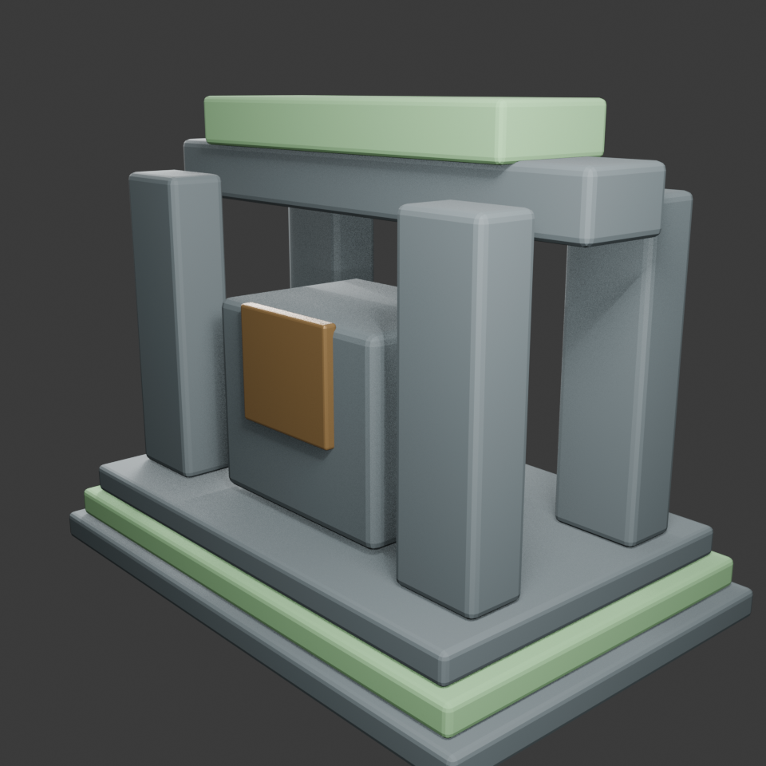 | 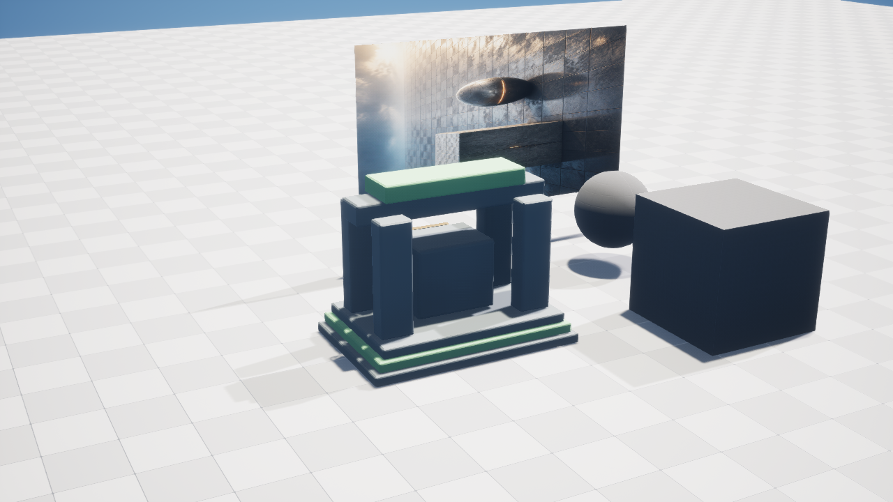 |

Blender 在这里不只是建模器，也是材质、几何处理、布局、灯光和交换格式的 DCC 执行面。第二条真实链路复用了已由 `ComfyUI-Production-Nodes` 生成并验证的 Base Color、Normal 与 Roughness，将它们装配到可编辑 Blender 材质，导出带贴图的 GLB，再对账到同一个 Scene Session 的 Unreal 候选空间。生成、材质装配与引擎回流各自保留类型化请求、内容哈希和宿主回执。

这条链路现已成为当前 Scene Session 的持久 DCC 工作项。场景变更谱可直接派发 Blender DCC，执行器按单一写入者语义领取，并在同一 append-only 事件流中报告执行、对账与完成；刷新或进程重启后仍恢复相同的能力版本、输入哈希和 Unreal 候选身份，已存在的生成结果不会被重复运行。

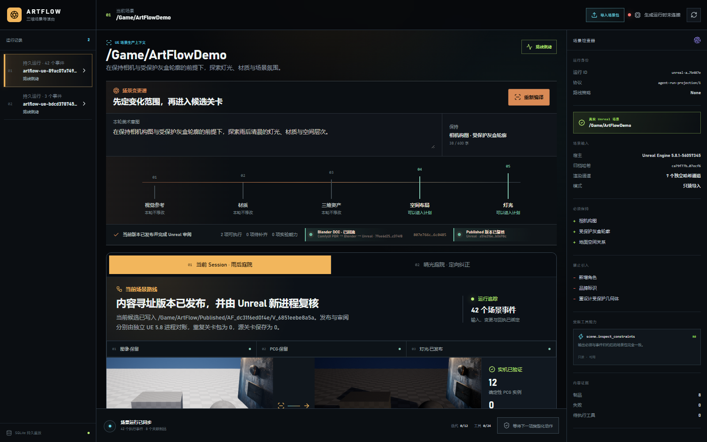

| ComfyUI PBR → Blender 可编辑材质 | Blender PBR → Unreal 候选关卡 |
| --- | --- |
| 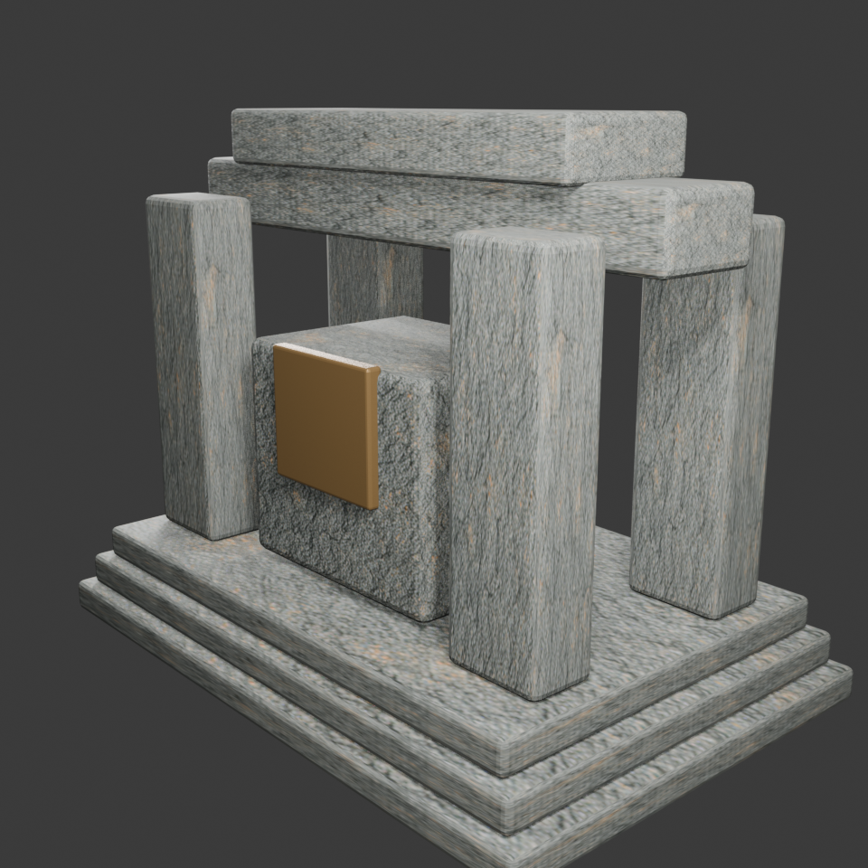 | 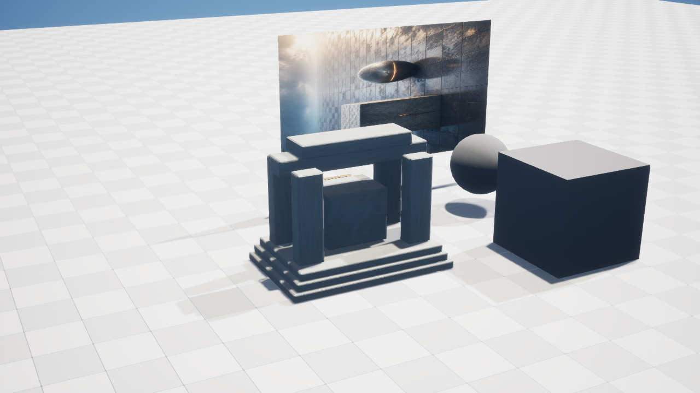 |

第三条 DCC 路线把当前 Session 的空间范围编译为固定 Geometry Nodes 布局：14 个程序化支撑组合由三个原型、确定性种子和 580 cm 半径生成，节点组保留在可编辑 `.blend` 中；用于引擎的实例被实现为单一交换资产并进入新的 Unreal 候选关卡。它展示的是场景级组合能力，而不是再生成一个孤立模型。

| Geometry Nodes 程序化庭院 | Unreal 场景级候选回流 |
| --- | --- |
|  |  |

第四条路线把 Unreal 当前机位、镜头参数和登记灯光导出为类型化 Shot Request。Blender 在相同相机关系下完成三点布光预演，Agent 再把 key / fill / rim 三组有限参数回填到新的 Unreal 候选。两端相机位置与视场角误差均为 0；第二次回填只对账已有候选，不重复创建灯光或关卡，源 `ArtFlowDemo` 仍保持字节不变。

| Blender 同机位灯光预演 | Unreal 三点灯光候选回填 |
| --- | --- |
|  |  |

第五条路线把 ComfyUI 场景条件图继续落实为可编辑场景，而不是停在图片文件。Agent 将已接受图像的内容身份与当前 Session、源镜头和 Blender 场景绑定，只提取有限的三组材质色板，并编译固定 key / fill / rim 灯光参数。Blender 5.2 在原可编辑庭院上完成 lookdev 预演；Unreal 5.8 再创建候选专属材质、覆盖生成场景的三个材质槽并应用同组灯光。重复回流返回 `reconciled`，未创建重复资产，源关卡哈希保持不变。

| ComfyUI 目标驱动的 Blender Lookdev | Unreal 隔离 Lookdev 候选 |
| --- | --- |
| 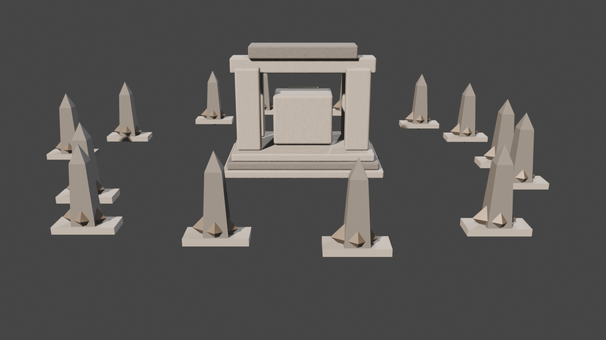 | 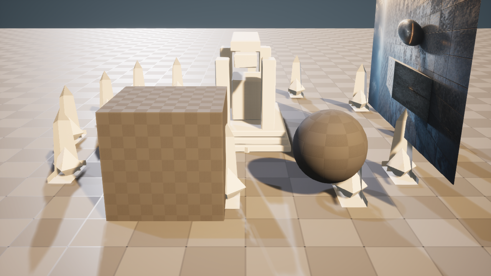 |

这条路线现已进入 Scene Session 的产品工作流。现有 DCC Worker 将建模、ComfyUI PBR、Geometry Nodes、镜头灯光和场景 Lookdev 组织为同一个内容寻址工作项；`queue / claim / execute / reconcile` 五个事件写入原有账本，刷新后可恢复相同状态。场景变更谱直接呈现三段媒体和最终 Unreal 候选，不要求用户运行脚本或操作 ComfyUI 节点画布。

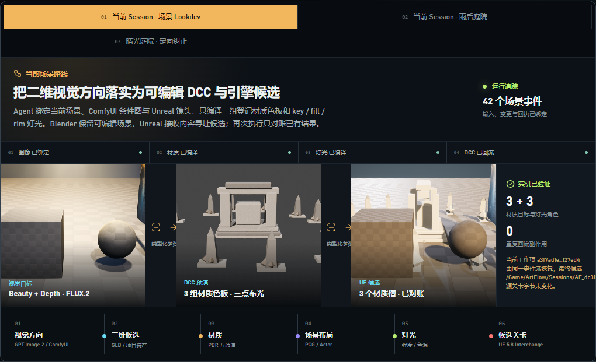

第六条路线把已经确定的 Lookdev 继续处理为可复用的引擎表面资产。Agent 将当前 Session、源
`.blend`、27 个登记对象、UV 方法、1024² 图集和 Base Color / Roughness 两个 Bake 通道编译为
固定 Surface Request。Blender 5.2 生成 `ArtFlow_BakedUV`、两张贴图、单材质 GLB 与保留完整
编辑能力的 `.blend`；Unreal 5.8 通过 Interchange 导入网格、材质和两张纹理，并在新的隔离候选
中替换原场景 Actor。第二次回流返回 `reconciled`，没有重复资产，源关卡哈希保持不变。

| Blender UV 与材质 Bake | Unreal 表面资产候选 |
| --- | --- |
| 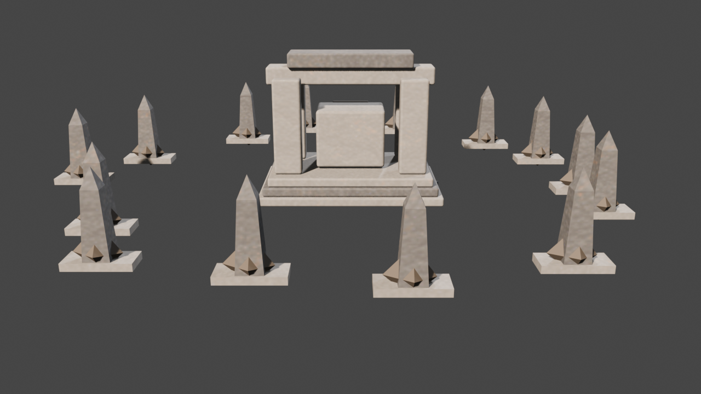 | 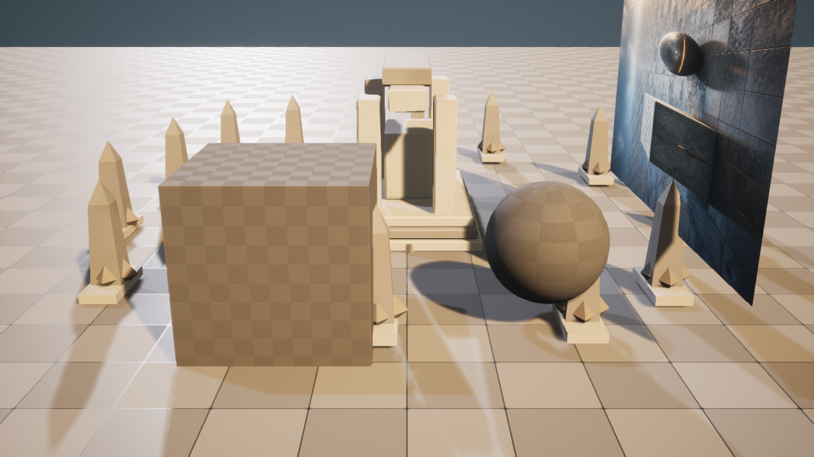 |

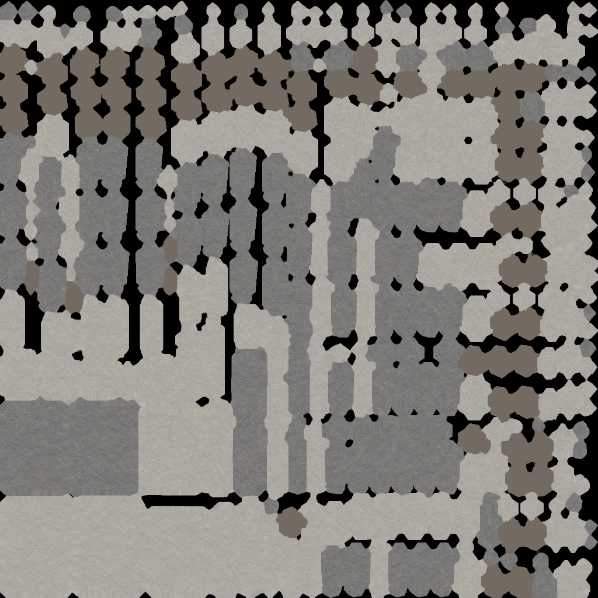

Surface Bake 也已进入当前 Scene Session 的产品工作项。场景变更谱把 Lookdev 输入、UV 图集、
Blender 结果和 Unreal 候选组织为同一条可恢复路线；六项 DCC 能力共享原有事件账本与本地 Worker，
没有增加第二套调度器或确认步骤。

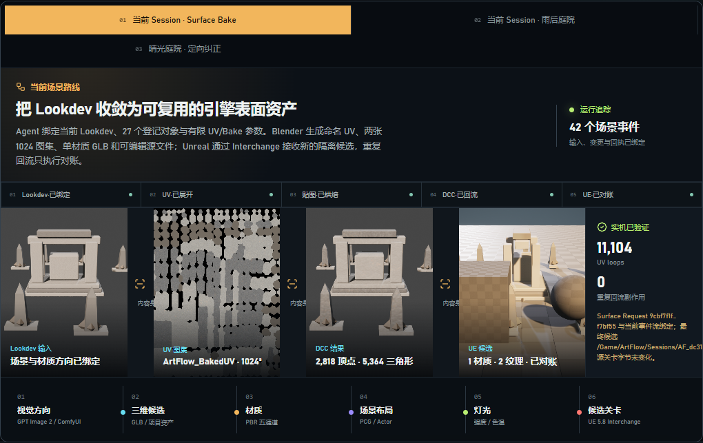

Blender 的确定性物理求解也可以作为场景布景工具。当前 Session 将庭院边界、登记碎石原型、数量、
随机种子和 96 帧预算编译为固定刚体任务；Blender 求解 12 个落点并输出变换清单，Unreal 只读取
通过边界、稳定性和间距检查的结果，在新的候选关卡生成实例。重复回流不会再次创建 Actor。

| Blender 刚体散落预演 | Unreal 布景候选 |
| --- | --- |
| 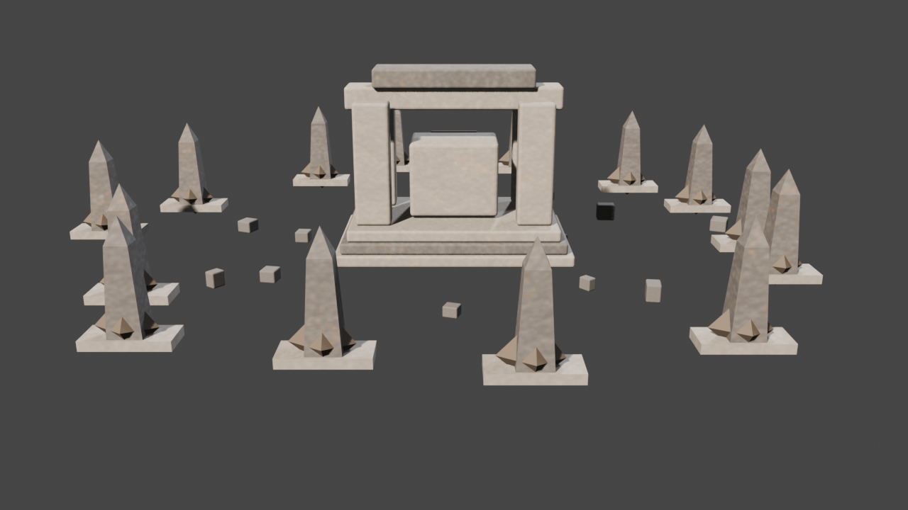 |  |

这项能力已经进入当前 Scene Session 的统一执行面。它与建模、PBR、Geometry Nodes、镜头灯光、
Lookdev 和 Surface Bake 共用同一条可恢复事件链；工作台直接展示 Surface 输入、Blender 求解和
Unreal 布景候选，重复派发恢复同一个内容寻址工作项，不会再次落物或导入 Actor。

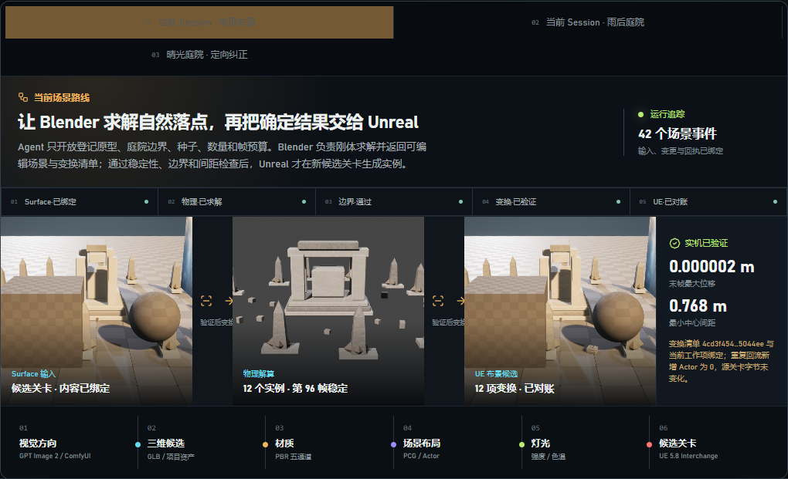

第八条生产路线让 ComfyUI 的节点图直接服务于三维表面制作。Agent 从当前 Unreal 机位裁取
`AF_Inlay` 区域，向登记的 FLUX.2 Klein ReferenceLatent 图填入有限参数，并从一次真实输出中
选择青铜绿日轮细节。Blender 将纹理转换为带厚度、带 UV 的可编辑嵌件，完成材质装配与 Bake；
Unreal 再把网格、纹理和项目自有材质写入隔离候选。重复回流创建与更新对象均为 0，源关卡未改变。

| ComfyUI 场景条件生成 | Blender 三维嵌件与烘焙 |
| --- | --- |
| 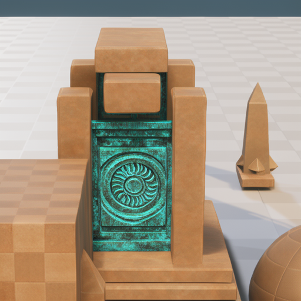 |  |

这条路线已登记为当前 Scene Session 的第八项 DCC 能力。场景变更谱直接呈现 Unreal 取样、
ComfyUI 生成、Blender 转化和引擎回流，并沿用同一条可恢复事件链。

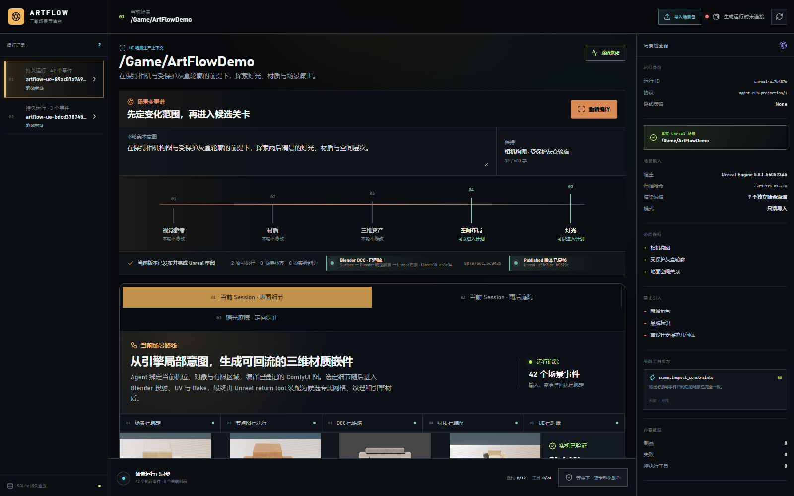

第九条路线把二维视觉方向继续扩展为可复用的场景模块，而不是只生成单件模型。Agent 读取当前
Session 的庭院边界和已登记的 ComfyUI 表面目标，编译三变体 Wayfinder 套件；Blender 保留每个
变体的 Geometry Nodes recipe、UV、双材质槽、独立 LOD1 与碰撞代理，Unreal 再由类型化 PCG
consumer 将九个确定性点位写入新的隔离候选。三项资产在 UE 中均验证为 2 级 LOD 和 1 个简单
碰撞体；第二次回流没有创建或更新 Actor，源关卡哈希保持不变。

| Blender 程序化模块套件 | Unreal PCG 场景装配候选 |
| --- | --- |
| 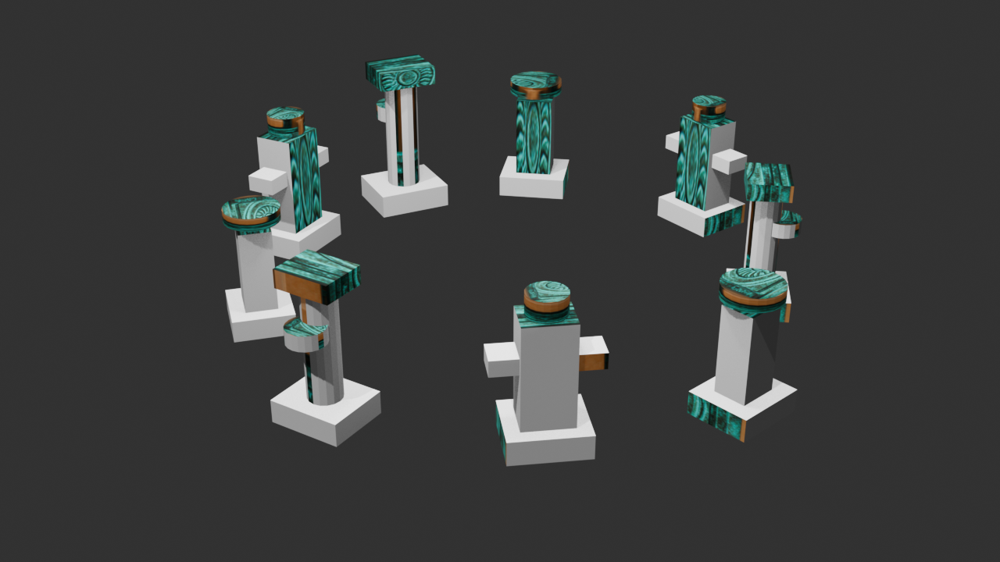 | 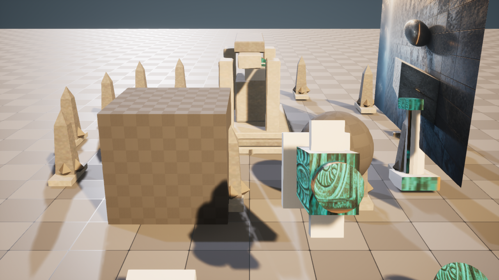 |

该路线现已作为当前 Scene Session 的第九项 DCC 能力进入统一执行面。场景变更谱以视觉方向、
场景边界、DCC 套件和 PCG 装配四个真实画面呈现完整变化；九项能力继续共用同一 Worker 与
append-only 事件账本，重复派发恢复相同内容身份。

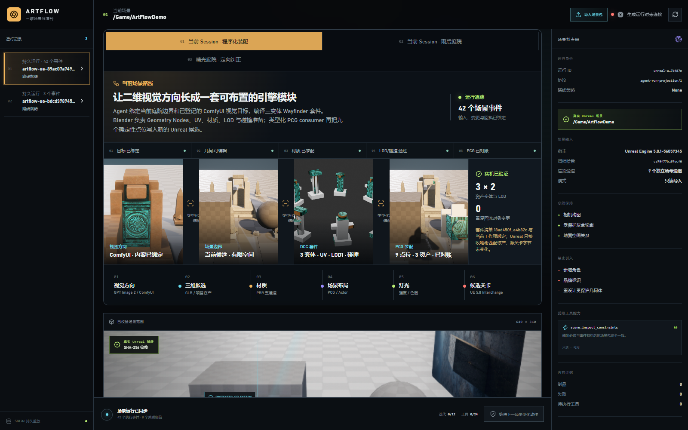

第十条路线让 ComfyUI 节点图参与三维空间决策，而不仅生成最终画面。Agent 将当前 Unreal Depth
与方块、球体、立面三个保护区域编译为固定密度任务；ComfyUI 输出可检查的空间蒙版，验证后再
投影为 12 个带密度、旋转、缩放和确定性种子的空间点。项目自有 Unreal PCG 图消费这些点和
M32 的三种 Blender Wayfinder 网格，在新的隔离候选中由原生 PCG 节点完成实例化。

| ComfyUI 空间密度与保护排除 | Unreal 原生 PCG 候选 |
| --- | --- |
|  | 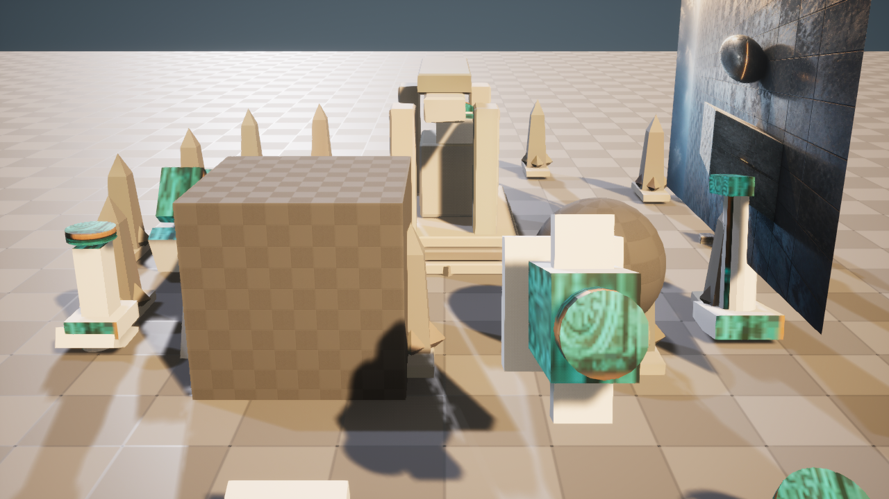 |

本次实测的有效密度覆盖率为 29.197%，保护区泄漏为 0；第二个 Unreal 进程对账同一 PCG 图、
候选关卡和 12 个实例，重复外部副作用为 0，源关卡与上游程序化套件候选均未改变。

这条空间生成路线现已作为当前 Scene Session 的第十项能力进入统一执行面。产品不暴露任意
ComfyUI 图或 Unreal 脚本；现有 Worker 验证场景条件、节点回执、空间清单、Blender 套件、原生
PCG 图与候选身份后，仍使用同一条五段持久事件链执行和恢复。

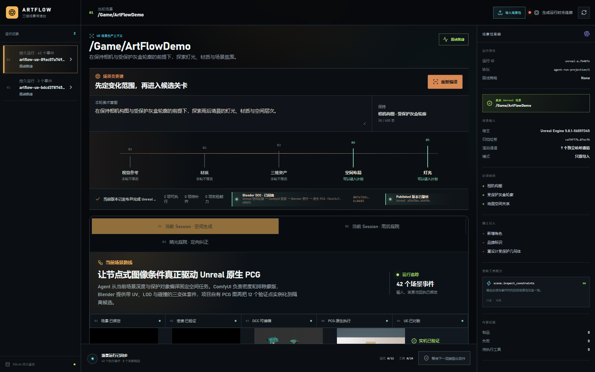

## 项目定位

游戏美术团队已经能够使用 ComfyUI、图像模型和各类生成服务快速产出概念方案，但把生成结果真正带入 Unreal 生产管线仍有明显断层：

- 生成模型不了解关卡中的相机、保护对象、空间边界和现有资产；
- 图片、材质、模型、PCG 与灯光分别存在于不同工具，缺少统一的变更计划；
- 候选结果通常依赖主观选择，难以解释为什么采用、为什么拒绝；
- 超时或进程中断后盲目重试，可能造成重复生成、重复导入和脏资产；
- 二维参考图很难直接落实为引擎内可编辑、可复检的三维结果。

ArtFlow 在生成模型与 Unreal 之间增加一层受约束的 Agent 控制平面。它读取真实场景事实，将目标编译为类型化 `SceneChangePlan`，只调用经过声明的有限工具，并以独立评价和确定性规则决定后续动作。所有场景写入首先发生在候选关卡，源关卡不会被直接覆盖。

### 从当前 Unreal 场景开始

使用者可直接从 Unreal 编辑器的“启动 ArtFlow 场景任务”进入，也可以在“场景变更谱”中描述本轮美术意图。编辑器入口会导出当前已保存关卡，向仅监听 localhost 的 Agent 发起类型化握手，并在确认 Scene Package、Session、策略与候选目录身份后把回执留在项目 `Saved` 目录。整个握手不修改源关卡。

视觉参考、材质、三维资产、空间布局和灯光是可独立编排的变更领域。ArtFlow 根据 Scene Digital Twin 与实际运行时能力标出可执行、待补齐和实验路线；确认后的 Scene Session 进入 append-only 账本，刷新或重启不会丢失。

当所有选定领域满足前置条件时，系统生成一份与场景哈希、Session、策略版本和领域操作严格绑定的候选关卡请求。请求只能指向 ArtFlow 派生的隔离内容目录；截图中的状态表示“请求已封存”，不表示 Unreal 已经完成本次写入。

封存后的 Candidate Plan 会进入当前 Scene Session 的注册工作项。使用者可在 Unreal 的 Tools 菜单选择“执行当前 ArtFlow 候选”；编辑器原子领取单一写入权，依次回传执行、对账和结果状态。当前 UE 5.8.1 实测由实时导出的场景包建立新 Session，生成 12 个 PCG 实例并保持源关卡哈希不变。

评价通过后，使用者可以继续在同一组 Unreal 菜单中选择“发布当前 ArtFlow 版本”与“审阅当前 Published 版本”。两个入口只调用插件内置的固定能力，由 Agent 根据当前 Session 投影确定唯一合法候选和精确 Published 关卡；它们不接收文件路径、地图名称、脚本或自定义事件。提交后的完成状态未知时，系统先对账已有回执，再决定是否继续，重复操作不会重复发布。

当前候选经独立评价后只判定 `lighting` 失败。第一次单灯纠正满足执行合同，但新的视觉复评仍识别到第二盏定向光主导画面。Agent 因此编译完整的注册灯光组补丁：主光调整为 `2.2 / 8500K` 与低角度方向，辅助定向光由 `6.0 / 6500K` 压低至 `0.25 / 9000K`。UE 回执证明保护结构未变、PCG 实例保持 `12 → 12`、源关卡哈希未变；七项技术检查与新视觉复评通过后，编排器采用精确内容身份并发布到 `/Game/ArtFlow/Published/AF_dc31f6ed0f4e/V_6851eebe8a5a`。两个新的 UE 5.8.1 进程分别完成发布对账与精确版本审阅，没有创建第二个关卡包，也没有保存源关卡。

| 当前 Session · Published 版本 | 窄屏场景变体状态 |
| --- | --- |
|  |  |

| Unreal 精确 Published 版本 | 同一 Session 的场景变更谱 |
| --- | --- |
|  |  |

在真实 UE 5.8 宿主中，当前已接入的 PCG 与灯光域可以进一步编译为具体 Candidate Plan。下面的候选由 Session 请求派生目录承载，生成 12 个 PCG 实例；新编辑器进程再次打开同一计划时完成对账而不重复生成，源关卡文件哈希保持不变。

| 源关卡同机位 | PCG 与灯光候选 |
| --- | --- |
|  |  |

M13 进一步把真实 ComfyUI PBR、Unreal 材质实例、项目自有资产、PCG 与灯光封装进同一份四操作
Candidate Plan。下面的雨湿庭院候选来自当前 RTX 4080 受审图执行；原始技术图未通过时，系统只纠正
失败的 PBR 域，再由 UE 串行绑定验证后的材质与场景工具。新进程对账保持 12 个实例，源关卡字节不变。

| 雨湿庭院源关卡 | 材质、项目资产、PCG 与灯光联合候选 |
| --- | --- |
|  |  |

## 生产案例

Scene Lab 当前聚焦两条来自同一 Unreal 场景、但走不同生成路线的生产案例。图像与宿主指标来自本仓冻结的 UE 5.8、ComfyUI 与 Codex Image 回执；当前 Session 的评价、采用、发布和审阅由 Unreal Bridge 以注册内容身份回传，并由 append-only 事件实时投影。回调不接收主机路径，也不能提交自定义事件结构。

### 雨后庭院：跨管线场景改造

Agent 将受审 ComfyUI PBR、已验证材质实例、项目资产、固定 PCG 图和灯光参数编译为一份类型化 Candidate Plan。原始 PBR 技术图不满足通道语义时，只重建失败的技术域；通过后再由 Unreal 串行写入隔离候选关卡。新进程重放同一计划时直接对账，不重复调用 Provider 或导入资产。


### 晴光庭院：视觉目标驱动的单域纠正

Codex GPT Image 2 先依据源机位生成晴光、轻度植被覆盖的视觉目标，并把源图、目标图、保持项和内容哈希绑定为图像域回执。第一次 UE 候选故意使用 `0.05 / 6500K` 的错误主光；评价结果只有 `lighting` 失败，图像、材质、资产和 PCG 四个领域的证据被锁定。Correction Planner 只提交灯光补丁，修正为 `5.5 / 4200K`，随后由新的 UE 进程完成对账和同机位回渲。


修正前后保持 12 个 PCG 实例、同一材质路径和同一项目资产集合；四个成功领域的证据哈希完全一致，外部重复提交为 0。通过复检后，编排器将精确候选发布为内容寻址场景变体；新 UE 进程对账没有创建第二个关卡包，源 `ArtFlowDemo.umap` 字节始终未变化。

Scene Lab 将视觉目标、失败候选、定向纠正、Codex 采用、版本发布与 Unreal 审阅组织成一条场景变体谱系。审阅入口只打开采用决定绑定的 Published 关卡；本次 UE 5.8.1 实测首次返回 `inspected`，新进程返回 `reconciled`，两次检查均未保存源关卡。

## 工作流程


1. **场景理解**：Unreal Bridge 导出 Beauty、Depth、World Normal、Object ID，以及相机、Actor、材质、灯光、PCG、保护对象和空间边界。
2. **计划编译**：Agent 把美术目标编译为类型化 Scene Delta DAG，并根据隐私、成本、宿主能力与风险选择可用工具。
3. **候选执行**：ComfyUI、GPT Image 2、图生 3D Provider 和 Unreal 工具只执行各自声明范围内的任务，不拥有最终决策权。
4. **独立评价**：确定性 Constraint Judge 优先检查硬约束，多模态 Visual Critic 评价视觉方向；视觉吸引力不能覆盖相机、结构或保护区失败。
5. **纠正与发布**：只重跑失败领域，通过复检的候选以内容寻址方式发布；失败候选可以丢弃，源关卡始终保持不变。

## 系统架构


```text
Unreal Scene Bridge
        │
        ▼
Scene Digital Twin ── Context Assembler ── Production Memory
        │
        ▼
Planner / Capability Router / Policy Engine
        │
        ├── ComfyUI PBR
        ├── GPT Image 2
        ├── Blender DCC Bridge
        ├── Image-to-3D Provider
        └── Typed Unreal Tools
        │
        ▼
Candidate Level ── Technical Judge ── Visual Critic
        │
        ▼
Correction Planner ── Reconcile ── Publish / Discard
        │
        ▼
SQLite Event Log / Provenance / OpenTelemetry
```

MCP 作为薄互操作层，只投影已经存在的固定资源与窄工具。它不接收任意本地路径、ComfyUI workflow、Python、Shell 或 Blueprint，也不维护第二套 Agent 状态机。

ComfyUI 的节点画布可以直接参与这套管线，但职责位于 Agent 下面：项目登记和版本化可复用的生成、ControlNet、LoRA 与 PBR 技术图子图，Agent 依据 Scene Session 选择能力、填充类型化参数并读取回执。这样既保留节点生态的组合效率，也避免让模型在生产时临时拼接任意工作流。生成结果可继续进入 Blender 的材质与几何处理，再由 Unreal 工具完成 PCG、布光和候选回填。

当前实机没有安装 ControlNet 或 LoRA 权重，Agent 因而选择已验证的 FLUX.2 Klein `ReferenceLatent` 路线：先将 Unreal 同机位 Beauty 与归一化 Depth 合成为场景条件，再由受审图生成暖色穿透光候选。它保留方块、球体与立面轮廓关系，同时形成可继续驱动 Blender / Unreal lookdev 的视觉目标。

| Unreal Beauty + Depth 条件 | ComfyUI 场景条件候选 |
| --- | --- |
| 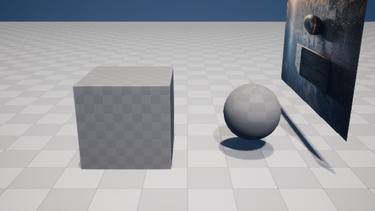 | 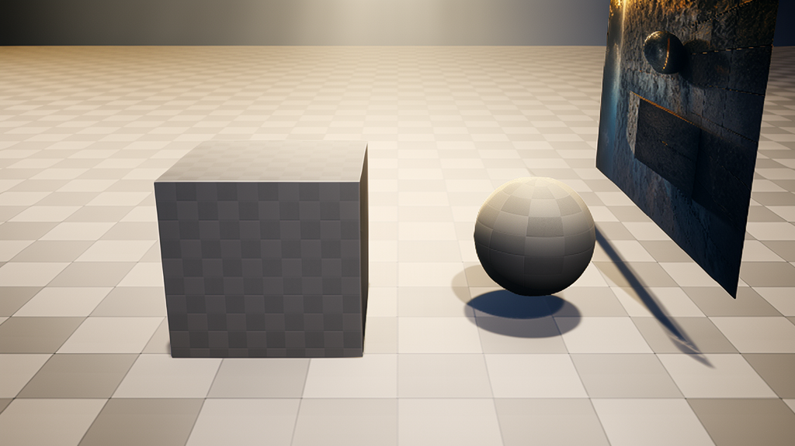 |

这里的 Blender 能力边界并不限于建模。ArtFlow 将它视为完整 DCC 执行面：模型与修改器、UV、材质节点、贴图装配与 Bake、Geometry Nodes 场景布局、镜头灯光交换，以及后续动画和模拟缓存都可注册为独立能力。ComfyUI 则提供可组合的节点式图像、控制图和 PBR 子图；Agent 负责依据真实能力选择子图并填入类型化插槽，再把结果交给 Blender 和 Unreal。三者通过内容身份和宿主回执连接，不共享一套脆弱的临时脚本状态。

## Agent 工程设计

| 能力 | 实现方式 | 生产约束 |
| --- | --- | --- |
| 上下文工程 | Scene Digital Twin、稳定约束前缀、最近观察、来源绑定记忆 | 陈旧观察与无关项目记忆不会进入当前决策 |
| 工具系统 | Pydantic 输入输出、能力注册、读写域、风险、超时与验证信号 | 不暴露任意主机代码或任意 ComfyUI 图 |
| 路由与策略 | 能力实测、隐私/成本上限、内容指纹、确定性硬门禁 | 模型置信度不能覆盖规则失败 |
| 持久执行 | SQLite append-only 事件、确定性 Reducer、`reserve / submit / reconcile` | 超时被视为“结果未知”，不会直接重提 |
| 独立评价 | 生成器、Technical Judge 与 Visual Critic 权限分离 | 生成器不能评价或采用自己的结果 |
| 定向纠正 | 失败域分类、检查点与已通过证据锁定 | 一处失败不会触发整条生成链重跑 |
| 生产记忆 | episodic / semantic / procedural 记录与来源引用 | 冲突、伪造来源和越权共享会被拒绝 |
| 可验证交付 | 类型化 Unreal 回执、内容哈希、来源 sidecar | 所有公开结论均可回到实际制品与分母 |

PydanticAI 仅用于类型化模型边界；状态机、工具权限、策略、恢复、评价和发布逻辑均由项目自身实现。系统没有为了增加概念数量而引入开放式多 Agent 协作、向量数据库或第二套工作流引擎。

## 验证结果

| 验证项 | 结果 |
| --- | ---: |
| Agent Harness 冻结案例 | 20 / 20 |
| 崩溃恢复场景 | 6 / 6 |
| 恢复测试中的重复外部副作用 | 0 |
| 生产记忆治理案例 | 6 / 6 |
| PBR 通道验证 | 5 / 5 |
| 多域 Scene Delta | 4 / 4 |
| PCG 保护区侵入 | 0 / 12 |
| 定向纠正重跑范围 | 仅 lighting，1 / 4 |
| MCP 越权输入拦截 | 4 / 4 |
| 来源文件哈希绑定 | 9 / 9 |
| 发布包内容寻址验证 | 36 / 36 |
| Scene Lab 浏览器检查 | 0 溢出、0 控制台错误、0 阻塞弹窗 |
| Scene Session 重复启动 | 1 个持久事件、0 个重复事件 |
| 场景变体生命周期重放 | 4 个类型化事件、重复注册后总事件仍为 7 |
| UE 原生生命周期回传 | 评价 / 采用 / 发布 / 审阅 4 / 4，顺序事件共 7 条 |
| 生命周期回调路径输入 | 0 个调用方路径字段；未知身份与乱序转换关闭失败 |
| 当前候选工作项 | 排队 / 领取 / 执行 / 对账 / 成功，8 条持久事件 |
| UE 候选执行结果 | 12 个 PCG 实例，源关卡字节变化 0 |
| 当前候选技术审查 | 6 / 6；回执、源关卡、命名空间、PCG 预算与同机位回渲 |
| 当前候选视觉裁决 | image、PCG 通过；lighting 进入单域修正 |
| 第一次灯光纠正复评 | 技术检查 7 / 7；视觉仍仅拒绝 lighting，未采用 |
| 注册双灯光组纠正 | 主光与辅助定向光 6 个类型化字段；其他领域重跑 0 |
| 当前候选复评与采用 | 技术检查 7 / 7；视觉 accepted；Codex 采用 1 次 |
| UE 原生发布 / 审阅菜单 | 2 / 2；固定插件能力；重复执行事件总数 37 → 37 |
| 非法 UE 操作拦截 | `delete` 1 / 1；执行插件脚本前关闭失败 |
| 候选工作项写入者 | 1 个；第二写入者与非法状态跳转关闭失败 |
| 陈旧候选请求拦截 | 1 / 1 |
| UE 原生 Scene Session 握手 | 1 次真实 UE 5.8 运行，源关卡哈希不变 |
| 同一真实握手请求重放 | 1 个 Session 事件、0 个重复事件 |
| Session 派生候选执行 | PCG 12 个实例，源关卡字节变化 0 |
| 新 UE 进程候选对账 | `reconciled=true`，重复实例 0 |
| 雨湿庭院跨管线计划 | 材质 / 项目资产 / PCG / 灯光 4 / 4 |
| 当前 ComfyUI PBR 验证 | 5 / 5 通道，真实生成 23.094 秒 |
| GPT Image 2 视觉目标绑定 | 1 / 1，源图与保持项内容寻址 |
| M13 单域故障分类 | 仅 `lighting`，1 / 5 |
| M13 修正前后成功域证据 | image / material / asset / PCG，4 / 4 哈希不变 |
| M13 修正后 UE 对账 | `reconciled=true`，外部重复提交 0 |
| 版本化场景发布 | 1 个内容寻址关卡包，源关卡字节变化 0 |
| 新进程发布对账 | `reconciled`，重复关卡包 0 |
| Published 版本 Unreal 审阅 | UE 5.8.1，12 个 PCG 实例，源关卡保存 0 |
| 新进程审阅对账 | `reconciled`，Published 关卡哈希一致 |
| Blender 5.2 自主建模 | 26 个可编辑构件、3 个材质、4,888 个生成三角面 |
| Blender → Unreal 回流 | 1 个 StaticMesh、3 个材质槽、1 个简单碰撞；源关卡字节变化 0 |
| Geometry Nodes 场景布局 | 14 个支撑组合、3 个原型、934 个 Unreal 构建三角面 |
| Unreal ↔ Blender 镜头灯光交换 | 相机位置 / FOV 误差 0；3 盏登记灯光；重复回填副作用 0 |
| ComfyUI 场景条件生成 | 826 节点实机能力；1024×576；RTX 4080 执行 9.41 秒 |
| 场景条件目标 → Blender / Unreal Lookdev | 3 个登记材质目标、3 盏登记灯光；重复回流副作用 0；源关卡字节变化 0 |
| Scene Session 生产能力链 | 10 个登记能力；每项使用 5 个持久生命周期事件，重复派发保持同一工作身份 |
| Blender 程序化场景套件 | 3 个 Geometry Nodes 变体；每项 2 级 LOD、1 个简单碰撞体 |
| ComfyUI 场景空间密度 | 29.197% 有效覆盖；3 个保护区泄漏 0；12 个确定性空间点 |
| Unreal 原生 PCG 装配 | 3 种 Blender 网格、12 个原生实例；重复执行副作用 0；两项源文件变化 0 |

这些数据描述仓库内固定场景和命名测试集，不代表开放域生成质量或商业 Provider 的服务等级。详细运行记录见 [验证证据目录](docs/evidence/)。

## 运行环境

- Windows
- Unreal Engine `5.8.1`
- Blender `5.2.0 LTS`
- Python `3.11+`
- Node.js 与 npm
- 本地生成验证设备：NVIDIA GeForce RTX 4080 16 GB
- ComfyUI 自定义节点：独立维护的 `ComfyUI-Production-Nodes`

其他平台与 Unreal 版本尚未完成同等级验证。

## 本地演示

```powershell
git clone https://github.com/Ubik42/ArtFlow-Agent.git
cd ArtFlow-Agent

python -m venv .venv
.\.venv\Scripts\python -m pip install -e ".[dev]"

.\scripts\start_showcase.ps1
```

脚本会安装缺失的前端依赖、构建当前界面，并在服务就绪后打开 `http://127.0.0.1:8798`。
演示读取已经完成且经过哈希绑定的运行，不会重新调用图像或三维生成服务。推荐讲解顺序见
[演示与复现指南](docs/DEMO_GUIDE.md)。

Unreal Bridge 的安装与宿主入口见 [Unreal 集成说明](integrations/unreal/README.md)。

## MCP 互操作

启动本地 stdio Server：

```powershell
uv run python scripts/run_artflow_mcp.py
```

边界验证会读取固定资源、调用全部窄工具，并确认路径注入、任意工作流和任意代码执行全部失败关闭：

```powershell
uv run python -m pytest tests/test_mcp_facade.py -q
```

## 可验证发布

```powershell
.\.venv\Scripts\python scripts\build_portfolio_release.py
.\.venv\Scripts\python scripts\verify_portfolio_release.py <生成的 ZIP 路径>
```

发布包只包含声明过的文档、截图和证据摘要，不包含提示词、凭据、隐藏推理或事件数据库。ZIP 内附带仅依赖 Python 标准库的独立验证器；修改任何已声明文件都会导致验证失败。

## 代码结构

| 路径 | 职责 |
| --- | --- |
| `src/artflow_agent/agent_runtime.py` | 持久事件、Reducer 与幂等状态转换 |
| `src/artflow_agent/agent_harness.py` | 上下文装配、能力注册与有界观察 |
| `src/artflow_agent/contracts/scene_delta.py` | Scene Digital Twin 与类型化 Scene Delta |
| `src/artflow_agent/routing.py` | Provider 路由、隐私/成本策略与指纹 |
| `src/artflow_agent/tribunal.py` | 独立评价与确定性硬门禁 |
| `src/artflow_agent/scene_lifecycle.py` | 多域执行、纠正、恢复与发布 |
| `src/artflow_agent/scene_session.py` | Scene Session 草案、持久身份与候选关卡请求 |
| `src/artflow_agent/scene_disposition.py` | 证据绑定的候选采用与版本化发布合同 |
| `src/artflow_agent/scene_variant_review.py` | 版本谱系投影、精确 Published 身份与 Unreal 审阅合同 |
| `src/artflow_agent/pbr.py` | PBR 合同、通道验证与受审图编译 |
| `src/artflow_agent/image_to_3d.py` | 图生 3D 合同、GLB 预检与 UE 接纳 |
| `src/artflow_agent/blender_modeling.py` | Blender 类型化 DCC 规格、固定执行器与产物回执 |
| `src/artflow_agent/mcp_facade.py` | 内容寻址 MCP 薄适配层 |
| `src/artflow_agent/provenance.py` | Unreal 回执、来源清单与验证 |
| `integrations/unreal/` | Unreal Scene Bridge 与 UE 测试宿主 |
| `web/` | React / TypeScript Scene Lab |

## 已知限制

- 当前实机证据来自一套项目自有 Unreal 演示场景，不将其包装为开放域质量基准。
- 图生 3D 路线当前用于几何草案验证，尚未覆盖高质量拓扑、UV、最终 PBR 和角色资产。
- PBR 路线使用固定受审 ComfyUI 模板，不提供任意节点图执行。
- Unreal 菜单会在项目 `Saved` 目录保存可回溯到原始握手回执的当前 Session 指针；编辑器重启后会重新核对活动源关卡、源文件哈希、localhost Origin 与 Run / Session 身份，不一致时不会猜测或自动切换任务。
- C2PA sidecar 使用 2.4 断言词汇并验证内容哈希，但尚未嵌入 JUMBF，也没有证书签名。
- 当前支持 Windows、Unreal 5.8 与本地 ComfyUI 工作流，其他宿主组合仍需单独验证。

## 文档

- [产品与能力边界](docs/PRODUCT_VISION_2026.md)
- [Unreal AIGC 场景转换调研](docs/research/UNREAL_AIGC_SCENE_TRANSFORMATION_2026-08-27.md)
- [演示与复现指南](docs/DEMO_GUIDE.md)
- [完整验证证据](docs/evidence/)
