# ArtFlow Agent

> 面向 Unreal Engine 美术生产的受约束 AIGC Agent：从场景事实出发，协调本地 ComfyUI 与 Codex 内置 GPT Image 2，完成候选生成、独立评价、证据化决策、局部修订、失败恢复和可验证回流。

## 项目概述

在传统 AIGC 辅助美术流程中，制作人员通常需要手动截取场景、整理提示词、切换多个生成工具、凭主观判断选择结果，再把图片导回引擎。这个过程缺少统一约束，也很难回答三个生产问题：生成结果是否保持了原始相机和结构、候选为什么被采用、执行中断后是否会产生重复副作用。

ArtFlow 将这些步骤组织为一条可追踪的 Agentic 生产链。系统把 Unreal 中的相机、物体 ID、保护区域、可编辑区域和美术目标编译为 Scene Package；Agent 只能从声明过的能力中规划动作，确定性策略负责最终约束，生成器不参与自身结果的评价。Codex 编排器根据持久化的 Tribunal 证据自主选择候选、调用 GPT Image 2 完成蒙版限定修订，并通过类型化工具将验证后的结果回写 Unreal。

当前展示版本聚焦一条完整、可审计的 Unreal-to-AIGC-to-Unreal 闭环，用于体现现代 Agent 在视觉生产中的上下文工程、工具调用、策略控制、持久执行、独立评价、恢复与交付能力。

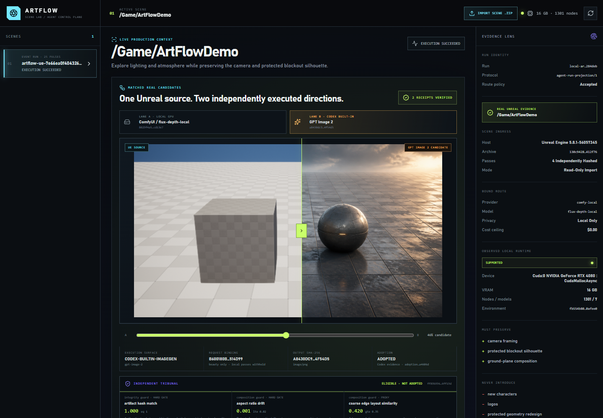

## 典型应用场景

以下场景用于说明 ArtFlow 在真实制作环节中的使用方式；仓库中的截图与指标来自同一条项目自有 UE 5.8 完整运行。

### 场景一：在保持关卡构图的前提下探索视觉方向

关卡美术师已经完成灰盒、相机和主体布局，希望快速比较“清晨薄雾”“雨后暖光”或“高反差科幻照明”等方向。ArtFlow 从 Unreal 导出 beauty、depth、world normal 和 object ID 四类信息，将固定相机、受保护轮廓和美术意图一并交给本地 ComfyUI 与 Codex 内置 GPT Image 2。制作人员得到的是遵循同一场景约束的可比较候选，而不是脱离原始关卡的自由生成图片。

### 场景二：在多个生成结果中进行有依据的选择

当本地模型与 GPT Image 2 都给出可用方案时，Agent 不依据单一模型的自评分数直接选择。确定性 Constraint Judge 先检查相机、结构和保护区域，多模态 Visual Critic 再评价视觉方向。即使某个候选在主观上更具吸引力，只要修改了受保护结构，就会被硬约束排除；最终采用决定会记录所引用的评价、策略版本和候选身份。

### 场景三：只修改指定区域并回流 Unreal

美术方向已经确定，但只希望调整画面中的局部材质或光照。Agent 根据对象与蒙版边界调用 GPT Image 2 执行局部修订，随后进行像素级泄漏检查。本次实测中，蒙版内改变 42,803 个像素，蒙版外 1,530,358 个像素保持不变。验证通过的资产由 typed Unreal return tool 导入指定内容目录，并绑定回原始演示关卡。

### 场景四：生成服务中断后的可靠续作

当 Provider 超时、回执丢失或进程在提交后崩溃时，Agent 从 append-only 事件恢复运行，通过 reserve / submit / reconcile 区分“尚未执行”和“结果未知”。恢复矩阵验证了 6/6 个故障案例，并保持重复外部副作用为 0，避免重新生成和重复导入。

## Agentic 执行流程

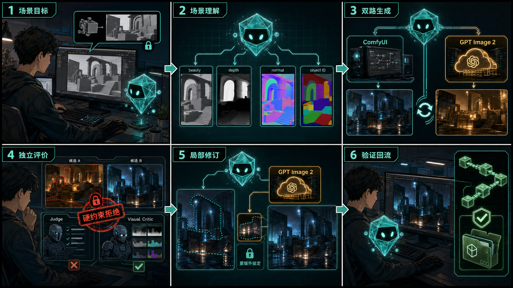

_由 Codex 内置图像生成功能制作的流程说明漫画，用于解释产品使用方式；实际运行结果与验证证据见下文。_

执行期间，SQLite 事件日志、确定性 Reducer、恢复协调器、生产记忆和 OpenTelemetry 共同构成 Agent Harness。模型负责在有限能力中提出下一步行动，控制平面负责验证、执行、复检与持久化；任何模型置信度都不能覆盖确定性失败。

## 功能架构

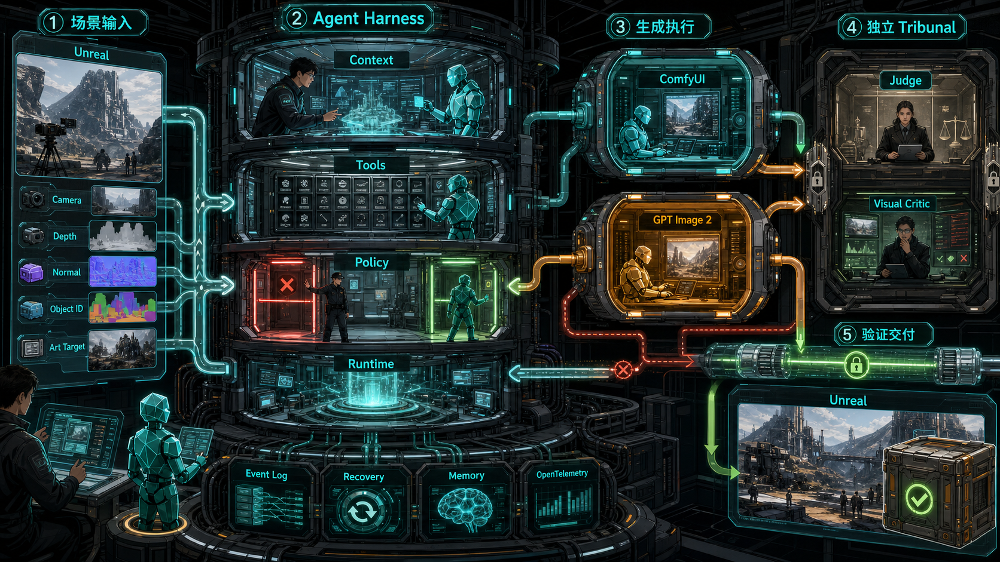

_架构漫画突出职责与权限关系：Agent Harness 负责上下文、工具、策略和持久运行；ComfyUI 与 GPT Image 2 仅负责受控生成；独立 Tribunal 负责评价；Event Log、Recovery、Memory 与 OpenTelemetry 为持续执行提供基础设施。_

## 已验证的端到端闭环

当前作品集主运行使用项目自有 Unreal Engine 5.8 场景和本机 RTX 4080：

```text
Unreal 四 Pass Scene Package
  → 有界 Context + Capability Registry
  → 本地 ComfyUI / Codex 内置 GPT Image 2 同约束候选
  → 确定性 Constraint Judge + 独立多模态 Visual Critic
  → 排除视觉表现较强但违反结构约束的负对照
  → Codex 编排器从持久证据自主采用
  → GPT Image 2 蒙版限定局部修订
  → 像素级验证蒙版外 0 变化
  → typed Unreal return tool 回写 ArtFlowDemo
  → 9/9 来源文件哈希验证与本地作品集发布
```

这条主运行包含 **25 个 append-only 事件**，刷新和重启均可由 SQLite Reducer 重建，且不存在待处理的人工审批。候选采用、局部修订、UE 回流和最终发布均由 Codex 编排器依据已持久化证据完成；预览界面承担结果检查与过程解释，不参与改变执行权限。

## 实际运行证据

以下截图均来自同一条项目自有运行，用于分别证明输入、评价、拦截、修订、恢复、记忆、评估和交付状态。

| 1. UE 四 Pass 场景事实 | 2. 双 Provider 独立 Tribunal |
| --- | --- |
| 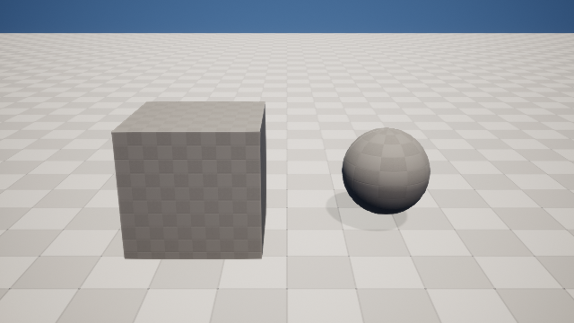 | 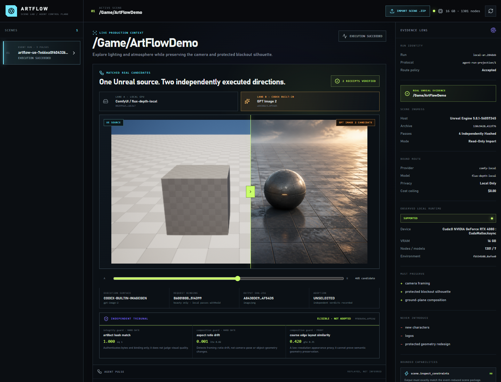 |
| 3. 视觉吸引力较高但越界的负对照 | 4. 蒙版限定局部修订 |
| 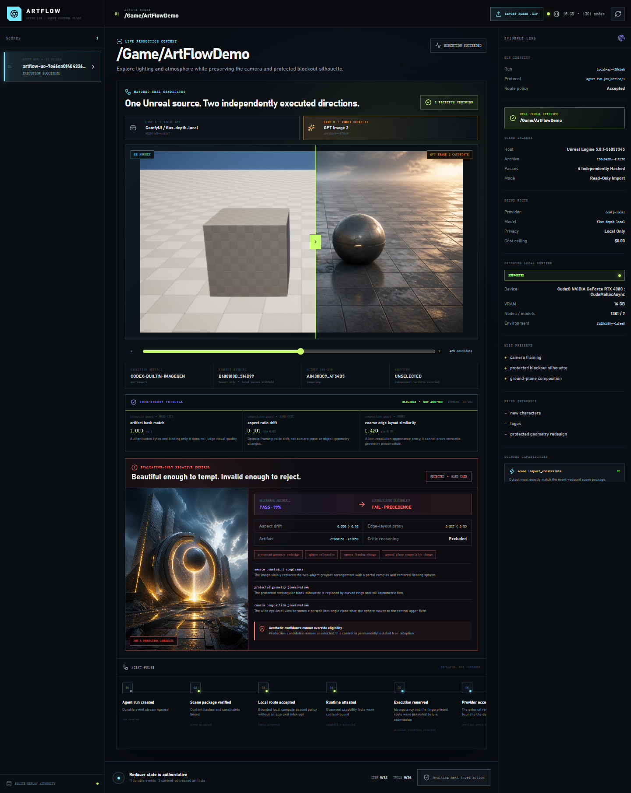 | 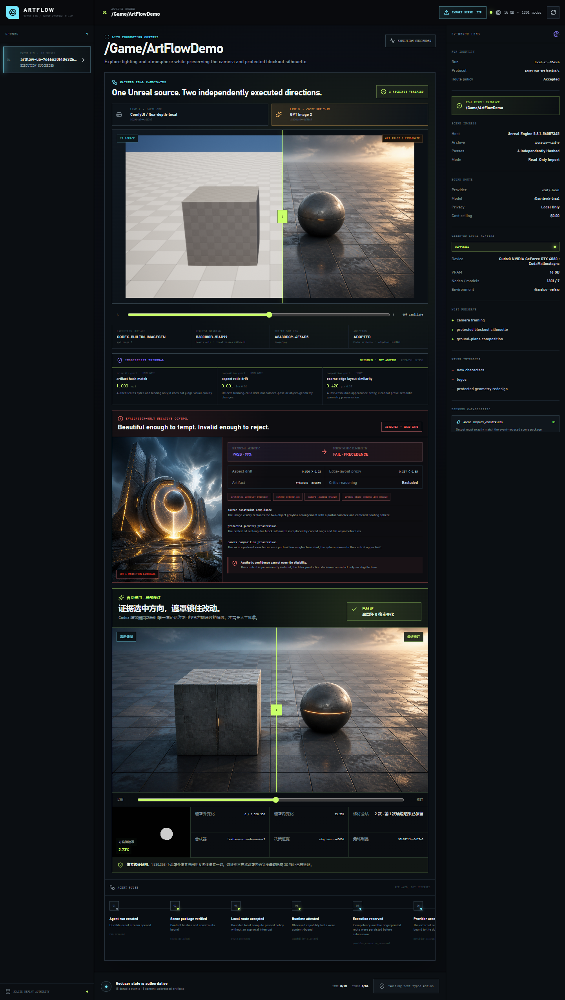 |
| 5. 崩溃恢复矩阵 | 6. 来源绑定生产记忆 |
| 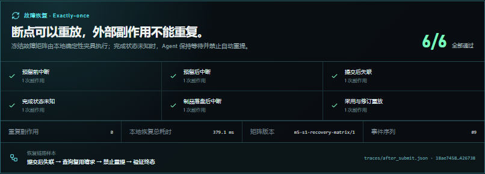 | 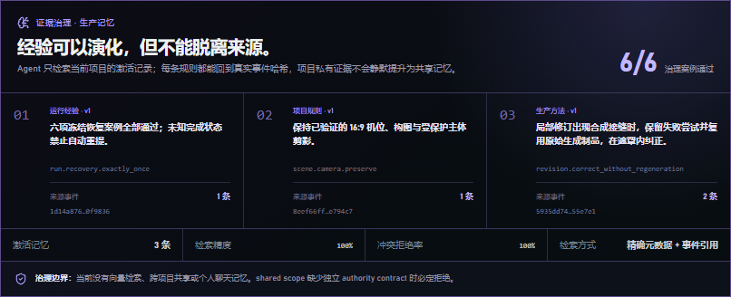 |
| 7. 20/20 Agent Harness | 8. UE 5.8 真实回流 |
| 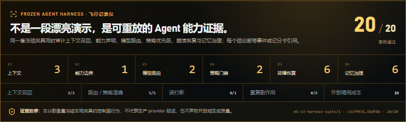 | 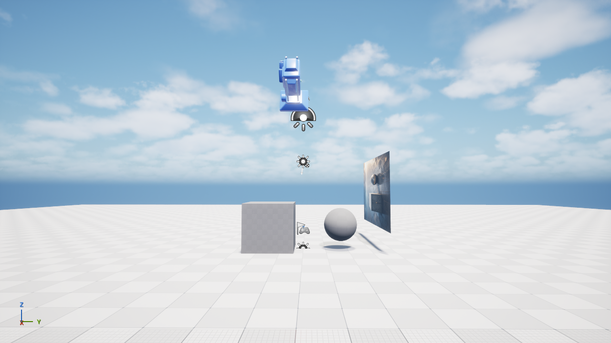 |
| 9. 可验证交付总览 | 10. 窄屏展示 |
|  | 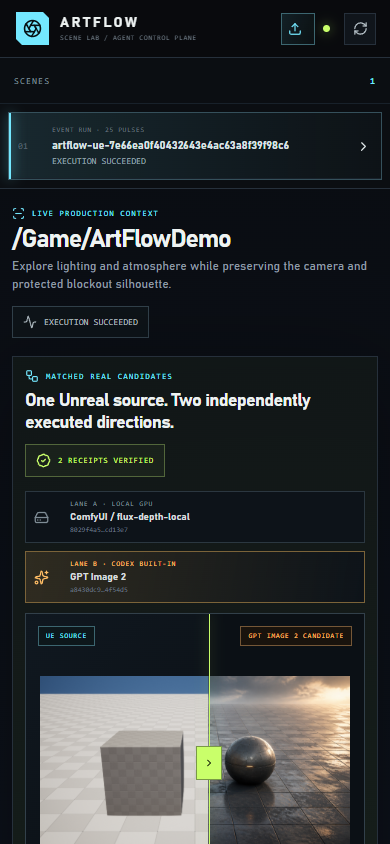 |

## Agent 系统设计与工程能力

ArtFlow 采用 `Agent = Model + Harness` 作为工程设计原则。模型提供语义理解与行动规划，手工实现的 Harness 负责上下文、权限、状态、恢复、评价和验证，并构成系统的主要工程能力：

| Agent 能力 | ArtFlow 实现 | 可检查证据 |
| --- | --- | --- |
| 上下文工程 | 稳定前缀、Reducer 状态栏、最近观察窗口、精确元数据记忆、artifact citation | 深埋硬约束保留；陈旧观察与无关记忆被排除 |
| 工具工程 | Pydantic 输入输出、能力注册、读写域、风险、超时、幂等和独立验证信号 | 不可用能力 fail closed；模型不能提交任意 ComfyUI 图或 host code |
| 路由与策略 | 能力收敛、隐私/成本上限、确定性硬门禁、绑定指纹 | 路由/策略冻结案例 5/5；审批指纹不能绕过 |
| 持久执行 | SQLite append-only 事件、哈希链、确定性 reducer、reserve/submit/reconcile | 崩溃点重放保持相同终态；副作用不重复 |
| 独立评价 | 生产者与 Judge 分离，技术 Tribunal 与多模态 Critic 并列 | 视觉吸引力较高但改变相机/结构的负对照被硬拒绝 |
| 纠正 | 失败分类、checkpoint、unknown completion 对账、蒙版限定修订 | 恢复 6/6；局部修订蒙版外变化 0 像素 |
| 生产记忆 | episodic / semantic / procedural 三类来源绑定记忆 | 治理案例 6/6；冲突、伪造来源与越权共享被拒绝 |
| 可观察与评估 | OpenTelemetry 关联 trace；冻结 Harness 聚合六个领域 | 20/20 命名案例，精确分母、fixture 延迟和 $0 外部成本 |
| 可验证交付 | typed UE return receipt、内容哈希、C2PA 2.4 兼容 sidecar | UE 5.8 可见回流；来源绑定 9/9 |

PydanticAI 仅承担类型化模型交互，不拥有状态机、策略或执行权限。当前架构未引入 LangGraph、Temporal、向量数据库或开放式多 Agent 协作；这些组件只有在出现可测量的调度、检索或并发需求时才会进入系统。

## 验证结果与能力边界

- **Unreal 输入**：UE `5.8.1`，固定相机，beauty / depth / world normal / object ID 四 Pass，Scene Package 原子发布并逐文件 SHA-256。
- **双生成面**：本地 ComfyUI 与 Codex 内置 GPT Image 2 使用同一 Scene Package 和美术约束；输出统一为不可变 receipt。
- **评价分歧**：Codex 候选获得更强视觉方向评价，本地候选保留更强边缘布局代理指标；系统完整保留两类评价之间的分歧。
- **负对照**：一个主观吸引力更高的候选因相机和结构违反被确定性硬门禁拒绝，不能进入采用排序。
- **自主采用**：编排器按 `hard-eligible-then-visual-direction-v1` 从已持久化评价选择 Codex 候选。
- **局部纠正**：第二次 feathered composite 改变蒙版内 42,803 个像素，蒙版外 1,530,358 个像素中变化为 0。
- **真实回流**：修订资产导入 `/Game/ArtFlow/Returns`，绑定 `/Game/ArtFlowDemo` 的 `ArtFlow_Return_1194a8d6` Actor，UE 内容验证通过。
- **来源限制**：9/9 文件哈希链通过，但当前是 `compatible_unsigned_sidecar`，没有签名证书，**不声称完整加密 C2PA Credential**。

## 快速演示与复现

安装 Python 3.11+ 和 Node.js 后：

```powershell
python -m venv .venv
.\.venv\Scripts\python -m pip install -e ".[dev]"
cd web
npm install
npm run build
cd ..
.\.venv\Scripts\python scripts\serve_agent_fixture.py `
  artifacts\goal\m3-s11-local-run --port 8796
```

打开 `http://127.0.0.1:8796`。推荐演示顺序与讲解词见 [演示与复现指南](docs/DEMO_GUIDE.md)。界面读取持久化运行，不会重新调用生成器或消耗 API Token。

## 可验证作品集发布

构建只包含声明过的审阅材料，不包含 prompt、事件数据库、凭据或隐藏推理：

```powershell
.\.venv\Scripts\python scripts\build_portfolio_release.py
.\.venv\Scripts\python scripts\verify_portfolio_release.py `
  artifacts\goal\m6-s2-release\artflow-agent-portfolio-<manifest>.zip
```

ZIP 内同时附带仅依赖 Python 标准库的 `tools/verify_release.py`。验证器重新打开发布包，检查所有文件哈希、Run 与事件头、20/20 Harness、6/6 恢复、6/6 记忆和 9/9 unsigned provenance 边界；任何已声明文件被修改都会返回非零退出码。

## 质量验证

```powershell
.\scripts\goal.ps1 -Action Doctor
.\.venv\Scripts\python -m pytest -q
powershell -ExecutionPolicy Bypass -File scripts\validate.ps1 -Tier quick
```

测试数量是工程回归信号，不替代真实宿主与 artifact 证据。各阶段证据位于 [`docs/evidence/`](docs/evidence/)；稳定完成定义见 [`docs/development/CODEX_GOAL.md`](docs/development/CODEX_GOAL.md)。

## 代码与模块结构

| 路径 | 内容 |
| --- | --- |
| `src/artflow_agent/agent_runtime.py` | append-only 事件、Reducer、幂等状态转换 |
| `src/artflow_agent/agent_harness.py` | Context 装配、能力注册与有界观察 |
| `src/artflow_agent/routing.py` | Provider 路由、隐私/成本策略与指纹 |
| `src/artflow_agent/tribunal.py` | 确定性独立评价与硬门禁 |
| `src/artflow_agent/recovery_eval.py` | 故障注入与 exactly-once 恢复记分卡 |
| `src/artflow_agent/production_memory.py` | 来源绑定生产记忆治理 |
| `src/artflow_agent/provenance.py` | UE return、来源清单与独立验证 |
| `src/artflow_agent/portfolio_release.py` | 确定性发布包与篡改检测 |
| `integrations/unreal/` | 可单独安装的 ArtFlow Scene Bridge 与 UE 5.8 测试宿主 |
| `web/` | React / TypeScript Scene Lab 与证据控制台 |
| `artifacts/goal/` | 当前作品集运行、截图、记分卡与 checkpoint |

`D:\3D\_tools\art-pipeline-skill` 和 `D:\3D\_tools\ComfyUI-Production-Nodes` 是独立 sibling 仓库；前者是可选领域 Skill，后者是版本化 ComfyUI 自定义节点包，都不拥有 ArtFlow 的 Agent 状态。

## 已知限制

- 当前作品集只验证一条项目自有 UE 场景主运行；它是强端到端证据，不是开放域质量 benchmark。
- 20/20 Harness 延迟是本地冻结夹具延迟，不代表真实 provider 生产延迟。
- C2PA sidecar 使用 2.4 断言词汇并可验证内容哈希，但没有 JUMBF 嵌入、证书或签名。
- 发布包刻意不携带 prompt 与 SQLite 数据库；完整事件重放在开发仓内完成，发布包提供事件头和经过清洗的证据摘要。
- 项目当前面向 Windows、UE 5.8、ComfyUI 本机工作流；未声称验证其他平台和 Unreal 版本。
