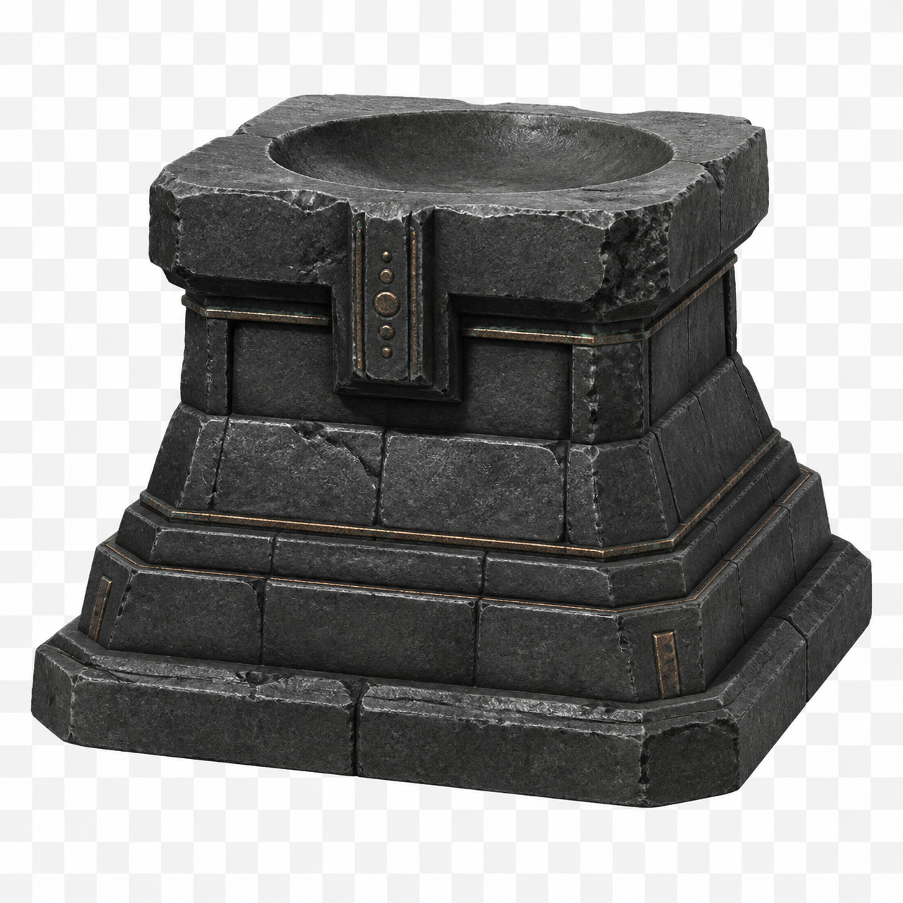
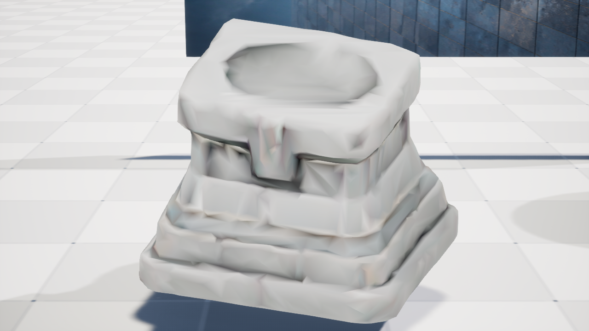

# M10-S2 图生 3D 与 Unreal Interchange 实机证据

## 结论

ArtFlow 已完成一条可替换的图生 3D 候选支线：项目自有概念参考经
`stabilityai/TripoSR` 生成 GLB，进入确定性预检，再由 Unreal Engine 5.8 Interchange 导入项目
隔离命名空间并放置到独立候选关卡。该支线没有获得规划、评价或发布权限；它只是 Agent 可以选择
的一种资产工具，服务不可用或候选被拒绝时，原有 `asset.catalog.query` 项目资产路线仍然成立。

| GPT Image 2 生成的项目自有参考 | UE 5.8 中的真实三维候选 |
| --- | --- |
|  |  |

右图是实际 GLB 在 UE 候选关卡中的几何结果，不是概念图贴片。当前 TripoSR 结果能够表达祭坛的
主体轮廓，但只带顶点色且缺少法线，UE 侧使用项目自有顶点色材质并生成法线，因此画面仍偏浅，
**不声称达到最终 PBR 资产质量**。后续可把已接纳网格接入现有 ComfyUI PBR 材质分支，或替换为
具备纹理生成能力的 provider，而不改变上层 Scene Delta 合同。

## Provider 选择

本切片目标是尽快证明真实边界，不做通用三维模型质量竞赛。调研后的选择如下：

- [TripoSR](https://github.com/VAST-AI-Research/TripoSR)：MIT，官方 Hugging Face Space 可匿名调用，
  适合用一个真实候选验证合同、许可证、GLB 检查和 UE 接入。
- [TRELLIS.2](https://github.com/microsoft/TRELLIS.2)：公开实现要求 Linux 且建议至少 24 GB 显存，
  不适合作为本机 RTX 4080 16 GB 的快速基线。
- [Hunyuan3D 2.1](https://github.com/Tencent-Hunyuan/Hunyuan3D-2.1)：形状与纹理能力更完整，但官方
  给出的 shape / texture 路径显存需求更高，适合作为后续高质量 provider，而非本切片依赖项。

本次固定官方 Space revision
`f84354eb350eb07a108faf33a6bc564d455f9764`，并将 MIT 文本及其 SHA-256 一同保存在证据目录。

## 真实运行链

```text
GPT Image 2 项目自有参考
  → provider-neutral generation request
  → TripoSR /preprocess + /generate（一次外部提交）
  → 内容寻址 GLB receipt
  → 无执行加载的 GLB 结构/预算检查
  → UE 5.8 Interchange 隔离导入
  → 项目自有材质 + 简单碰撞
  → 内容寻址候选关卡放置
  → 截图、回执与源关卡哈希复核
```

| 指标 | 实测结果 |
| --- | ---: |
| 外部提交 | 1 次 |
| 生成耗时 | 8.236468 秒 |
| 估算外部成本 | 0 美元 |
| GLB 大小 | 2,519,740 bytes |
| 导入前顶点 / 三角面 | 63,044 / 125,834 |
| UE 构建后顶点 / 三角面 | 2,413 / 4,817 |
| UE 材质槽 / 简单碰撞 | 1 / 1 |
| 候选最长边 | 179.9999998 cm |
| 重复外部副作用 | 0 |

导入前数字来自 GLB accessor；UE 数字来自 StaticMesh 构建结果，两者不是同一统计阶段，不能直接
当作“自动减面率”。候选资产位于
`/Game/ArtFlow/Generated/m10_86bcc31c4daa/`，场景位于
`/Game/ArtFlow/Staging/AF_M10_86bcc31c4daa`，没有写入源 `ArtFlowDemo`。

## 接纳门禁与负对照

预检直接解析 GLB header、chunk 和 JSON，不执行资产内脚本，也不跟随外部 URI。它记录格式、
扩展、POSITION accessor、边界、三角面、顶点、材质表示、法线策略、比例和文件预算。真实候选
通过当前策略；把三角面上限收紧到 100,000 后，同一 125,834 面输入被唯一理由
`triangle_budget_exceeded` 拒绝，拒绝发生在 UE 放置前。

真实导入请求重复执行返回 `reconciled`；候选放置同样按内容哈希对账。源关卡执行前后 SHA-256
均为 `620e481466b40de6dab569737ba782246f85b62a6123ea7e702102ed5d24974a`。

## 可复核文件

- `generation-request.json` / `generation-receipt.json`：provider-neutral 请求与真实回执。
- `glb-inspection.json` / `mesh-admission-policy.json`：接纳事实和冻结策略。
- `triangle-budget-rejection.json`：预算负对照。
- `unreal-admission-request.json` / `unreal-admission-receipt.json`：UE Interchange 请求与结果。
- `stage-receipt.json`：候选关卡放置、尺度、截图和源关卡不变证据。
- `verification.json`：独立复核汇总，SHA-256 为
  `9b59aa8443e21bb76b6ef7b88ada5a47dd0d049d7dd976416463572c71ee57bf`。

执行复核：

```powershell
uv run python scripts/verify_m10_s2_evidence.py
uv run python -m pytest tests/test_image_to_3d.py -q
```

这条证据证明的是“Agent 能把二维意图安全变成可审查的三维候选并接入 UE”，不是“单张图自动
得到可直接量产的最终资产”。质量提升属于 provider、材质和后处理分支；权限、审计、暂存和发布
仍由 ArtFlow 控制平面统一负责。
