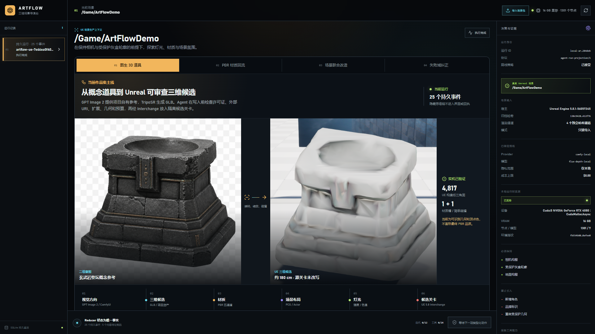
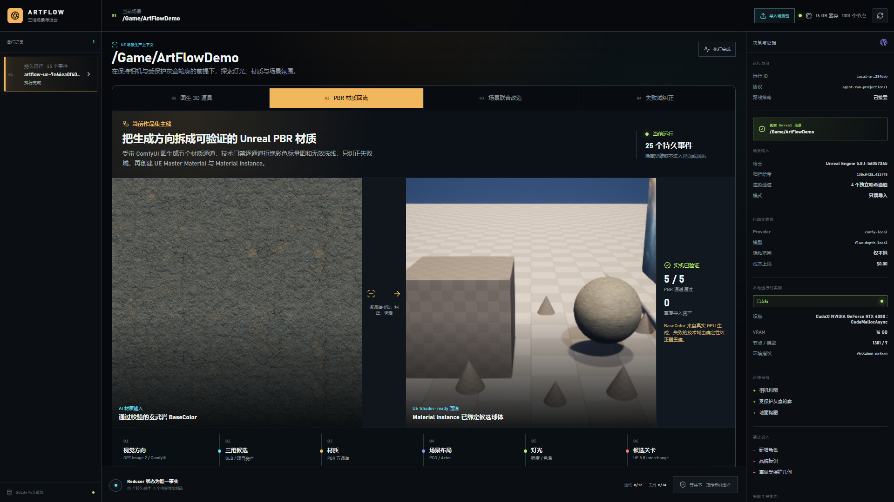
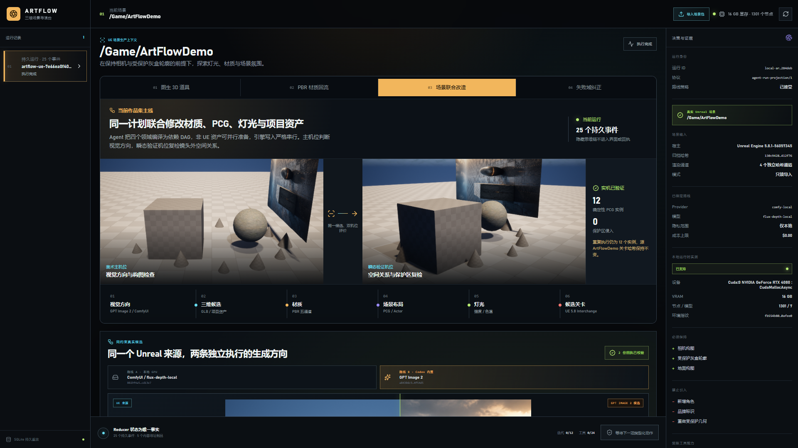
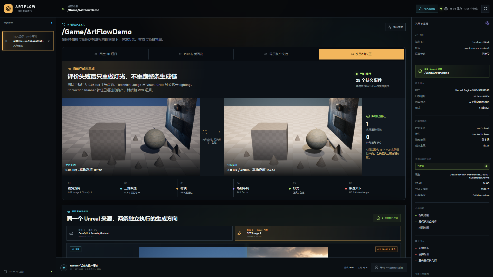
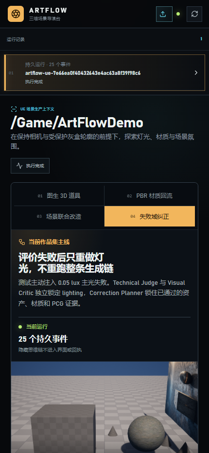

# M10-S3 中文 Scene Lab 与作品集发布证据

## 结论

M10-S3 已把 M8–M10 的真实运行证据收束为一版可直接展示的中文 Scene Lab。首屏提供四个可切换生产案例，候选采用、定向纠正与发布均由 Agent 依据持久证据负责；界面不再出现授权、批准或确认弹窗。

| 图生 3D 道具 | PBR 材质回流 |
| --- | --- |
|  |  |
| 四域场景联合改造 | 失败域定向纠正 |
|  |  |

窄屏证据：



## 产品案例与原始证据

| 案例 | 展示结论 | 原始证据 |
| --- | --- | --- |
| 图生 3D 道具 | 4,817 三角面、1 个材质槽、1 个简单碰撞；100,000 三角面负对照失败关闭 | `artifacts/goal/m10-s2-image-to-3d/verification.json` |
| PBR 材质回流 | 五个 PBR 通道通过；两次无效生成被拒绝；源关卡未改写 | `artifacts/goal/m8-s2-pbr-material/independent-verification.json` |
| 四域联合改造 | asset / material / PCG / lighting 四域均对账；12 个实例，保护区侵入 0 | `artifacts/goal/m9-s2-unreal-multi-domain/verification.json` |
| 定向纠正 | 只重跑 lighting；生成与导入外部重提 0；重复发布副作用 0 | `artifacts/goal/m9-s3-correction-release/verification.json` |
| MCP 互操作 | 3 个资源、4 个窄工具；4 类越权输入全部拒绝；任意执行面 0 | `artifacts/goal/m10-s1-mcp-facade/boundary-audit.json` |

这些数字由 `scripts/verify_m10_s3_scene_lab.py` 回查原始 JSON，并为五张截图计算 SHA-256。最终回执为 `artifacts/goal/m10-s3-scene-lab/verification.json`，状态为 `verified`。

## 浏览器验收

- 桌面案例截图：4 张，均为 1920×1080。
- 窄屏截图：430×932。
- 桌面与窄屏横向溢出：0 px。
- 控制台错误：0。
- `[role=dialog]` 与阻塞权限门禁：0。
- HTML 语言：`zh-CN`。
- 页面使用真实运行回执的只读投影，不会为展示重新调用 Provider。

## 独立发布包

- 归档：`artifacts/goal/m10-s3-release/artflow-agent-portfolio-2428f9ce692c32bf.zip`
- Manifest SHA-256：`2428f9ce692c32bfa62df18f043dd2407b4c453754533d7d1018f4f800acef17`
- 内容寻址文件：36/36。
- 项目验证器：通过。
- ZIP 内标准库验证器：通过；不依赖项目虚拟环境。
- 发布验证回执：`artifacts/goal/m10-s3-release/verification.json`。

发布包同时检查 Harness 20/20、恢复 6/6 且重复副作用 0、记忆治理 6/6、来源绑定 9/9，以及 M8–M10 五项生产能力。图生 3D 路线仍明确标记为实验性顶点色几何，不宣称最终生产 PBR 品质；C2PA 仍是可验证哈希链与 unsigned sidecar，不宣称具有签名证书。

## 复现命令

```powershell
npm --prefix web run build
python scripts/serve_agent_fixture.py artifacts/goal/m3-s11-local-run --port 8796
python scripts/verify_m10_s3_scene_lab.py
python scripts/build_portfolio_release.py
python scripts/verify_portfolio_release.py `
  artifacts/goal/m10-s3-release/artflow-agent-portfolio-2428f9ce692c32bf.zip
```
