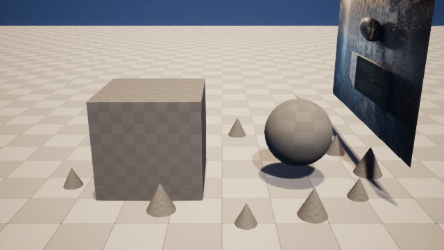

# M12-S2 类型化候选关卡执行与重启对账

## 交付结果

ArtFlow 现可把持久 Scene Session 编译为 `artflow-scene-candidate-plan/1`。计划从已经校验并进入
事件账本的 Scene Digital Twin 读取目标 Actor、PCG 组件、受审图、源指纹和源关卡身份，只为当前
注册的 `unreal.pcg.layout.apply` 与 `unreal.lighting.rig.patch` 生成有界参数。任意工具名、未知域、
越界参数、陈旧指纹和越出 `/Game/ArtFlow/Sessions/` 的目标都会在场景写入前失败关闭。

UE 依据请求派生目录复制源关卡，再执行固定 PCG 图和灯光补丁。源 Actor GUID 在复制前验证；
Unreal 为候选副本重新生成 Actor GUID 后，执行器通过唯一标签、组件类型、受保护语义指纹和最终
参数完成派生对象映射，不错误要求候选 GUID 等于源 GUID。

## 真实 UE 5.8 结果

```text
Candidate Plan：8d9643cd0a5a9ebab138ce78ed0027b67804c591658e8354e459dee13eed3853
Stage Request：5e39f4fb72dc51f4ecd930b2e753465aa19aec67996625314a96b1ddacf9de2e
候选关卡：/Game/ArtFlow/Sessions/AF_784907467248/Candidates/C_5e39f4fb72dc
候选关卡 SHA-256：8003c9a2b91292ef7a7338f67b6437eb325d9b26af9531494c0336983262b480
PCG 实例：12
源关卡 SHA-256（前/后）：620e481466b40de6dab569737ba782246f85b62a6123ea7e702102ed5d24974a
首次执行：reconciled=false
新 UE 进程恢复：reconciled=true
```

| 源关卡同机位 | 请求派生候选关卡 |
| --- | --- |
|  |  |

## 聚焦验证

```text
Ruff：All checks passed
Python focused：16 passed
UnrealBuildTool：Succeeded
真实执行：success=true, reconciled=false, generated_instance_count=12
进程重启对账：success=true, reconciled=true, generated_instance_count=12
源关卡字节变化：0
```

## 证据

- `artifacts/goal/m12-s2-live-candidate-v2/scene-handshake-receipt.json`
- `artifacts/goal/m12-s2-live-candidate-v2/candidate-execution-receipt.json`
- `artifacts/goal/m12-s2-live-candidate-v2/candidate-execution-proof.log`
- `artifacts/goal/m12-s2-live-candidate-v2/source-beauty.png`
- `artifacts/goal/m12-s2-live-candidate-v2/candidate-beauty.png`

## 证据上限

证据证明当前项目自有 UE 5.8 场景可以执行 Session 派生的 PCG 与灯光计划，保存隔离候选、回渲并
在新进程中对账同一结果，不重复生成实例且不改变源关卡。它不证明 image、material 或 asset 域
已经由这份新计划执行，也不表示候选已经通过视觉评价或发布。
