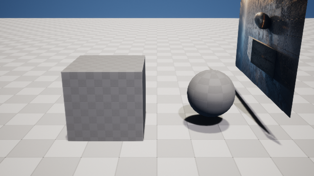
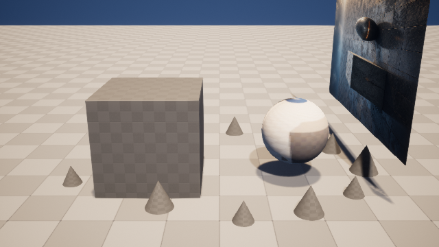
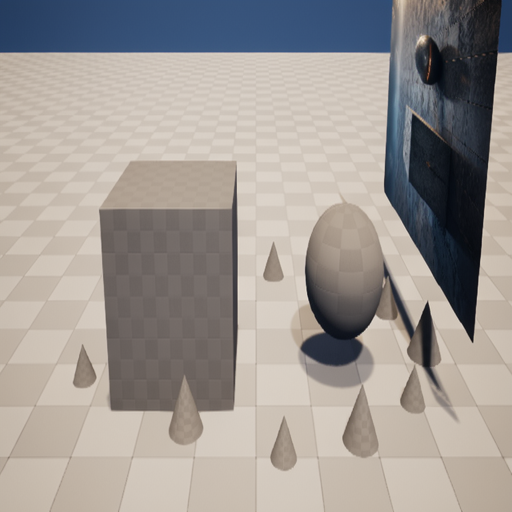
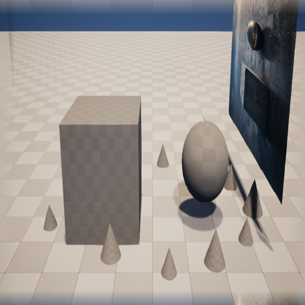
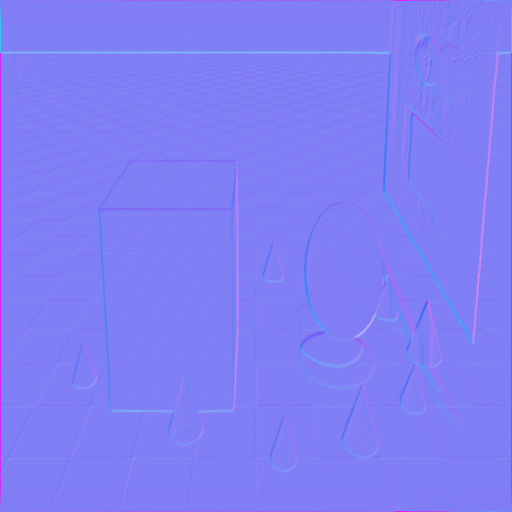

# M13-S1：雨湿庭院跨管线候选

本切片把材质、项目资产、PCG 与灯光从四段历史演示收敛为同一份内容寻址 Candidate Plan，
并在真实 UE 5.8 候选关卡执行。源关卡未发布、未覆盖。

## 可见结果

| 源关卡同机位 | 跨管线候选同机位 |
| --- | --- |
|  |  |

| ComfyUI 原始 BaseColor | 通过验证的周期化 BaseColor | DirectX Normal |
| --- | --- | --- |
|  |  |  |

## 真实管线

- 隔离 ComfyUI `0.28.0` 运行于 RTX 4080；当前 `/object_info` 观测 826 个节点。
- `ComfyUI-Production-Nodes` 固定在 `d102528b8f2418b98551eeb9aa3841116206a61c`；受审图、
  节点 Schema 和模型槽位均由能力快照封存。
- 真实 Provider prompt id 为 `8fc86ed6-225c-404d-980c-bb451987188a`，五通道生成耗时
  `23.094s`。
- 原始技术图因非灰度标量图、错误法线语义和边缘不连续被拒绝。纠正器保留生成纹理的内部主体，
  周期化边缘，并从同一高度代理派生空间对齐的 Normal、Roughness、Metallic 与 AO；最终 5/5 通过。
- UE 导入 5 个 Texture2D、1 个 PBR Master 和 `MI_RainWetCourtyard`，随后 Candidate Plan 串行绑定
  该材质、项目自有 `SM_ArtFlowRock`、固定 PCG 图和 4200K 主光。

Candidate Plan `candidate-plan-02234449a4d7` 的四个注册操作都引用明确的能力快照、生成回执、
UE 导入请求、Actor 指纹和项目资产字节哈希。它不包含 ComfyUI 任意图、Python 或 Shell。

## 独立评价与恢复

- Technical Judge：材质实例匹配、项目资产集合匹配、PCG `12/64`、灯光 `5.5 / 4200K`、
  保护对象存在，全部通过。
- Visual Critic：同尺寸、同机位平均绝对变化 `13.395890`，保护区代理变化 `10.858383`，通过。
- 新 UE 进程对同一计划返回 `reconciled=true`，实例仍为 12，没有再次调用 ComfyUI 或重复导入。
- `ArtFlowDemo.umap` 前后 SHA-256 均为
  `620e481466b40de6dab569737ba782246f85b62a6123ea7e702102ed5d24974a`。

本切片未发布候选，也未声称当前像素代理等同于开放域多模态美术评价。下一切片将使用另一条图像
能力路线完成第二个生产案例，并注入单域失败，验证只纠正失败领域。
