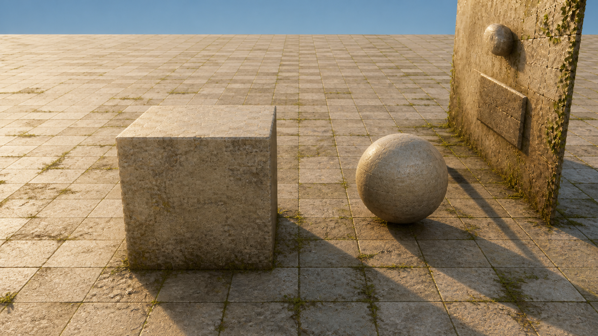
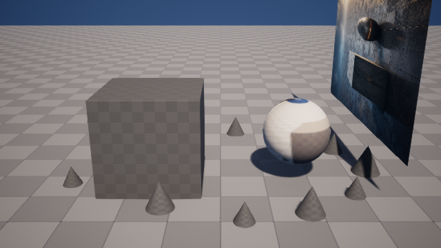
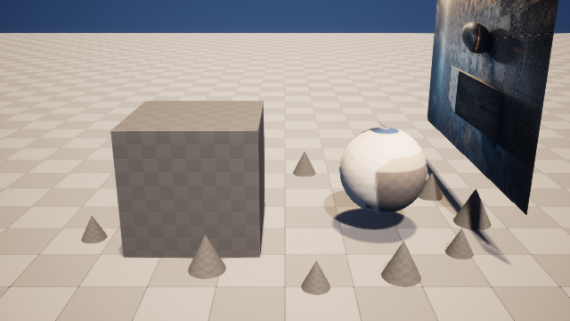

# M13-S2：晴光庭院图像目标与单域纠正

本切片使用 Codex 内置图像生成能力建立第二条生产路线，并在同一 Scene Session 候选中验证
“只纠正失败域”。候选没有发布，也没有覆盖源关卡。

## 可见结果

| GPT Image 2 视觉目标 | 故意失败的 UE 候选 | 只修正光照后的 UE 候选 |
| --- | --- | --- |
|  |  |  |

## 图像目标绑定

内置图像生成采用编辑模式，以 M13-S1 的 UE 源机位为参考。提示词要求保持 16:9 相机、地平线、
物体数量、位置、比例与灰盒轮廓，只允许低角度暖阳、风化石材和少量苔藓/藤蔓变化，并禁止文字、
界面元素和水印。生成结果为 `1672 × 941` PNG，SHA-256 为
`2b075863f65211642080ad62cf2c931bc8cf5f9e1301d762ea038a05a823c517`。

`codex-image-target-receipt.json` 同时绑定源回渲哈希、目标图哈希、Scene Package、保持项和用途；
它只作为 visual target，不直接拥有 Unreal 写入权限。

## 故障分类与纠正

- 初始五操作 Candidate Plan 包含 image target、已验证 PBR、项目资产集、PCG 和 lighting。
- 为验证纠正范围，lighting 被故意设为 `0.05 / 6500K`；其余四个操作沿用已验证内容身份。
- Technical Judge 确认材质路径、项目资产集合、12 个 PCG 实例、保护对象和源关卡哈希均正确。
- Domain Evaluation 只返回 `failed_domains = ["lighting"]`，没有把视觉偏差误判为图像、资产或 PCG 失败。
- Correction Plan 的 `rerun_domains` 与 `failed_domains` 严格相等，只允许调用
  `unreal.lighting.rig.patch`，将主光改为 `5.5 / 4200K`。
- 补丁执行前后材质路径、12 个实例、保护对象状态和源关卡哈希完全相同。
- 新 UE 进程以修正后的五操作计划对账，返回 `reconciled=true`，没有再次生成 PCG 或提交外部 Provider。

修正前后图像、材质、资产和 PCG 四个成功域的 evidence SHA-256 均逐项一致。画面平均亮度从
`120.040` 恢复到 `156.717`；源 `ArtFlowDemo.umap` 前后 SHA-256 均为
`620e481466b40de6dab569737ba782246f85b62a6123ea7e702102ed5d24974a`。

## 关键证据

- `failure-domain-evaluation.json`：唯一失败域为 lighting；
- `lighting-correction-plan.json`：唯一重跑域为 lighting，并引用四个保留证据哈希；
- `lighting-correction-receipt.json`：真实补丁从失败值写到目标值；
- `lighting-correction-reconcile-receipt.json`：当前内容绑定请求再次运行时只完成对账；
- `corrected-execution-receipt.json`：UE Session Candidate 新进程对账；
- `corrected-domain-evaluation.json`：五个领域全部接受；
- `ui-case-rain.png`、`ui-case-sunlit-correction.png`、`ui-narrow-sunlit-correction.png`：
  当前中文 Scene Lab 的桌面与窄屏实测截图。

该证据只说明固定项目场景中的类型化编排、定向纠正和幂等对账，不把单一演示场景包装为开放域
视觉质量基准。
