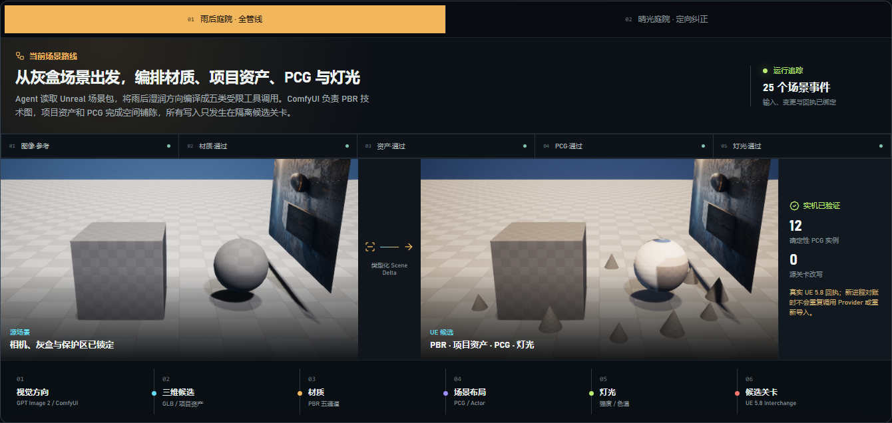
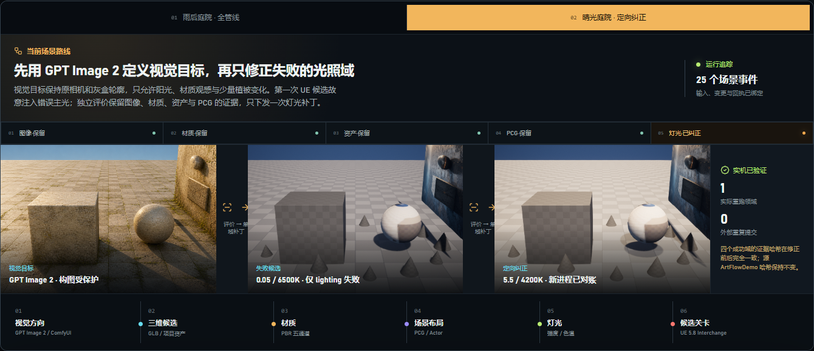

# M14-S1：审阅者启动路径与作品集发布

本切片把 M13 的真实能力收口为可从 GitHub 全新 clone 启动、可独立验证的中文作品集交付，不再
依赖开发机已有的 `node_modules`、`.venv`、浏览器会话或被忽略的运行目录。

## 当前展示

| 雨后庭院全管线 | 晴光庭院定向纠正 |
| --- | --- |
|  |  |

README 首屏、Scene Lab 与五分钟讲解统一使用这两条当前案例。历史 Harness、MCP、图生 3D 和
来源验证仍作为底层工程证据保留，但不再占据对外产品开场。

## 一键启动

仓库根目录新增：

```powershell
.\scripts\start_showcase.ps1
```

脚本按依赖顺序完成前端依赖、`web/dist`、Python 虚拟环境、项目安装和本地服务启动；任一步失败
都会返回非零退出码。首次实现使用 `uv run` 自动建环境，在干净 clone 中暴露了 Windows PE 资源
安装边缘问题；最终实现改用标准 `venv + pip`，并把前端构建前置，避免 Hatchling 的 forced include
找不到 `web/dist`。

全新本地 clone `f370694` 实测：

- `npm ci`：34 个包，0 vulnerabilities；
- Vite production build：1804 modules transformed；
- 新 `.venv` 完成项目及运行依赖安装；
- `/api/agent/runs` 返回 HTTP 200；
- `/api/showcase/production/m13-sun-target` 返回 HTTP 200，`X-Content-SHA256` 为
  `2b075863f65211642080ad62cf2c931bc8cf5f9e1301d762ea038a05a823c517`。

## 发布包

- 归档：`artifacts/goal/m14-s1-release/artflow-agent-portfolio-29eb651ceec19a82.zip`；
- ZIP SHA-256：`280b6f96e91e9b1cfd79673149e0f5cd5cf4351716870d019628454f72ba2a6e`；
- Manifest SHA-256：`29eb651ceec19a82a4f1410d99cc7ff7b3f752a7e318325840018db52e11447d`；
- 声明文件：49 / 49；
- 项目验证器：passed；
- ZIP 内标准库独立验证器：passed。

发布包包含当前 README、演示指南、Unreal 集成说明、两条 M13 证据、计划/评价/UE 回执和桌面/
窄屏截图。它明确排除 prompt、凭据、SQLite 事件数据库、隐藏推理和候选运行时。仓库自身包含一份
固定的展示 fixture，使 clean clone 可以运行只读 Scene Lab；该 fixture 不进入发布 ZIP。
