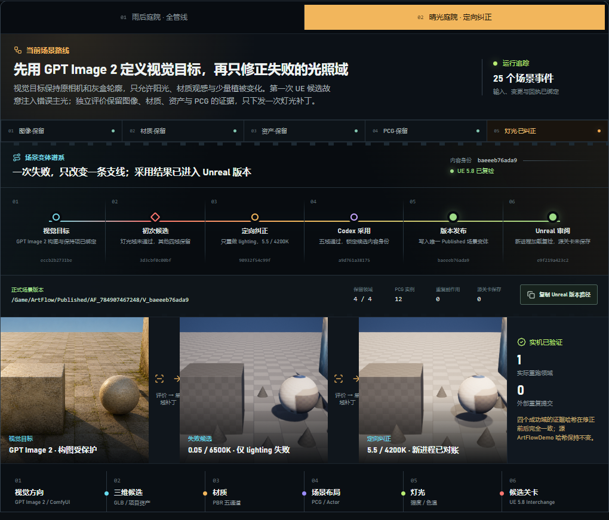
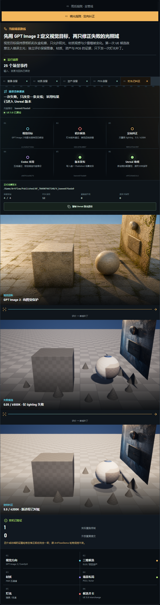

# M16-S1 · 场景变体谱系与 Unreal 审阅交接

## 产品结果

晴光庭院案例现在从视觉目标一直呈现到 Unreal 正式版本，六段谱系均来自冻结回执：

1. GPT Image 2 视觉目标；
2. 仅 `lighting` 失败的初次候选；
3. 保留四域证据的定向纠正；
4. Codex 基于五域评价作出的采用决定；
5. 内容寻址 Published 场景版本；
6. 独立 UE 5.8 进程的场景审阅与新进程对账。

Scene Lab 使用连续胶片与领域光谱表达这条关系。桌面界面保留单行时间关系，窄屏改为 3×2
折返谱线，六个状态均直接可见，不依赖横向滚动。

## Unreal 审阅边界

审阅请求绑定发布请求、采用决定、内容身份、Published 关卡哈希、源关卡哈希和三个技术事实。
宿主入口只在当前打开关卡与请求中的精确 Published 路径一致时继续执行；它不接收任意场景路径，
不调用 Provider，也不保存源关卡。

两次独立 UE 5.8.1 进程结果：

| 项目 | 首次进程 | 新进程 |
| --- | --- | --- |
| 审阅状态 | `inspected` | `reconciled` |
| Published 关卡哈希 | `88177f…e1cf2` | 相同 |
| PCG 实例 | 12 | 12 |
| 源关卡保存 | 0 | 0 |
| 源关卡哈希变化 | 0 | 0 |

新进程根据项目 `Saved/ArtFlowSceneBridge/PublishedReview` 中的固定审阅身份完成对账，但仍重新
加载和检查 Published 关卡，没有把旧回执直接当成当前场景事实。

## 界面验收

| 目标 | 结果 |
| --- | --- |
| 桌面视口 | 1600 × 1000；页面横向溢出 0 |
| 窄视口 | 720 × 1200；页面横向溢出 0 |
| 窄屏谱系 | 6 / 6 可见；内部横向溢出 0 |
| 浏览器控制台 | 0 error，0 warning |

窄屏实测图：

## 冻结证据

- `artifacts/goal/m16-s1-variant-lineage/review-request.json`
- `artifacts/goal/m16-s1-variant-lineage/review-receipt.json`
- `artifacts/goal/m16-s1-variant-lineage/review-reconcile-receipt.json`
- `artifacts/goal/m16-s1-variant-lineage/lineage.json`
- `artifacts/goal/m16-s1-variant-lineage/verification.json`

本切片没有重新运行 GPT Image、ComfyUI、材质生成、PCG 或发布；它把已有真实执行结果接入了
产品表面，并新增了严格限定的 Unreal 版本审阅动作。
