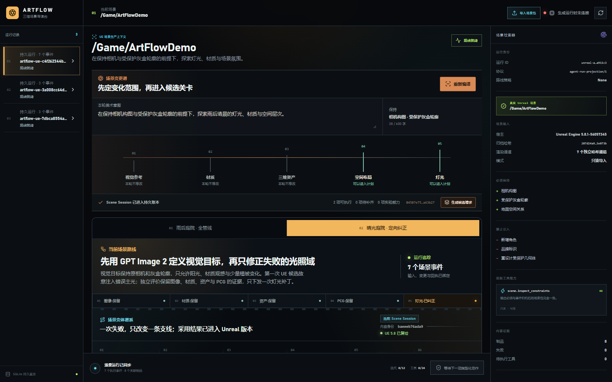
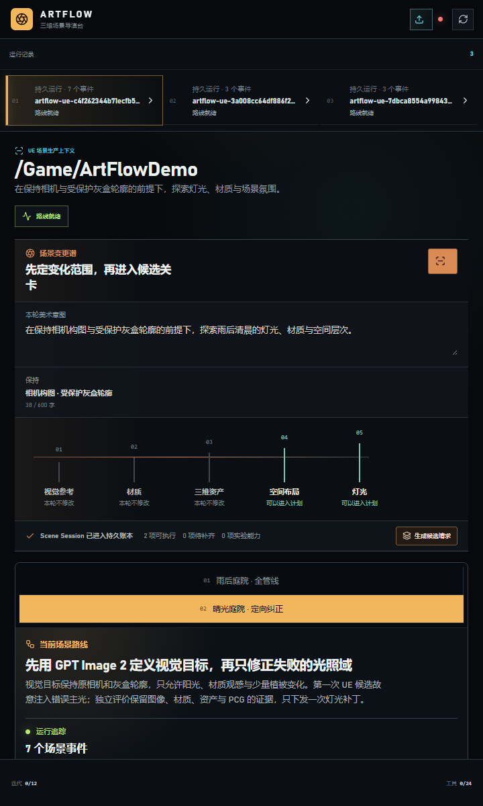

# M17-S1 · 实时场景变体生命周期

M12 的编辑器 Scene Session、M13 的候选评价、M15 的采用与发布，以及 M16 的 Unreal 审阅现已进入同一条 append-only Agent 事件流。当前运行可以从 SQLite 重放评价、采用、发布、审阅和六段场景变体谱系，不再以冻结展示 JSON 作为权威状态。

## 实现结果

- 新增 `scene_candidate_evaluated`、`scene_candidate_adopted`、`scene_variant_published`、`scene_variant_reviewed` 四类事件；
- 每个事件校验 Run、Scene Session、Stage Request、Candidate Plan、Evaluation、Decision、Publish 与 Review 身份；
- 相同 action id 与相同内容重复提交只保留一条事件；相同 action id 换内容返回冲突；
- 仅回环接口 `/api/agent/runs/{run_id}/scene-variant-lifecycle/m16` 读取项目注册的 M12–M16 制品，不接收本地路径；
- `AgentRunProjection.scene_variant_lineage` 成为实时界面的首选数据源，冻结谱系仅在当前运行没有生命周期时标记为“作品演示数据”。

## 回放与界面证据

目标运行重放后共 7 个事件，其中 4 个为场景变体生命周期事件。重复注册后的谱系完全一致，Published 版本为 `/Game/ArtFlow/Published/AF_784907467248/V_baeeeb76ada9`，PCG 实例为 12。

| 桌面 1600 × 1000 | 窄幅 720 × 1200 |
| --- | --- |
|  |  |

两种尺寸均显示“当前 Scene Session”，页面与谱系横向溢出为 0，控制台错误与警告为 0。

## 复现

```powershell
uv run python scripts/capture_m17_lifecycle.py
uv run python -m pytest -q tests/test_scene_variant_lifecycle.py
```

结构化结果位于 `artifacts/goal/m17-s1-live-lifecycle/verification.json`，重放数据库与完整投影位于同一目录。
