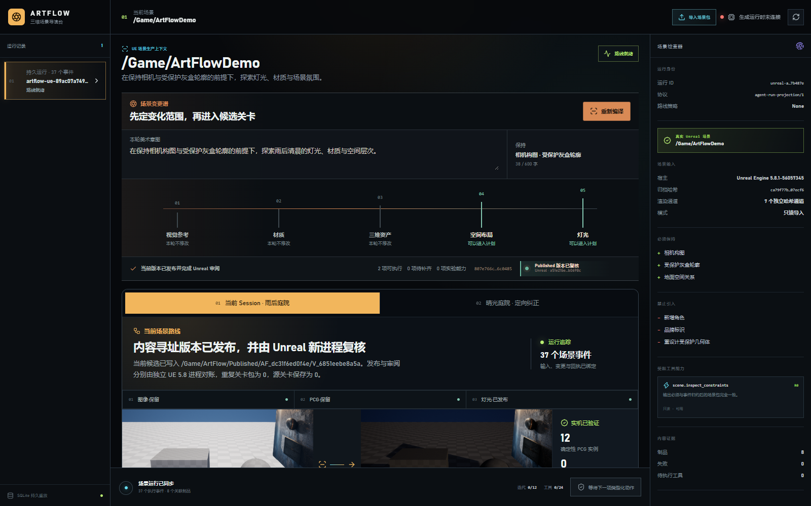
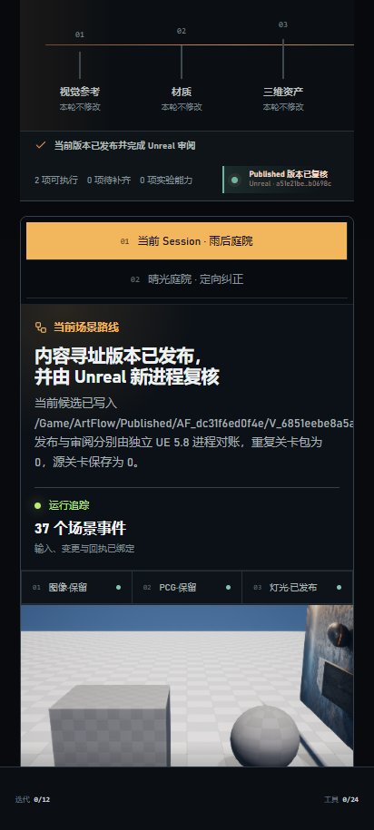

# M21-S1 · 当前 Scene Session 发布与 Unreal 复核

## 结果

当前 Scene Session 的事件 35 已采用精确纠正候选。ArtFlow 从这条持久决定、accepted 评价、灯光纠正回执和候选文件字节编译发布请求；调用方不能传入候选路径、发布路径或审阅目标。

UE 5.8.1 首次写入内容寻址关卡：

`/Game/ArtFlow/Published/AF_dc31f6ed0f4e/V_6851eebe8a5a`

新的 UE 进程随后返回 `reconciled`，没有创建第二个包。另两个进程只加载该 Published 版本，依次返回 `inspected` 与 `reconciled`。事件 36、37 将发布和审阅追加到原 Scene Session；实时投影的 `case_id` 为 `current-session`。

| 场景导演台 | 窄屏发布状态 |
| --- | --- |
|  |  |

## 宿主事实

- Published 文件 SHA-256：`a51e21be6b83365a85d00725ae6a237aaaad432f0c2101e270c23625eab0698c`；
- 源 `ArtFlowDemo.umap` 前后 SHA-256：`620e481466b40de6dab569737ba782246f85b62a6123ea7e702102ed5d24974a`；
- 保护结构指纹：`18fe1bae0b9317874f613368c7de1d93fb6f9b7f225f33487669976578b07733`；
- PCG 实例：12；重复关卡包：0；源关卡保存：0；
- 发布状态：`published → reconciled`；审阅状态：`inspected → reconciled`；
- 五个进程与日志索引见 `host-runs.json`。第一次负对照在写入前因保护指纹语义不一致被拒绝，没有产生包或事件；合同统一后才执行真实发布。

## 机器证据

- `artifacts/goal/m21-s1-current-publish/verification.json`：冻结汇总；
- `live-projection.json`：37 个事件重建的完整实时投影；
- `publish-created-receipt.json`、`publish-reconciled-receipt.json`：发布与新进程对账；
- `review-inspected-receipt.json`、`review-reconciled-receipt.json`：精确版本审阅；
- `publish-*.log`、`review-*.log`：UE 5.8.1 宿主日志；
- `scripts/capture_m21_current_publish.py`：只读回查与哈希验证入口。

聚焦验证覆盖当前发布/审阅合同、非法身份、首次回执与幂等重放；前端完成 TypeScript/Vite 构建，并在 1600×1000 与 412×915 下检查零坏图、零控制台错误和零横向溢出。
