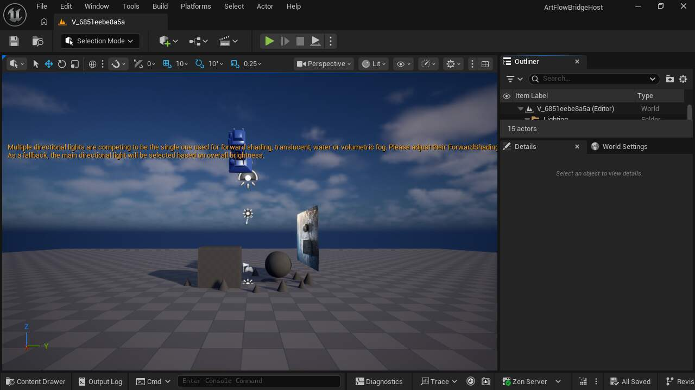

# M22-S2 · Unreal 重启后的 Session 恢复

ArtFlow Scene Bridge 1.2.1 在项目 `Saved/ArtFlowSceneBridge/CurrentSession.json` 中原子保存当前 Scene Session 指针。该指针只引用已经落盘的握手回执；恢复时重新核对活动源关卡、源关卡 SHA-256、localhost Origin、Run 身份与 Session 身份。

新的 UE 5.8.1 进程未接收 `ArtFlowCurrentVariantRun` 或 `ArtFlowEndpoint` 参数，仅从 `/Game/ArtFlowDemo` 启动并执行注册审阅动作。进程 29904 恢复 Run `unreal-artflow-ue-89ac07a74988b8dd2fca9295e141a6fd-ca79f77b487e`，随后打开精确 Published 版本并成功对账。源关卡哈希仍为 `620e481466b40de6dab569737ba782246f85b62a6123ea7e702102ed5d24974a`。

公开 `Tools > ArtFlow` 菜单现只注册四个产品入口：启动任务、执行候选或纠正、发布当前版本、审阅当前 Published 版本。旧的“仅导出场景包”和“查看最近导出”不再暴露。

本切片只执行一次编译、一次成功恢复闭环与既有目标状态校验，没有扩展通用测试矩阵。
