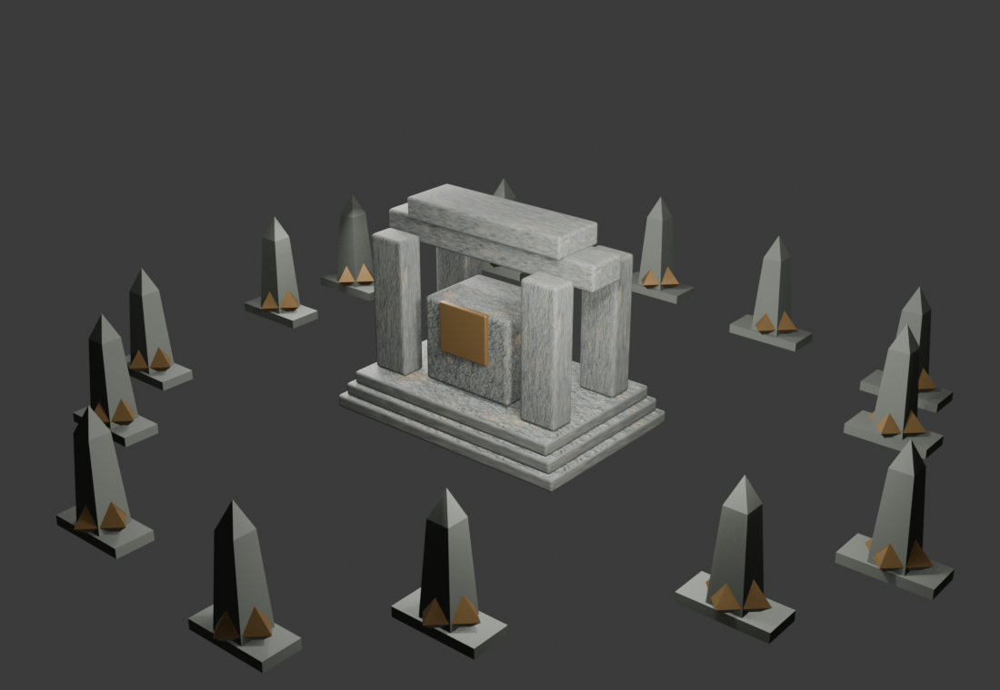
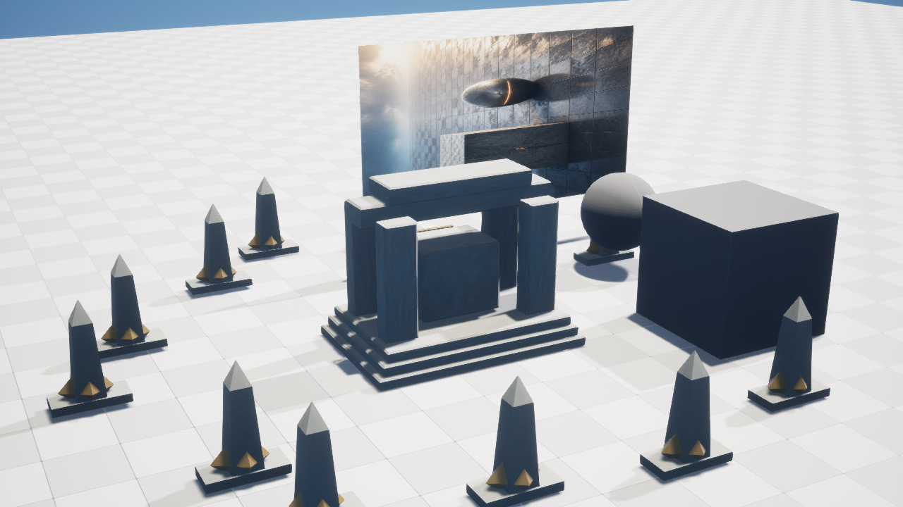

# M23-S4 · Geometry Nodes 多资产布局与 Unreal 回流

当前 Scene Session 的空间范围被编译为 `artflow-blender-geometry-layout-request/1`。固定能力 `blender.geometry_nodes.shrine_courtyard.v1` 在 Blender 5.2 LTS 中建立可编辑节点组 `AF_GN_ShrineCourtyard_v1`，通过三个原型和确定性点集生成祭坛庭院支撑组合；引擎交换阶段再实现实例并与已有 PBR 主资产合并。

| Blender Geometry Nodes 预览 | Unreal 候选关卡 |
| --- | --- |
|  |  |

| 阶段 | 真实结果 |
| --- | --- |
| Blender 宿主 | 5.2.0 LTS |
| 节点组 | `AF_GN_ShrineCourtyard_v1` |
| 布局参数 | 14 个支撑组合、3 个原型、580 cm 半径、Session 派生 seed `1546778350` |
| Geometry Nodes 实现几何 | 322 顶点、476 三角面 |
| 组合边界 | 1143.067 × 1104.458 × 293.249 cm |
| 引擎交换 | 嵌入贴图 GLB，5,954,684 bytes |
| Unreal StaticMesh | 2,084 顶点、934 个构建三角面、3 个材质槽、1 个简单碰撞 |
| 候选关卡 | `/Game/ArtFlow/Sessions/AF_dc31f6ed0f4e/Candidates/Blender_B_add8b6794d46` |
| 第二次执行 | `reconciled`，重复副作用 0 |
| 源关卡 | SHA-256 前后均为 `620e481466b40de6dab569737ba782246f85b62a6123ea7e702102ed5d24974a` |

项目自有 Unreal GUI 进程 PID 46196 完成资源导入与候选放置；第二个 PID 36496 对账相同内容身份并完成异步截图。两个进程启动前均无其他 UnrealEditor，结束后自行退出。没有重跑 ComfyUI、PBR 装配、PCG 或灯光任务。
