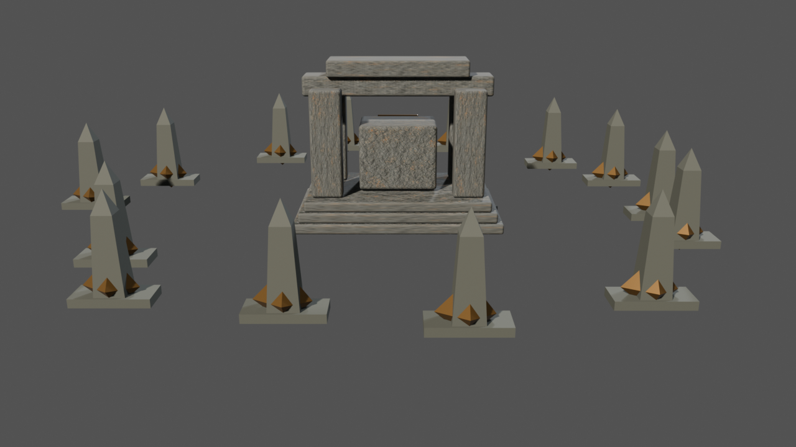
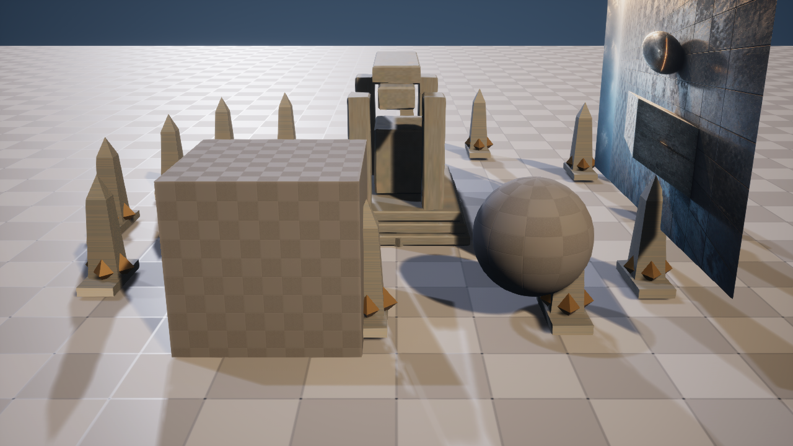

# M23-S5 · Unreal ↔ Blender 相机灯光交换

当前 Scene Session 的 Unreal 相机、镜头与两盏登记灯光被导出为 `artflow-unreal-camera-light-source/1`，再与 Geometry Nodes 候选身份共同编译为 `artflow-blender-shot-request/1`。固定能力 `blender.shot.rain_breakthrough.v1` 在 Blender 5.2 LTS 中重建同一相机关系，完成 key / fill / rim 三点灯光预演，并只把这三组有限参数回填到新的 Session 派生 Unreal 候选。

| Blender 同机位预演 | Unreal 隔离候选回填 |
| --- | --- |
|  |  |

| 阶段 | 真实结果 |
| --- | --- |
| Unreal 源相机 | `ArtFlow_Camera`，位置 `[-900, 0, 420] cm`，水平 FOV `55°` |
| Blender 宿主 | 5.2.0 LTS；相机位置误差 `0 cm`，FOV 误差 `0°` |
| 灯光方案 | key `3.2 lux / 5200K`；fill `0.65 lux / 8800K`；rim `1.4 lux / 7600K` |
| Unreal 候选 | `/Game/ArtFlow/Sessions/AF_dc31f6ed0f4e/Candidates/Shot_B_e8e5f2673e75` |
| Unreal 宿主 | 5.8.1；回填相机位置误差 `0 cm`；三盏登记 Directional Light |
| 第二次执行 | `reconciled`，重复副作用 `0` |
| 源关卡 | SHA-256 前后均为 `620e481466b40de6dab569737ba782246f85b62a6123ea7e702102ed5d24974a` |

两个项目自有 Unreal GUI 进程分别创建候选并对账相同内容身份，均在脚本完成后退出。回填目标始终是候选关卡；没有覆盖、重命名或保存源 `ArtFlowDemo`，也没有开放任意相机属性、灯光属性或宿主脚本执行。
