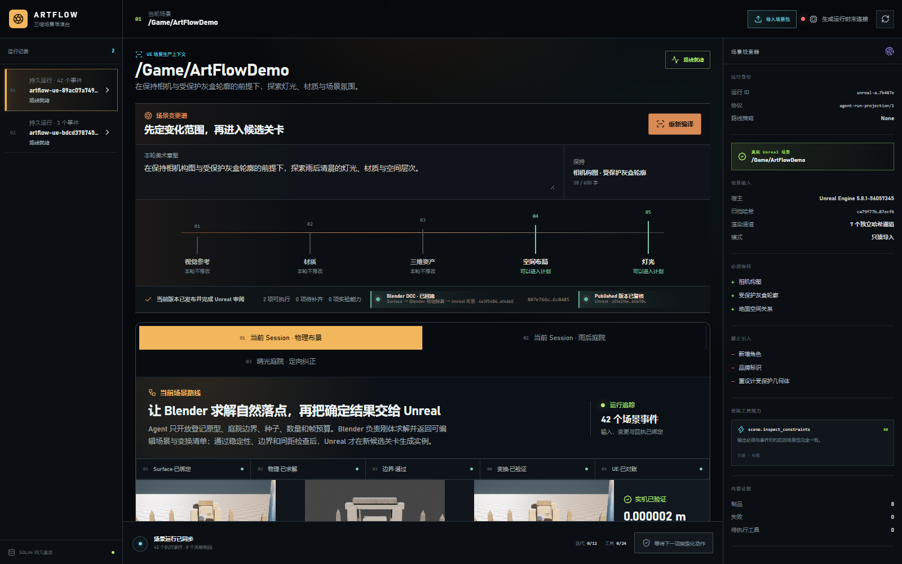
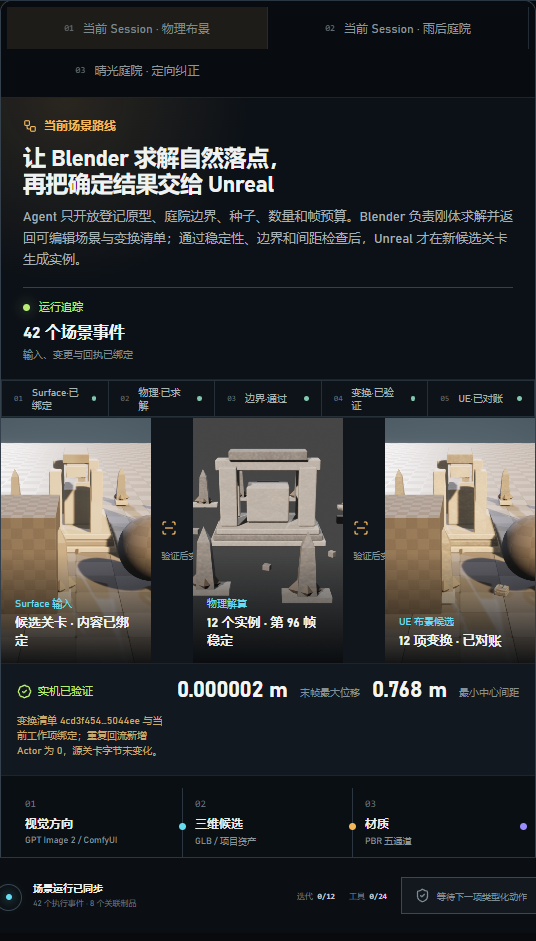

# M29-S1 · Live set-dressing dispatch

本切片把已经由 Blender 5.2 与 Unreal 5.8 实测的物理布景链路接入当前 Scene Session，而没有建立第二套调度器。

- `SceneDccWorkDefinition` 绑定 M28 请求、Blender 回执、变换清单与 Unreal 回执的内容身份，并将 `blender.rigidbody.rubble_settle.v1` 登记为第七项有限能力。
- 同一个 DCC Worker 完成 `queue → claim → execute → reconcile → succeeded`；重复派发恢复 `dcc-work-4e3f5486dc3f`，重复外部副作用为 0。
- 事件账本重放后投影与完成时状态一致；最终候选为 `Dressing_B_c496854357de`。
- 场景变更谱显示 Surface 输入、Blender 第 96 帧求解和 Unreal 12 项变换候选。三张媒体均为 1280×720。
- 1600 px 与 760 px 检查均无横向溢出；浏览器控制台错误与警告为 0。

| 桌面工作台 | 窄屏路线 |
| --- | --- |
|  |  |
