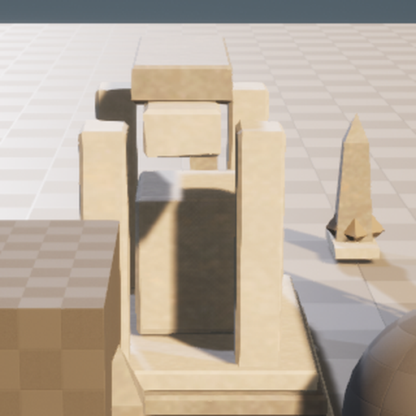
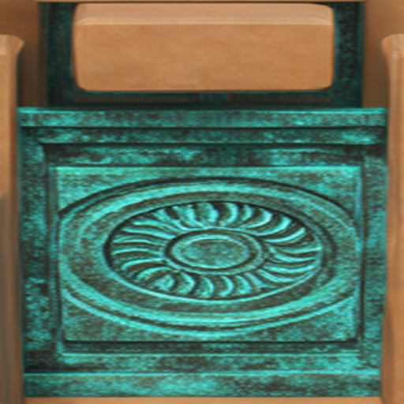

# M30-S1 场景条件表面细节投射

## 结果

当前 Scene Session 的 Unreal 同机位画面与 `AF_Inlay` 有界区域被编译为固定 ComfyUI
请求。真实 ComfyUI 0.28.0 / RTX 4080 运行一次 FLUX.2 Klein ReferenceLatent 图，生成青铜绿
日轮嵌件方向；后续执行只读取同一 provider request 与内容哈希，没有再次生图。

Blender 5.2 LTS 将选定区域装配为带厚度的可编辑 inlay plate，保留 UV、材质、烘焙纹理、
`.blend` 与 GLB。Unreal 5.8.1 将网格、纹理和项目自有双面材质导入内容寻址目录，并绑定到
从现有布景候选派生的隔离关卡。再次回流创建和更新对象均为 0，源 `ArtFlowDemo.umap` 哈希
保持 `620e4814…d24974a`。

## 实际流程

| Unreal 场景区域 | ComfyUI 生成方向 |
| --- | --- |
|  |  |

| 提取的投射纹理 | Blender 可编辑三维嵌件 |
| --- | --- |
|  |  |

## 能力边界

- ComfyUI 执行项目登记的固定图，模型只填写 prompt、seed、denoise 与已声明输入槽。
- Blender 能力是版本化 DCC 操作，不接受模型临时生成 Python；本例负责投射、UV、材质与 Bake。
- Unreal return tool 只读取登记请求/回执，在候选关卡中装配结果；没有覆盖源关卡。
- Unreal 同机位截图已记录候选回流，但嵌件在当前宽镜头中辨识度有限，因此公开流程图以
  Blender 近景作为三维视觉证据，不将该截图描述为最终美术质量。

结构化结果见 `artifacts/goal/m30-s1-surface-detail/verification.json`。
