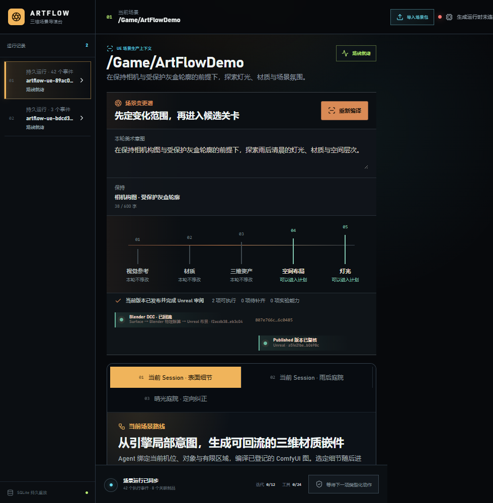

# M31-S1 实时表面细节能力

M30 的场景条件表面细节链路已登记为当前 Scene Session 的第八项 DCC 能力。工作定义同时绑定
Surface Detail Request、ComfyUI Receipt、Blender Receipt 与 Unreal Return Receipt；本地 Worker
沿用现有 queue / claim / execute / reconcile / success 事件，不启动生成宿主，也不新增调度器。

场景变更谱新增四段真实媒体：Unreal 场景取样、ComfyUI 节点生成、Blender 三维转化、Unreal
候选回流。界面保持“场景导演台”的横向变化谱语言，没有引入聊天框或通用节点编辑器。

1600×1000 与 980×1000 两个视口均加载全部四张媒体；窄屏横向溢出为 0，控制台错误与警告为 0。
