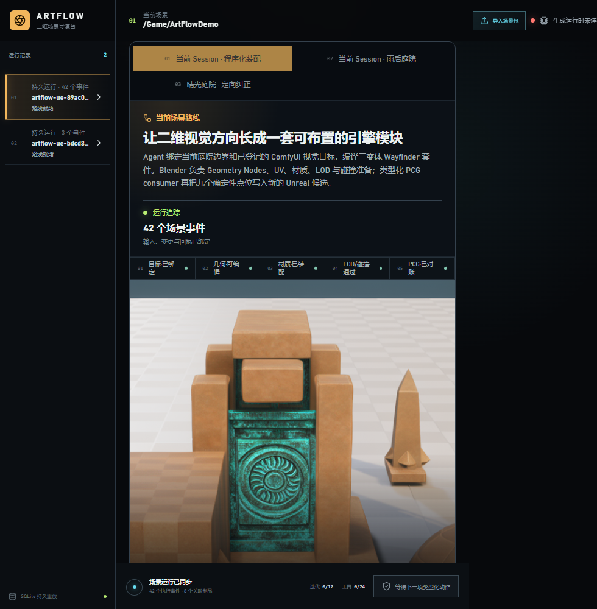

# M33-S1 实时程序化场景装配能力

M32 的跨宿主程序化套件已登记为当前 Scene Session 的第九项 DCC 能力。工作定义同时绑定套件
Request、Blender Receipt、Manifest 和 Unreal Return Receipt；现有本地 Worker 对每个文件及其
交换资产进行内容校验后，沿用原有 queue / claim / execute / reconcile / success 事件。

重复派发恢复同一个 `dcc-work-c766882fef4c`，5 个 DCC 生命周期事件可由 SQLite 重放，外部重复
副作用为 0。1600×1000 与 980×1000 两个视口均无横向溢出，6 张媒体全部加载，控制台错误和
警告均为 0。
