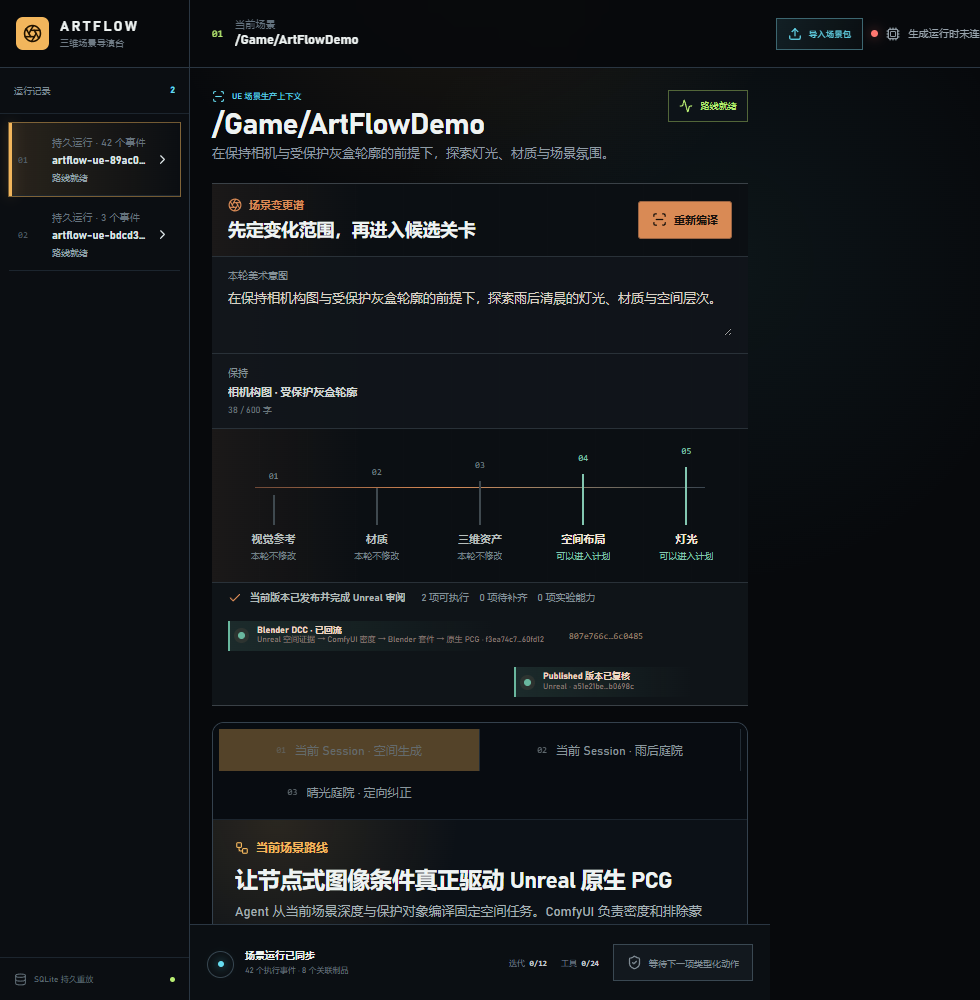

# M35-S1 实时原生 PCG 空间生成能力

M34 的空间生成路线已登记为当前 Scene Session 的第十项有限生产能力。工作定义同时绑定场景
条件 Request、ComfyUI Receipt、空间点清单、项目自有 PCG 图与 Unreal Candidate Receipt；
现有本地 Worker 在执行前重放所有内容身份，并沿用原有 queue / claim / execute / reconcile /
success 五段事件。

重复派发恢复同一个 `dcc-work-f3ea74c7e62a`，事件投影与 SQLite 重放结果一致，外部重复副作用
为 0。1600×1000 与 980×1000 两个视口均无横向溢出；6 张媒体全部加载，控制台错误和警告均为 0。
