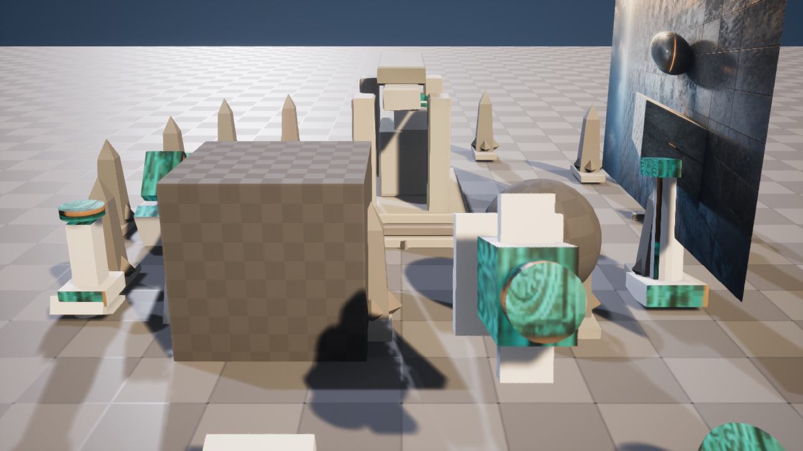

# M36-S1 程序化环境镜头包

ArtFlow 将当前 Scene Session 的 Blender 镜头预演、三点灯光回执和 M34 原生 PCG 候选编译为
固定 Shot Package Request。请求只开放 24 fps、0–120 帧、预览帧、一个相机和 key / fill / rim
三组登记灯光参数，并绑定全部上游内容身份。

| Blender 镜头与灯光预演 | Unreal Level Sequence 候选 |
| --- | --- |
|  |  |

真实 UE 5.8.1 执行创建内容寻址 `LevelSequence`，包含 1 个 CineCamera、3 个灯光绑定和 1 条
Camera Cut，播放范围为 120 帧。CineCamera 水平 FOV 与 Blender 预演相差约 0.000004°。
第二个编辑器进程返回 `reconciled`，没有创建重复 Sequence 或候选；上游原生 PCG 候选哈希保持不变。
