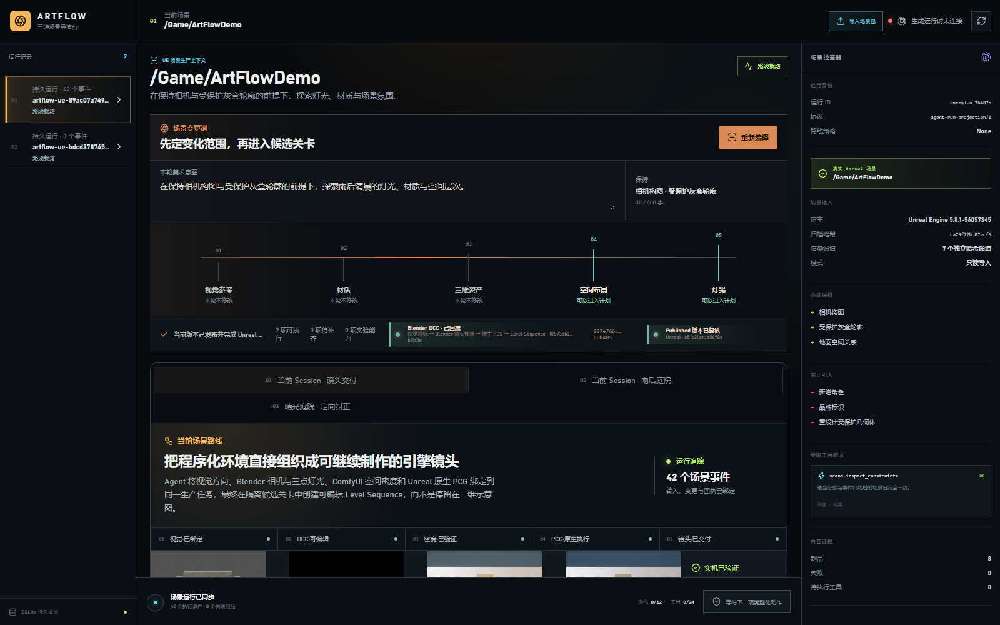
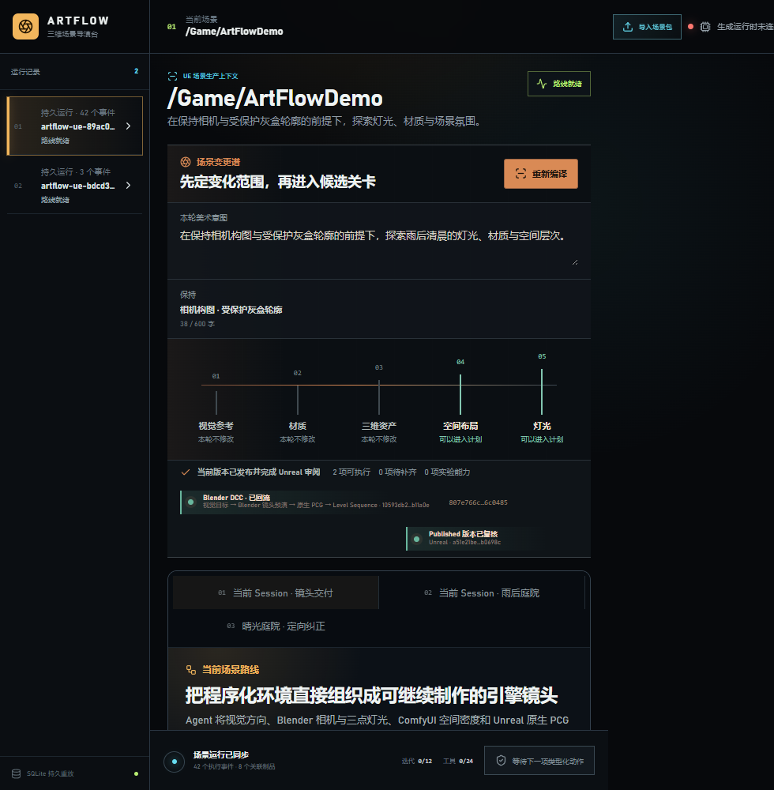

# M37-S1 实时镜头包生产路线

M36 的 Shot Package 已登记为当前 Scene Session 的第十一项有限生产能力。工作项绑定视觉目标、
Blender 镜头回执、ComfyUI 空间密度、Unreal 原生 PCG 候选、Level Sequence 与最终候选身份，
并复用已有 `queue / claim / execute / reconcile / success` 事件链。

重复派发返回同一个工作身份；新建 Worker 从事件数据库恢复后得到相同投影，外部重复副作用为 0。
场景变更谱以四段真实媒体呈现 Blender 镜头预演、ComfyUI 空间条件、Unreal 原生 PCG 和可编辑
Level Sequence。1600×1000 与 980×1000 两种宽度均无横向溢出或失败媒体，浏览器控制台无消息。

