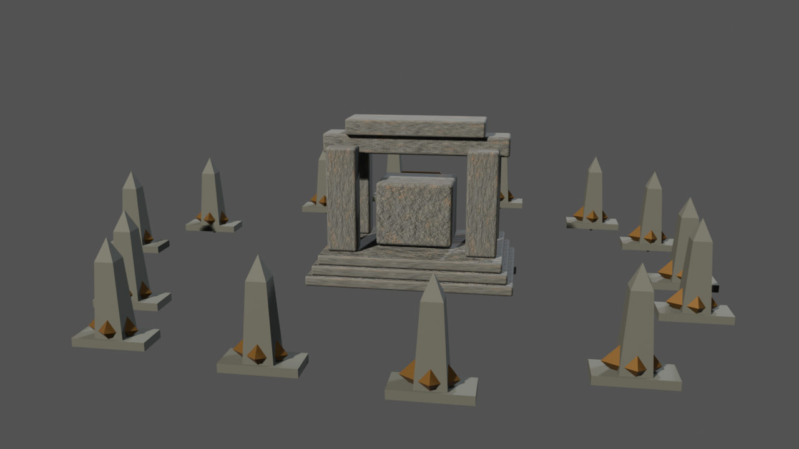
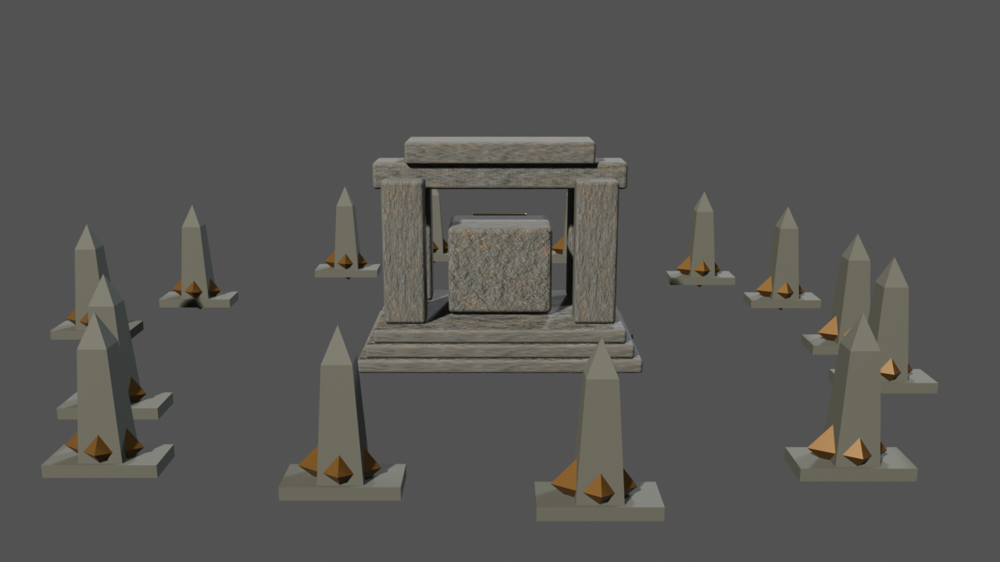
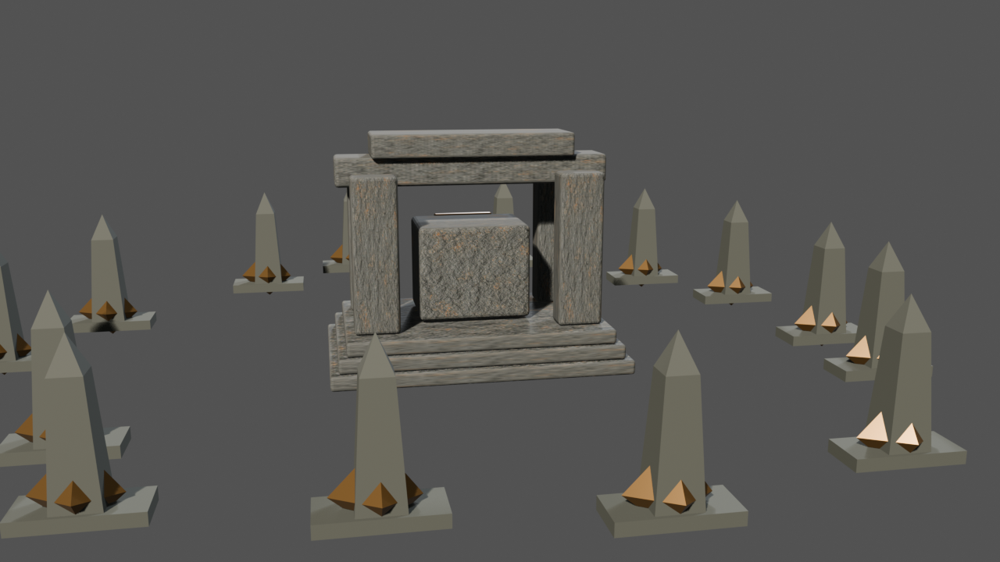
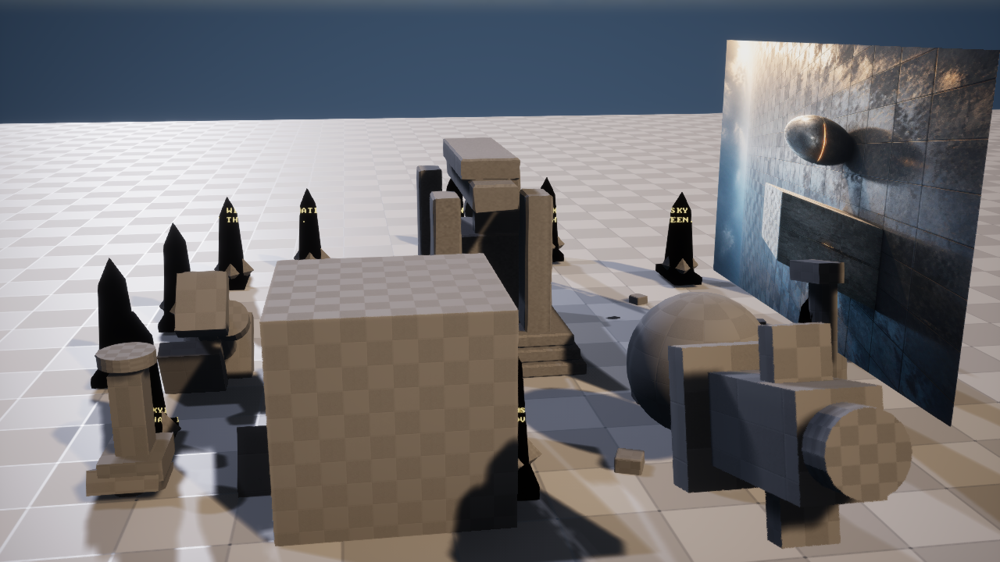
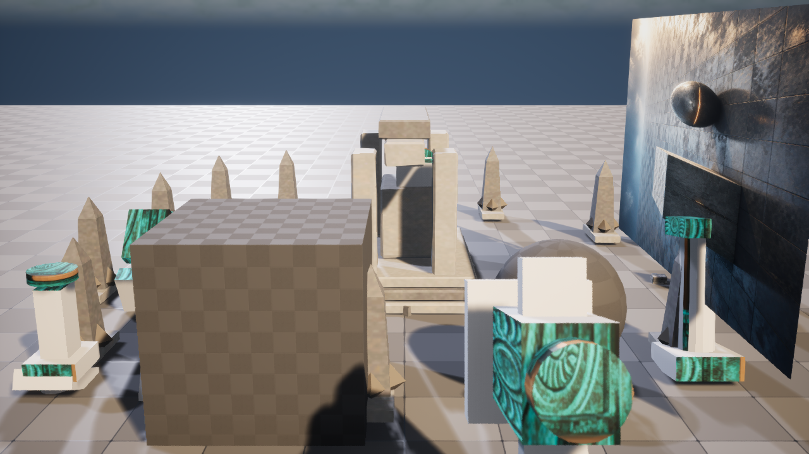
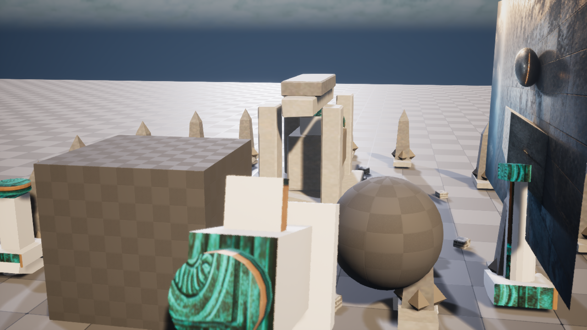

# M38-S1 Blender 到 Unreal 的有限镜头运动

ArtFlow 从 M36 Shot Package 和 Blender 可编辑镜头预演编译固定 Camera Move Request。请求绑定
原 Blender、原 Level Sequence、候选关卡和两端回执身份，只包含 0、60、119 三个关键帧，
不接收任意轨道、对象或宿主代码。

| Blender 起始帧 | Blender 中间帧 | Blender 结束帧 |
| --- | --- | --- |
|  |  |  |

Blender 5.2 写入 3 个相机位置与旋转关键帧，位移总长 412.4318 cm，并保存可编辑 `.blend`。
固定 Unreal 工具从 M36 Sequence 派生新的内容寻址 Sequence，写入 1 条 Transform Track、1 个
Section、9 个通道和 27 个键值。

| Unreal 起始帧 | Unreal 中间帧 | Unreal 结束帧 |
| --- | --- | --- |
|  |  |  |

第二个 UE 5.8.1 进程返回 `reconciled`。派生 Sequence 哈希与首次执行一致，重复轨道为 0；
M36 原 Sequence 和 Shot Package 候选关卡在执行前后保持相同文件哈希。
