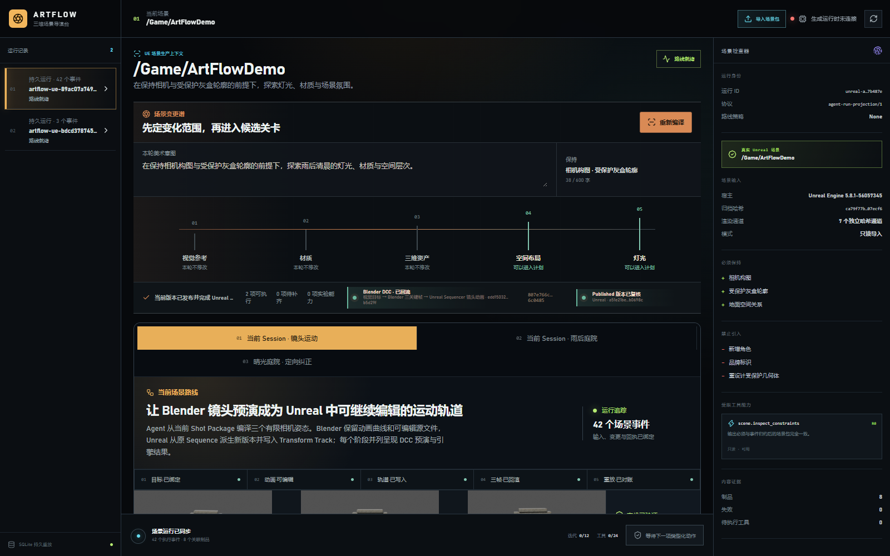
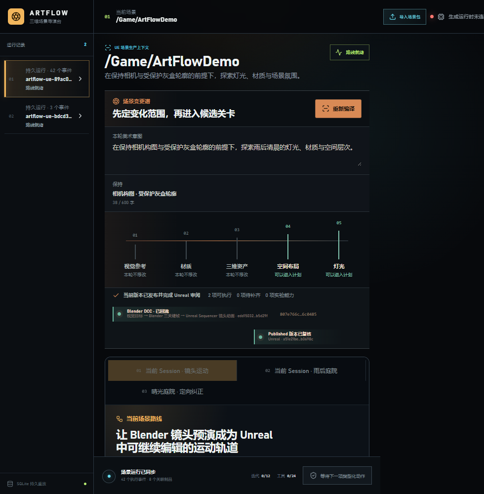

# M39-S1 · 实时镜头运动路线

M38 的 Blender 三关键帧镜头运动已登记为当前 Scene Session 的第十二项生产能力，并复用既有
Scene DCC Worker。工作项使用相同内容身份完成 queue、claim、execute、reconcile 与 success；
重复派发返回同一工作身份，外部重复副作用为 0。

## 可核对结果

- 登记能力：12 项；本次新增 `blender.camera_move.three_key_dolly.v1`。
- 工作事件：5 个；重放投影一致。
- Blender 与 Unreal 分别展示 0、60、119 帧，共 6 张宿主画面。
- Unreal 结果保持 1 条 Transform Track、9 个通道、27 个键值。
- 1600×1000 与 980×1000 两种视口均无横向溢出或失败媒体，浏览器控制台错误与警告均为 0。

结构化证据见
[`live-camera-move-work-receipt.json`](../../artifacts/goal/m39-s1-live-camera-move/live-camera-move-work-receipt.json)
与 [`verification.json`](../../artifacts/goal/m39-s1-live-camera-move/verification.json)。
