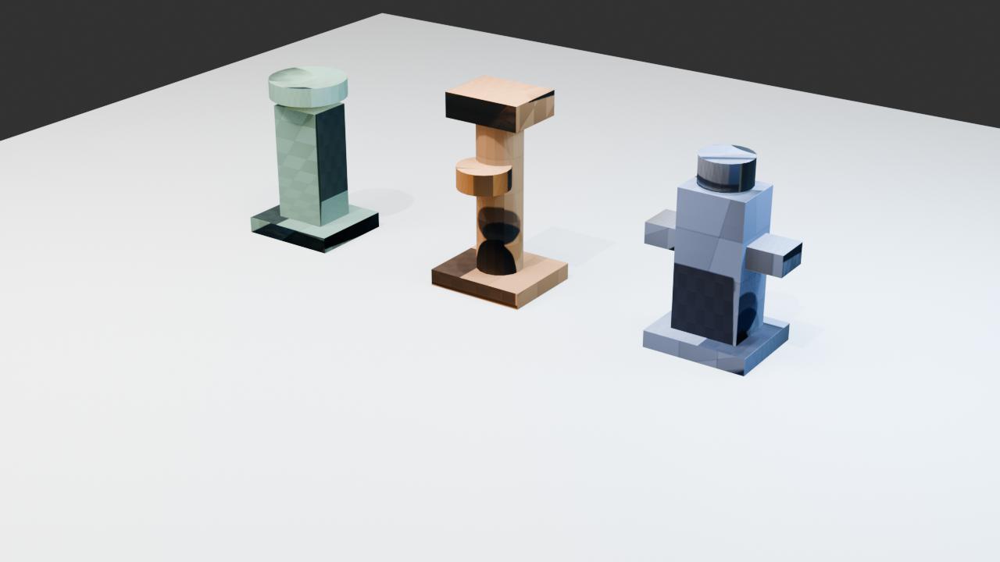
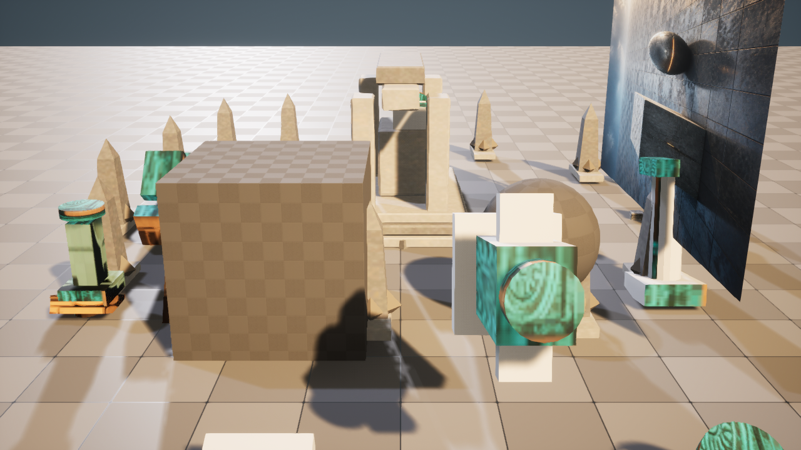

# M40-S1 · 场景条件材质变体

当前 ComfyUI 场景条件结果被作为视觉输入，与 Wayfinder Blender 编辑源和 Unreal 原生 PCG
候选一起写入类型化请求。固定能力在 Blender 5.2 中为 A、B、C 三种模块建立独立材质节点，
烘焙 512×512 Base Color 与 Roughness，并保留可继续编辑的 `.blend`。

Unreal 5.8.1 导入六张贴图，建立一个参数化母材质和三个 Material Instances，再按模块身份绑定
原生 PCG 生成的三个组件、十二个实例。首次进程在资产提交后、最终回执前退出；第二个进程从
确定性资产身份恢复，未重新创建内容，并完成同机位截图和回执。

## 实测结果

- UV 覆盖：A 92.36%、B 94.67%、C 94.84%。
- Blender：3 套可编辑材质、每套 5 个节点、6 张烘焙贴图。
- Unreal：1 个母材质、3 个 Material Instances、3 个 PCG 组件、12 个实例。
- 重复应用改动组件 0，重复外部副作用 0。
- `ArtFlowDemo.umap` 与上游 `Density_B_1a637a8d89b8` 在本次运行前后哈希一致。

结构化证据见
[`blender-material-variation-receipt.json`](../../artifacts/goal/m40-s1-material-variation/blender-material-variation-receipt.json)、
[`unreal-material-variation-receipt.json`](../../artifacts/goal/m40-s1-material-variation/unreal-material-variation-receipt.json)
与 [`verification.json`](../../artifacts/goal/m40-s1-material-variation/verification.json)。
