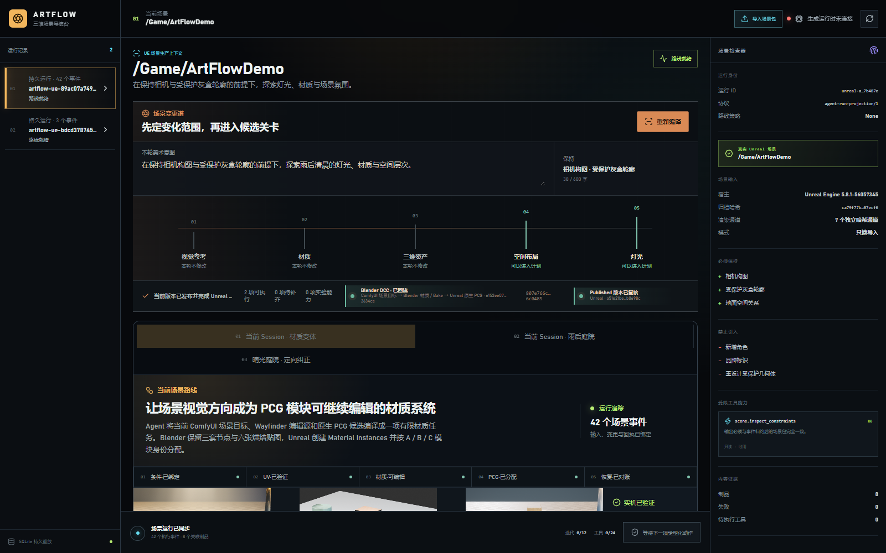
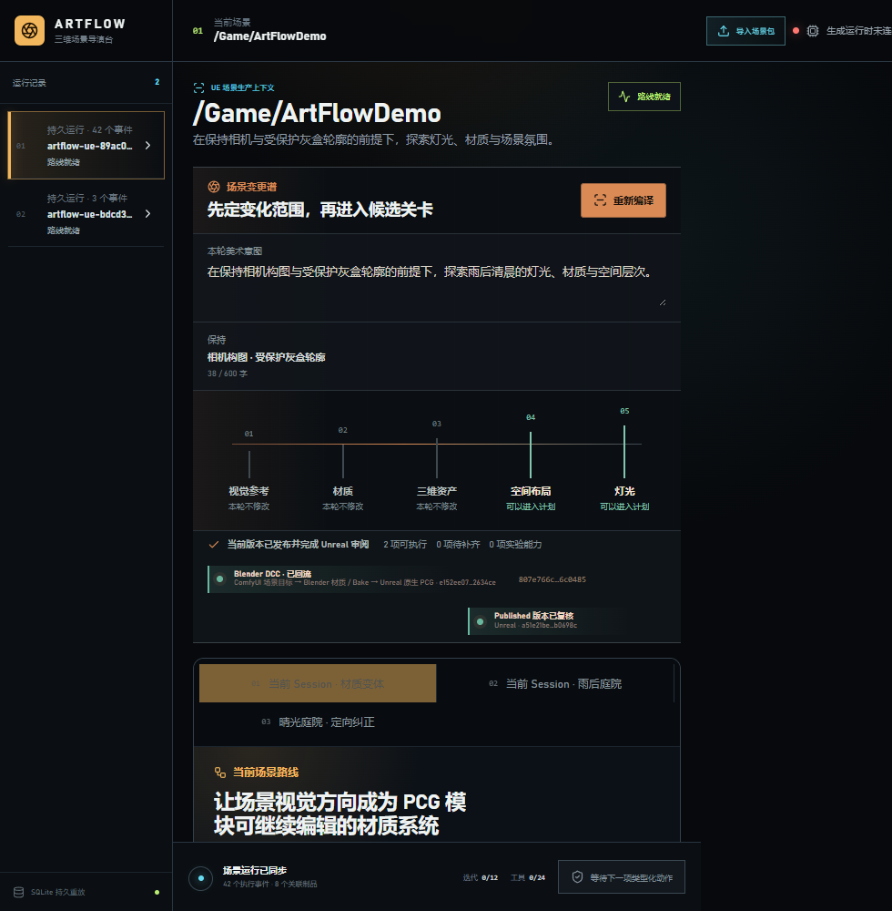

# M41-S1 · 实时材质变体路线

M40 的场景条件材质能力已经登记为当前 Scene Session 的第十三项生产能力。工作定义绑定
ComfyUI 条件结果、材质请求、Blender 编辑源、六张烘焙贴图和 Unreal 候选；既有 DCC Worker
完成五段事件生命周期，重复派发保持同一工作身份。

## 可核对结果

- 当前 Session 登记 13 项生产能力。
- queue、claim、execute、reconcile、success 共 5 个持久事件。
- 重复派发保持同一工作身份，重放投影一致，外部重复副作用为 0。
- 场景变更谱连续展示 ComfyUI 条件、Blender 材质预演和 Unreal PCG 候选。
- 1600×1000 与 980×1000 均无横向溢出或失败媒体；浏览器控制台消息为 0。

结构化结果见
[`live-material-variation-work-receipt.json`](../../artifacts/goal/m41-s1-live-material-variation/live-material-variation-work-receipt.json)
和 [`verification.json`](../../artifacts/goal/m41-s1-live-material-variation/verification.json)。
