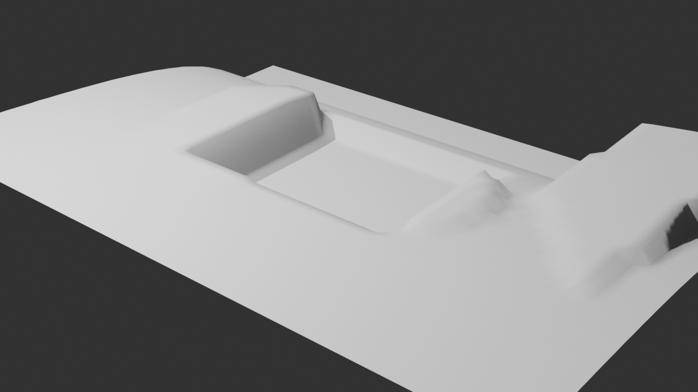
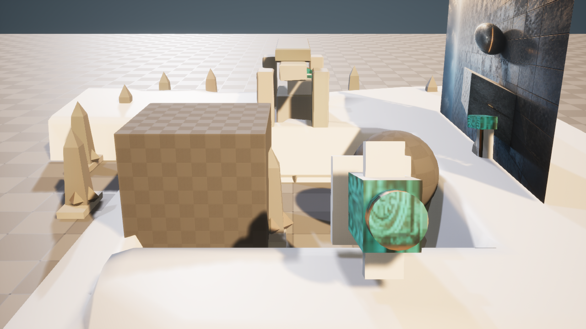

# M42-S1 · 场景条件地形与生物群落回流

当前 Scene Session 的归一化深度、保护区和 M40 材质候选被编译为一个内容寻址请求。固定
ComfyUI 子图只接受两个登记输入和一个阈值，不接受模型生成的节点图。

| 阶段 | 真实结果 |
| --- | --- |
| ComfyUI | 0.28.0 / RTX 4080；1309 个可见节点；固定子图输出 640×360 高度图与生物群落蒙版 |
| 空间约束 | 生物群落覆盖 27.6345%；保护区泄漏 0 |
| Blender 5.2 | 3072 顶点、2961 面、可编辑 Geometry Nodes、`ArtFlow_TerrainUV`、碰撞代理、GLB |
| Unreal 5.8.1 | 派生 `Terrain_B_dfa6418e8729` 候选；项目 PCG 图生成 18 个实例 |
| 重放 | 第二次返回 `reconciled`；重复副作用 0；源关卡和 M40 候选哈希不变 |

| Blender 地形预演 | Unreal 候选 |
| --- | --- |
|  |  |

冻结回执位于 `artifacts/goal/m42-s1-terrain-biome/`。这一切片证明 ComfyUI 不只生成最终图像，
也能作为空间字段计算层；Blender 不只建模，也承担可编辑几何处理与交换；Unreal 保持最终原生
PCG 与候选场景所有权。
