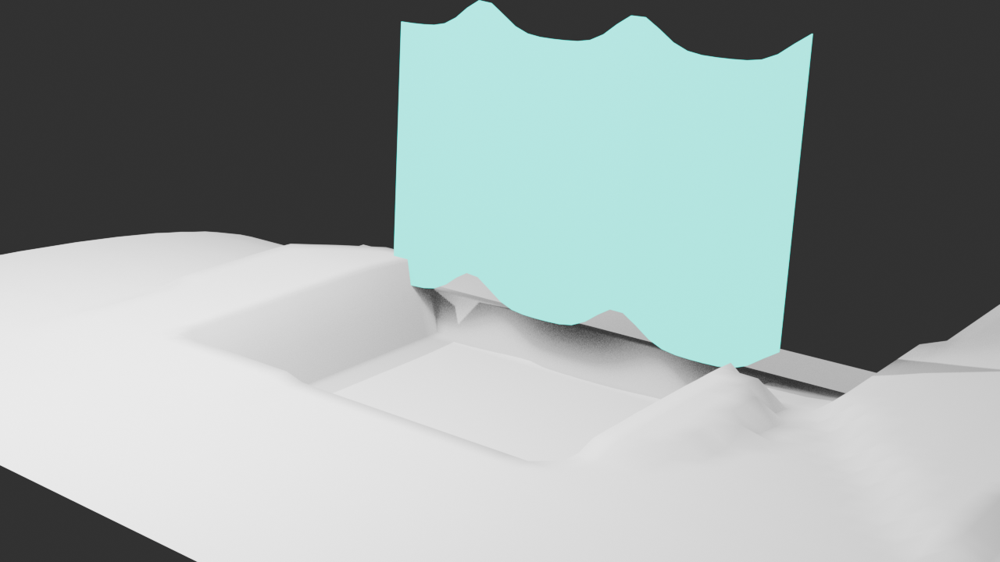
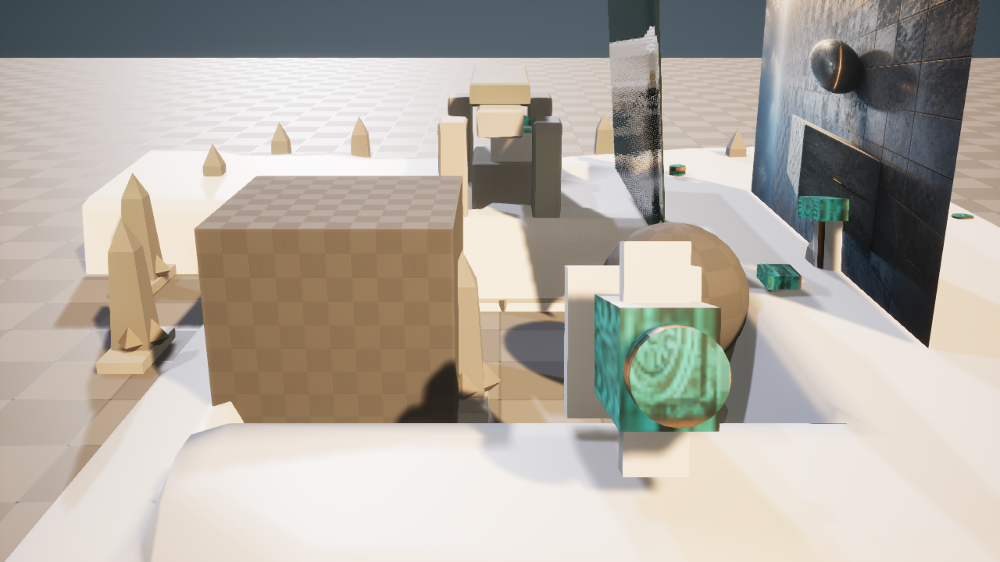

# M43-S1 · Blender 模拟缓存与 Unreal Sequencer 回流

Agent 从 M42 已对账的地形候选编译固定 `blender.cache.wind_veil.v1` 请求。请求限定 72 帧、
24 fps、32×12 网格、0.42 m 最大形变和 32 MB Alembic 预算，模型不提供 Blender 代码或任意
Sequencer 轨道。

| 阶段 | 真实结果 |
| --- | --- |
| Blender 5.2 | 384 顶点、341 面；Wave + Solidify 可编辑源；72 个缓存样本 |
| Alembic | 5,980,896 bytes；SHA-256 由 Blender 回执冻结 |
| Unreal 5.8.1 | Geometry Cache + 派生候选 + Level Sequence |
| Sequencer | 1 个绑定、1 条 Geometry Cache Track、1 个区段，帧范围 1–72 |
| 重复执行 | `reconciled`；重复资产 0；M42 候选哈希不变 |

| Blender 第 36 帧 | Unreal 候选 |
| --- | --- |
|  |  |

冻结请求与两端回执位于 `artifacts/goal/m43-s1-simulation-cache/`。本路线使用项目启用的
AlembicImporter 与 GeometryCache 插件，结果进入新的 Session 候选和项目自有 Sequence 路径。
