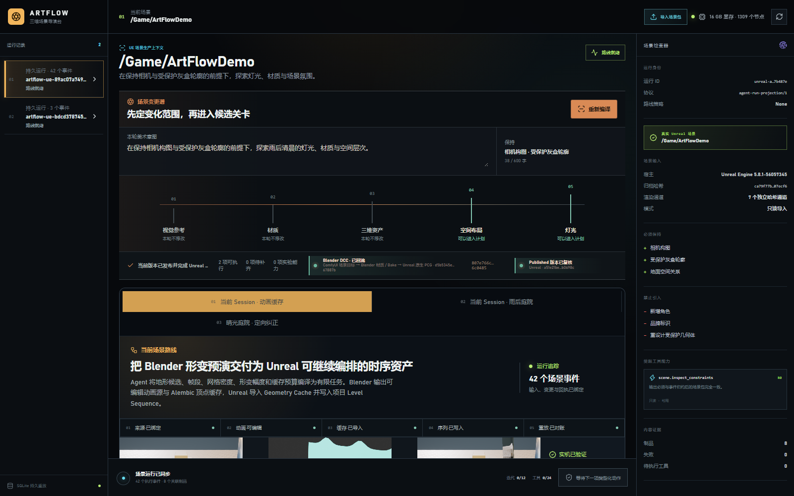

# M44-S1 · 动画缓存生产路线进入当前 Scene Session

M43 的地形来源、Blender 动画源、Alembic、Geometry Cache、Level Sequence 和 Unreal 候选已
登记为当前 Session 的第十四项有限 DCC 能力。现有 Worker 验证内容身份并投影原有五段生命周期。

| 项目 | 结果 |
| --- | --- |
| 工作身份 | `dcc-work-d5b5345e1aad` |
| 登记能力 | 14 项 |
| 生命周期事件 | 5 个：queued / claimed / executing / reconciling / succeeded |
| 重复派发 | 同一工作身份 |
| 重放 | 事件投影等价 |
| 外部重复副作用 | 0 |
| 前端验收 | 1600×1000 与 980×1000 均无横向溢出；5 张图片全部加载；控制台错误/警告 0 |

冻结工作回执与桌面、窄屏截图位于 `artifacts/goal/m44-s1-live-simulation-cache/`。
