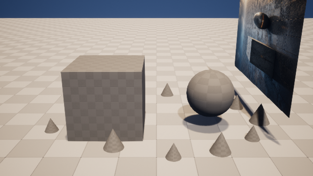

# M7-S2：候选关卡执行、对账与发布证据

本切片把 M7-S1 的只读 Scene Change Plan 变成了第一条真实可执行的 Unreal 三维闭环。它不是根据二维图直接覆写当前关卡，而是在内容寻址的候选关卡中执行受限操作，完成同机位渲染后再发布或丢弃。

## 本次真实执行

- 源关卡：`/Game/ArtFlowDemo`
- 候选关卡：`/Game/ArtFlow/Staging/AF_cb2176a7a45bbad1`
- 发布关卡：`/Game/ArtFlow/Published/AF_cb2176a7a45bbad1`
- 受审 PCG 图：`Create Points → Static Mesh Spawner`
- 项目内道具：`/Game/ArtFlow/Props/SM_ArtFlowRock`
- 灯光：仅将 `ArtFlow_KeyLight` 从强度 `8.0`、色温 `6500K` 改为 `5.5`、`4200K`
- PCG：固定种子 `240827`，生成并验证 `12` 个可见实例
- 保护对象：语义指纹执行前后均为 `65454d0c…b12a36f`
- 源地图 SHA-256：执行、重跑、发布、丢弃后均为 `620e4814…d24974a`

## 为什么这是 Agent 执行内核

执行器消费冻结的 Twin 与 Plan 身份，只接受 `set_lighting_rig` 和 `apply_pcg_layout` 两种类型化操作。它先验证源地图和保护对象，再复制候选关卡、绑定白名单 PCG 图、执行和渲染；同一计划再次运行时识别既有 12 个实例并返回 `reconciled`，不会追加重复实例。发布创建独立 Published 资产，丢弃只删除精确 staging 资产，两者都返回类型化回执且不覆盖源关卡。

这为后续的材质生成、图生 3D、PCG 参数求解和自动布光提供统一边界：规划模型可以提出变化，但真正写入 UE 的只能是经过契约验证、预算约束和幂等键约束的工具调用。

## 验证结果

- Unreal 5.8 C++：编译成功。
- 首次执行：12 个实例，候选渲染成功。
- 幂等重跑：12 → 12，重复外部副作用为 0。
- 发布：创建独立 Published 关卡，`source_overwritten=false`。
- 丢弃探针：候选关卡不存在，源关卡哈希不变；随后重新执行恢复演示候选。
- Python 严格契约：执行、对账、发布、丢弃四份回执全部通过。

机器可读证据位于 `artifacts/goal/m7-s2-scene-execution/`。
