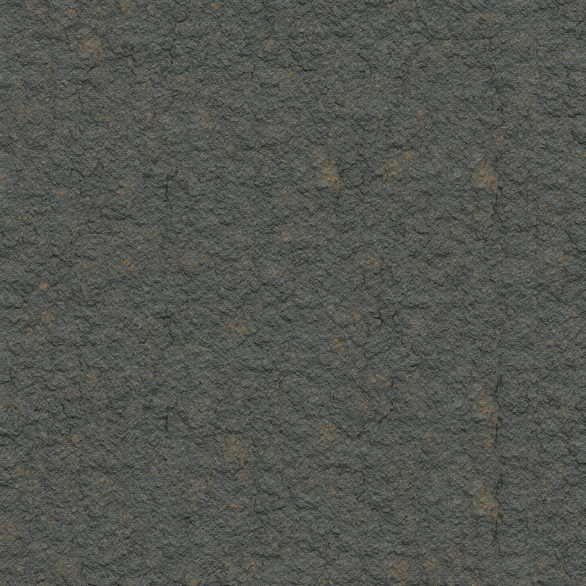
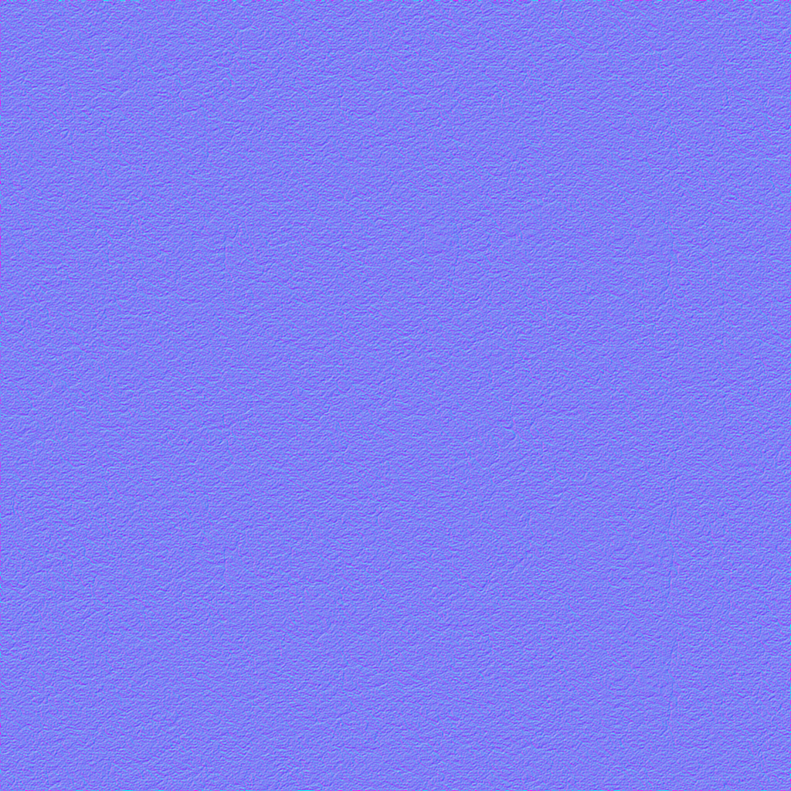
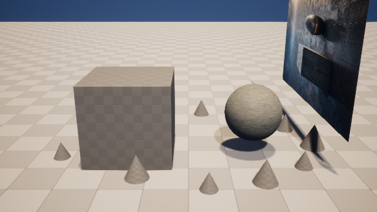

# M8-S2：真实 PBR 生成、失败域纠正与 Unreal 材质回流

本切片完成了从受审 ComfyUI 图到 UE 5.8 候选关卡的真实材质闭环。它没有把“生成服务返回了五张图”
等同于“得到可用材质”：两次原始生成都被逐通道技术检查拒绝，随后只纠正失败的技术贴图域，保留
可用的 AI BaseColor，并以同一来源构建空间对齐的 DirectX Normal、Roughness、Metallic 与 AO。

## 可见结果

| AI 生成的 BaseColor | DirectX Normal | UE 5.8 同机位材质回渲 |
| --- | --- | --- |
|  |  |  |

回渲中的 `Editable_Form` 已从编译占位棋盘格变为连续岩石微表面。捕获器在采集前显式等待所有资产与
Shader 编译完成，避免把 UE fallback material 当成最终视觉结果。

## 真实生成与纠正

- 隔离 ComfyUI GPU 宿主：`127.0.0.1:8190`，RTX 4080；共享 `8188` 未修改、未停止。
- 受审合成图：17 个固定节点接口，规范化 workflow SHA-256
  `8f573df2771bc5d5dd81800b0838b798377236109cdf7ffef356511cd0b86f3c`。
- 真实 prompt id：`7d90e117-9c5b-4880-8637-4524043b9b74`；执行耗时 `123.723s`；五个文件均返回。
- 第一次参考图路线因复刻 UE 截图而拒绝；第二次完整噪声合成虽得到可用 BaseColor，但多个技术图
  出现彩色/场景化结构，仍被 `semantic_invalid` 拒绝。
- 纠正器只重建失败的技术域：法线、粗糙度、金属度和 AO 都从同一 BaseColor 高度代理派生，因而
  像素空间严格对齐；玄武岩按 dielectric 处理，Metallic 为常量黑。

验证后五图均为 `1024×1024`；BaseColor 为 sRGB，Normal 使用 `TC_NORMALMAP`，三个标量图为灰度
源并在 UE 中使用 `TC_MASKS`。源文件、生成历史、能力快照、编译图和每个通道 SHA-256 全部保留在
`artifacts/goal/m8-s2-pbr-material/`。
宿主退出状态与共享端口保持情况记录在同目录的 `host-lifecycle.json`。

## 类型化 UE 回流与幂等

类型化请求 `pbr-ue-089e29542680f323c87bd657` 只允许写入
`/Game/ArtFlow/Generated/089e29542680f323` 和候选关卡
`/Game/ArtFlow/Staging/AF_cb2176a7a45bbad1` 的 `Editable_Form`。实际创建：

- 5 个 `Texture2D`；
- 1 个包含五条受控表达式连接的 PBR Master Material；
- 1 个 `MI_RuinAltarBasalt` Material Instance；
- 目标组件材质绑定和同机位 Final Color 回渲。

首次执行暴露 UE 5.8 Python 工厂 API 差异并在已生成资产上恢复；随后完全相同请求返回
`reconciled`，没有重复纹理、材质、Actor 或外部副作用。请求指纹为
`bfc8d102d040b888fb07fad150f295df948b08f57561a9719ada9763fb6b7f8a`，最终回执指纹为
`ea03d56d88efa1c639bc4a4a7473be8d16dda36b584efa97657f4b527069f1f1`。

## 独立核验

- 两个语义无效生成尝试均在 UE 导入前拒绝；有效集五个来源哈希逐字节复核。
- `ArtFlowDemo.umap` 前后 SHA-256 相同：`620e4814…d24974a`。
- `Protected_Blockout` 前后状态指纹相同：`18fe1bae…b07733`。
- 候选回渲 SHA-256：`bd928320…ea7ae`。
- 同机位差异中，目标球体区域平均绝对变化为 `3.246691`，保护方块为 `0.472945`，目标/保护比
  `6.864845`。
- 独立报告：`artifacts/goal/m8-s2-pbr-material/independent-verification.json`。

本切片证明的是“受审图生成 → 逐通道拒绝/纠正 → 类型化 UE 材质 → 可见回渲 → 幂等对账”。它
尚未声称能从单张二维图恢复唯一三维结构，也未实现多域 Scene Delta 的自动联合规划；后者进入 M9。
