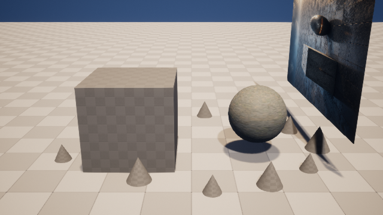
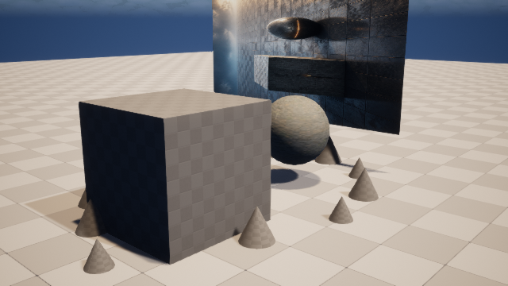

# M9-S2：真实 UE 四域联合执行与双机位核验

本切片将 M9-S1 的四域 `scene-delta-plan/2` 重新绑定到真实 UE 5.8 Scene Digital Twin、M8 PBR
回执和当前源关卡哈希，再通过一个内容寻址请求对账项目资产、灯光、材质和 PCG。候选仍位于
`/Game/ArtFlow/Staging/AF_cb2176a7a45bbad1`，没有发布或覆盖源关卡。

## 实机结果

| 美术主机位 | 独立验证机位 |
| --- | --- |
|  |  |

主机位保留构图，用于判断暖色灯光、玄武岩材质和 12 个 PCG 碎石的整体方向；验证机位从侧后方
观察保护方块、材质球和碎石空间关系，避免只优化一个镜头。两图均由 C++ `CapturePass` 在资产与
Shader 编译完成后采集，平均绝对差异为 `56.909078`，不是同一画面的重复截图。

## 请求绑定

请求 `m9-ue-79d79060738719cbf0db5f1d` 同时绑定：

- M9-S1 plan SHA-256：`bfbc36e2…343df3`；
- M9-S1 dry-run receipt SHA-256：`3fb05bf2…0dd2c0`；
- 真实 Twin 文件 SHA-256：`7604b26e…6aba82`；
- `Editable_Form`、`Protected_Blockout`、`ArtFlow_KeyLight`、`ArtFlow_Camera` 四个真实 Actor ID 与
  source fingerprint；
- M8 Material Instance 及 PBR request/receipt 指纹；
- PCG graph path、graph fingerprint、seed `240827`；
- 源关卡 SHA-256 `620e4814…d24974a` 和保护对象状态指纹。

任何请求字段被改写都会使 `request_sha256` 失效；外部资产路径和改变后的操作顺序也会被合同拒绝。

## 四域技术结果

执行顺序与 M9-S1 完全一致：

1. `asset-reuse`：只接受项目自有 `SM_ArtFlowRock`；
2. `lighting-patch`：主光 `5.5 / 4200K`；
3. `material-bind`：复用 M8 内容寻址的 `MI_RuinAltarBasalt`；
4. `pcg-layout`：固定 `PCG_ArtFlowScatter`、seed `240827`、12 个实例。

两次完全相同请求均返回 `reconciled`。复检结果：生成实例 `12`，保护区 AABB 内实例 `0`，M8 生成
资产仍为 `7` 个，没有重复纹理、材质、Actor 或 PCG 实例。源 `ArtFlowDemo.umap` 和保护对象前后
指纹完全相同；技术失败没有视觉分数覆盖入口。

最终请求 SHA-256 为 `2dba33e0…32ded`，回执 SHA-256 为 `8520cbff…12ef`。独立验证报告、两次
宿主结果、C++ 多机位回执和进程清理记录均位于
`artifacts/goal/m9-s2-unreal-multi-domain/`。

本切片证明联合执行、双机位证据与幂等对账，但尚未执行失败域纠正或发布。M9-S3 将注入一个真实
可恢复失败，只重新打开对应领域，再对纠正后的候选执行发布或丢弃并保留完整事件/回执链。
