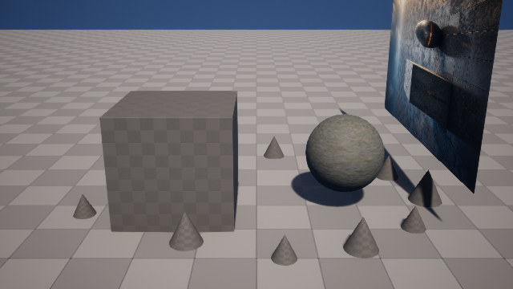
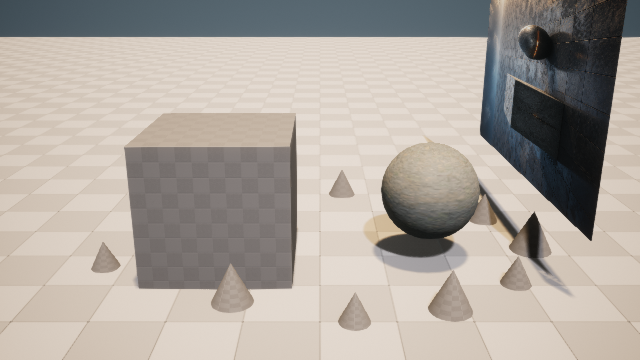
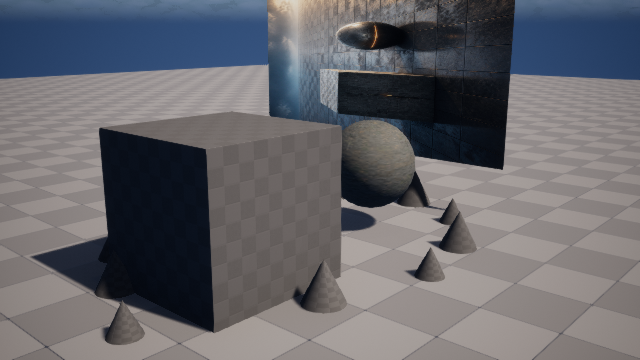
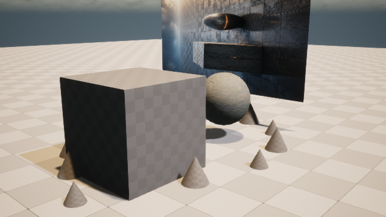

# M9-S3：单域纠错、崩溃对账与内容寻址发布

本切片在 M9-S2 的真实四域 UE 5.8 候选上注入一个可复现的灯光故障，并完成“独立评价 → 仅失败域
纠正 → 中断后对账 → 双机位复检 → 内容寻址发布”。故障注入是测试夹具，不冒充自然生产事故；
纠正与发布则通过真实 Unreal 命令行宿主执行。

## 真实视觉证据

| 故障候选：主光 0.05 lux | 纠正候选：主光 8.0 lux |
| --- | --- |
|  |  |

| 故障候选：验证机位 | 纠正候选：验证机位 |
| --- | --- |
|  |  |

故障主机位平均亮度为 `117.716133`，纠正后为 `166.661858`。两阶段都另外采集瞬态验证机位；纠正后
双机位平均差异为 `57.717595`，能够观察到真实三维空间关系，而不是替换二维预览平面。

## 为什么只重跑灯光域

Technical Judge 与 Visual Critic 分别出具四域结果：故障候选只有 `lighting` 失败，`asset`、
`material`、`pcg` 均通过。`DomainCorrectionPlan` 要求 `rerun_domains` 与 `failed_domains` 完全一致，
并用三个内容指纹锁定成功域。UE 的 `lighting-domain-patch-request/1` 只允许白名单强度与色温，执行前后
再次检查材质路径、PCG 实例数、源关卡哈希和保护对象状态。

真实纠正结果：

- 灯光 `0.05 → 8.0 lux`，色温保持 `4200K`；
- PCG `12 → 12`，没有重新生成实例；
- Material Instance 路径前后相同；
- 源 `ArtFlowDemo.umap` 与保护对象哈希前后相同；
- 没有再次调用图像生成、ComfyUI 或 PBR 导入。

## 持久恢复与发布

SQLite ledger 在外部 UE 调用前依次写入 `correction_reserved` 和 `correction_submitted`。测试故意在 UE
返回后省略 receipt 事件；新进程读取外部内容寻址回执并补写 `correction_receipt_recorded`，两次
reconcile 都停留在同一事件序号，期间外部提交数为 `0`。

最终 9 个 append-only 事件形成完整顺序：

```text
run_created → evaluation_recorded
→ correction_reserved → correction_submitted → correction_receipt_recorded
→ verification_recorded
→ disposition_reserved → disposition_submitted → disposition_receipt_recorded
```

通过后的候选发布到 `/Game/ArtFlow/Published/AF_M9_b70662c9ce03`，发布资产 SHA-256 为
`de5e7882…a3392a2e`。第二次相同发布请求返回 `reconciled`，目标文件哈希保持一致，重复副作用为 `0`；
源关卡未被覆盖。

## 可审计入口

- 合同与 ledger：`src/artflow_agent/scene_lifecycle.py`；
- UE 单域补丁：`integrations/unreal/apply_lighting_domain_patch.py`；
- UE 发布器：`integrations/unreal/publish_verified_scene_delta.py`；
- 独立验证：`scripts/verify_m9_s3_evidence.py`；
- 请求、回执、SQLite、事件流、四张回渲与验证报告：
  `artifacts/goal/m9-s3-correction-release/`。

独立报告 `verification.json` 的内部验证指纹为
`0817fca7c296341e141fa6cdf5394c5d3a80ae76bdd0e992470d08cb034a8e44`。这完成 M9 的真实三维闭环；
MCP、可选图生 3D 和新版中文 Scene Lab 仍属于 M10，本文不提前声称完成。
